# 魔法金屬M3大全

[巴哈](https://forum.gamer.com.tw/C.php?bsn=18673&snA=178326)

[內文來源](https://docs.google.com/document/d/1JSdXl_TssqfEU0NFCVWn7EPqE3UF8xCEBDJt1Wm9yLM)

- [魔法金屬M3大全](#魔法金屬m3大全)
  - [一、前言(遊玩前必看)](#一前言遊玩前必看)
  - [二、介面介紹](#二介面介紹)
    - [(一) 遊戲主畫面](#一-遊戲主畫面)
      - [黃色區域](#黃色區域)
      - [藍色區域](#藍色區域)
    - [(二) 背包介面](#二-背包介面)
    - [(二) 魔法金屬菜單](#二-魔法金屬菜單)
    - [(三) 職業界面](#三-職業界面)
    - [(四) 靈力系統](#四-靈力系統)
      - [靈力獲取方式](#靈力獲取方式)
      - [靈力使用方式](#靈力使用方式)
    - [(五) 生存資訊 (創傷系統與飲食均衡)](#五-生存資訊-創傷系統與飲食均衡)
      - [一、創傷系統](#一創傷系統)
      - [二、飲食系統](#二飲食系統)
    - [(六) 信箱系統](#六-信箱系統)
  - [三、生活技術](#三生活技術)
    - [(一)採礦技巧](#一採礦技巧)
    - [(二)農耕技巧](#二農耕技巧)
    - [(三)釣魚技巧](#三釣魚技巧)
    - [(四)養蜂技巧](#四養蜂技巧)
    - [(五)養龍技巧](#五養龍技巧)
    - [(六)寶石工藝](#六寶石工藝)
    - [(七)精鑄技巧](#七精鑄技巧)
    - [(八)烹飪技巧](#八烹飪技巧)
      - [烹飪](#烹飪)
      - [釀造](#釀造)
    - [(九)裁縫技巧](#九裁縫技巧)
      - [織布機的介紹](#織布機的介紹)
      - [曬皮架介紹](#曬皮架介紹)
      - [蠶寶寶的介紹](#蠶寶寶的介紹)
      - [衣物成型桌的介紹](#衣物成型桌的介紹)
    - [(十)釀造技巧](#十釀造技巧)
  - [四、副本](#四副本)
  - [五、世界](#五世界)
      - [遠古銩遺跡](#遠古銩遺跡)
      - [區塊型無限迷宮](#區塊型無限迷宮)
      - [天界](#天界)
      - [遠古世界](#遠古世界)
      - [大地礦坑](#大地礦坑)
      - [古代陵墓世界](#古代陵墓世界)
      - [混沌石世界](#混沌石世界)
      - [無垠深海](#無垠深海)
      - [遠古秘林](#遠古秘林)
      - [終界](#終界)
      - [豐饒之地](#豐饒之地)
      - [末日城](#末日城)
  - [六、BOSS](#六boss)
      - [~~BOSS 召喚磚使用方法~~](#boss-召喚磚使用方法)
      - [魔物召喚台使用方法](#魔物召喚台使用方法)
      - [破壞神](#破壞神)
      - [死亡收割者](#死亡收割者)
      - [影王龍](#影王龍)
      - [熔岩巨人](#熔岩巨人)
      - [死亡天使](#死亡天使)
      - [凋零至尊](#凋零至尊)
      - [黑暗騎士](#黑暗騎士)
      - [暴風魔蛇](#暴風魔蛇)
      - [赤瞳惡龍](#赤瞳惡龍)
      - [九頭怪蛇](#九頭怪蛇)
      - [符紋巨人](#符紋巨人)
      - [薔薇巨象](#薔薇巨象)
      - [天空守護龍](#天空守護龍)
      - [瑪夏達巴](#瑪夏達巴)
        - [固有技能](#固有技能)
        - [被動技能](#被動技能)
        - [備註](#備註)
      - [真瑪夏達巴](#真瑪夏達巴)
        - [備註](#備註-1)
      - [混沌黑龍](#混沌黑龍)
        - [固有技能](#固有技能-1)
        - [被動技能](#被動技能-1)
      - [炙焰鳳凰](#炙焰鳳凰)
        - [固有技能](#固有技能-2)
        - [被動技能](#被動技能-2)
      - [星辰飛龍](#星辰飛龍)
      - [赤血惡龍](#赤血惡龍)
      - [艾莉西亞](#艾莉西亞)
      - [鏡中夢魘](#鏡中夢魘)
          - [紅鏡](#紅鏡)
          - [綠鏡](#綠鏡)
          - [藍鏡](#藍鏡)
          - [黑鏡](#黑鏡)
      - [末日黑龍](#末日黑龍)
  - [七、魔法科技](#七魔法科技)
      - [魔法鋼](#魔法鋼)
      - [造版機(必要)](#造版機必要)
      - [魔法鋼爐(非必要)](#魔法鋼爐非必要)
      - [初級魔法煉造器(非必要)](#初級魔法煉造器非必要)
      - [魔法燃料反應器(必要)](#魔法燃料反應器必要)
      - [金屬還原器(非必要)](#金屬還原器非必要)
      - [魔法經驗提取器(非必要)](#魔法經驗提取器非必要)
      - [金屬熔爐&金屬粉碎器](#金屬熔爐金屬粉碎器)
      - [符紋鋼](#符紋鋼)
      - [魔法能系統](#魔法能系統)
      - [遠古銩](#遠古銩)
      - [魔法傳送板](#魔法傳送板)
      - [魔導空刷怪磚](#魔導空刷怪磚)
      - [法力附魔](#法力附魔)
      - [基岩錠](#基岩錠)
      - [基岩能量粉碎機](#基岩能量粉碎機)
      - [基岩合金批次融煉爐](#基岩合金批次融煉爐)
      - [魔力灌注](#魔力灌注)
      - [黑暗鋼錠](#黑暗鋼錠)
      - [人體改造](#人體改造)
      - [礦物純化儀](#礦物純化儀)
      - [法杖融合台](#法杖融合台)
      - [闇血鋼錠](#闇血鋼錠)
      - [紅蓮金屬錠](#紅蓮金屬錠)
      - [引力井](#引力井)
      - [無限鋼](#無限鋼)
      - [奧哈立爾鋼錠](#奧哈立爾鋼錠)
      - [宇宙能量錠](#宇宙能量錠)
      - [時光熔爐](#時光熔爐)
      - [時間機器](#時間機器)
      - [銀河能量錠](#銀河能量錠)
      - [阿達曼曼錠](#阿達曼曼錠)
      - [莫那海德錠](#莫那海德錠)
      - [黑洞頻率錠](#黑洞頻率錠)
  - [八、黑魔法](#八黑魔法)
    - [升級魔法金屬辭典](#升級魔法金屬辭典)
    - [覺醒遠古銩錠](#覺醒遠古銩錠)
    - [暗能量儀](#暗能量儀)
    - [黑暗附魔](#黑暗附魔)
    - [黑暗灌注](#黑暗灌注)
    - [圖騰充能](#圖騰充能)
    - [黑暗召喚](#黑暗召喚)
    - [黑暗轉換](#黑暗轉換)
    - [暗能量熔爐](#暗能量熔爐)
    - [暗能量高爐](#暗能量高爐)
  - [九、拉普達](#九拉普達)
    - [升級魔法金屬辭典](#升級魔法金屬辭典-1)
    - [占星者](#占星者)
    - [乙界位移](#乙界位移)
    - [黃金屋](#黃金屋)
    - [風行者](#風行者)
    - [銀色波江](#銀色波江)
    - [天空冒險](#天空冒險)
  - [十、狀態效果(更新版本:5.5.5)](#十狀態效果更新版本555)
  - [十一、常見問題](#十一常見問題)
  - [十二、職業](#十二職業)
  - [十三、結語](#十三結語)

## 一、前言(遊玩前必看)

由於魔法金屬是一個內容極為龐大的模組，
正常人不可能記住上百種道具的合成表，
(而我也懶得把那上百種道具的合成表整理上來)，
為了良好的遊戲體驗及編撰魔法金屬大全的方便，
建議所有玩家安裝 NEI、Waila 還有地圖類型的模組，
相信 minecraft 老玩家都對這些模組感到不陌生，
不過我還是要簡單介紹一下這幾個輔助模組的功能，
NEI 是方便玩家查看道具的合成表，
Waila 是在螢幕上方顯示玩家手指著的方塊的詳細資料，
包刮名稱、可否挖掘、需要何種挖掘道具、方塊來自何種模組、魔法能存量(很方便，這樣就不需要用聚魔法杖蹲下右鍵了)，
地圖類型的模組是方便玩家看地圖跟紀錄點，
玩過魔法金屬的人都知道模組內的 npc 有多麼的方便，
由於現今的魔法金屬沒有有效搬移 npc 的手段，
因此紀錄村莊的位置變得格外重要，
所以推薦安裝這類模組。

CodeChickenCore(NEI 前置模組)
: [CurseForge 頁面連結](https://www.curseforge.com/minecraft/mc-mods/codechickencore/files/all?filter-game-version=2020709689%3A4449)

NEI
: [CurseForge 頁面連結](https://www.curseforge.com/minecraft/mc-mods/notenoughitems/files/all?filter-game-version=2020709689%3A4449)

Waila
: [CurseForge 頁面連結](https://www.curseforge.com/minecraft/mc-mods/waila/files/all?filter-game-version=2020709689%3A4449)

Waila Harvesbility (Waila 的補充模組，功能是顯示方塊的所需挖掘等級)
: [CurseForge 頁面連結](https://www.curseforge.com/minecraft/mc-mods/waila-harvestability/files/all?filter-game-version=2020709689%3A4449)

地圖類型的模組擇一即可
JourneyMap
: [CurseForge 頁面連結](https://www.curseforge.com/minecraft/mc-mods/journeymap/files/all?filter-game-version=2020709689%3A4449)

Voxelmap(注意，本模組需使用 Liteloader)
: [CurseForge 頁面連結](https://www.curseforge.com/minecraft/mc-mods/voxelmap/files/all?filter-game-version=2020709689%3A4449)

Mapwriter 2
: [CurseForge 頁面連結](https://www.curseforge.com/minecraft/mc-mods/mapwriter-2/files/all?filter-game-version=2020709689%3A4449)

Xaero's Minimap
: [CurseForge 頁面連結](https://www.curseforge.com/minecraft/mc-mods/xaeros-minimap/files/all?filter-game-version=2020709689%3A4449)

Xaero's World Map(Xaero's Minimap 的附加模組)
: [CurseForge 頁面連結](https://www.curseforge.com/minecraft/mc-mods/xaeros-world-map/files/all?filter-game-version=2020709689%3A4449)

魔法金屬-MC 百科-最專業詳細的地方
: [百科 頁面連結](https://www.mcmod.cn/class/1111.html)

(記得下載與魔法金屬相同遊戲版本(1.7.10)的檔案。)

由於魔法金屬是一個尚未完成的模組，
因此最新的版本雖然有最新的內容但也常常會有很多的 bug，如果在遊玩時對遊戲內容有疑問或是發現 bug 請到[魔法金屬官方 DC 伺服器](https://discord.com/invite/JGTVQzD)的`#遊戲相關提問區`
詢問(這很重要因為如果你在`#主聊天室`詢問夜空姐姊會生氣氣) 。

使用 ctrl+f 快速搜尋 可以有效幫助你找到想找的目標。

## 二、介面介紹

### (一) 遊戲主畫面

#### 黃色區域

由上而下分別為：「飛行能量、睡眠值、金錢、**負重、飽食度、疲勞值、體溫、健康度、水份**」。上述粗體部分為角色之**生存要素**，可於 config 調整。

飛行能量：當飾品使用風行者架構以飛行時結晶升級後將出現本數值，飛行時會消耗，靠近風行者架構以補充。

睡眠值：目前暫無用處。

金錢：與 NPC 交易與製作、強化裝備時所消耗的貨幣，也可以與其他玩家交易用，M3 的通用貨幣之一。

負重：玩家背包中能裝的重量限制。每個物品都有其重量，當背包中裝載的物品中量總值超過負重值時，玩家將無法進行移動以及跳躍。

飽食度：玩家的飽食程度，低於 6 時無法跑步，歸 0 時開始扣血。

疲勞值：玩家的疲勞程度，進行砍樹、挖礦、挖土都會進行消耗，過低時會減慢挖掘速度，歸 0 時將會無法進行動作(砍樹、挖礦、挖土)。可藉由飲用疲勞藥水、食用料理、睡覺等方式加速恢復。

體溫：各地形、氣候皆有不同溫度設定，將會影響角色體溫(如：岩漿高溫、冬天或雪地等為低溫環境)。體溫過高(>60℃)或過低(<7℃)時會扣血。可藉由溫水/冷水獲得增益狀態避免體溫過低或過高，亦可藉由碧鋼控溫石調控體溫。

健康度：透過睡眠、吃料理會恢復，死亡、嗑藥將會減少。減少時會降低獲取的職業經驗、爆擊與迴避的數值。

水份：顧名思義，歸 0 時會扣血，可以透過水瓶、水壺裝水後飲用來恢復。注意：飲用海水會產生 10 分鐘**脫水**減益狀態，使角色水分消減速度加倍，本狀態僅可藉由角色死亡、浸泡聖泉等方式消除。

#### 藍色區域

由上至下分別為：「狀態列、耐力值、職業等級、玩家等級、物品列、生命魔力值」

狀態列：角色獲得的所有增益、減益狀態將會呈現於此。

耐力值：又稱 SP。按 C 可進行消耗，將會讓玩家進行大幅度的跳躍、前進，且將短暫獲得**摔傷無效**之增益效果。

職業等級：玩家職業等級，升級時會增加屬性點數、技能點數、專精點數等，重製職業時職業等級不會一併重製。可藉由擊殺怪物、完成目標、使用經驗卷軸、經驗寶典、能量寶典等獲得經驗。與擊殺怪物相差超過 11 等時無法獲得職業經驗。

玩家等級：藉由擊殺怪物、完成目標、挖掘寶石、使用經驗獎章、經驗寶典、經驗碎片等方式獲得經驗，進行附魔、製作黑魔法、拉普達物品時需要消耗。

物品列：當前玩家放置於背包快捷列(1\~9)可供使用之物品。

生命值：玩家的生命。歸 0 則角色將暫時處於重傷狀態 120 秒，若重傷時間內生命未完全恢復則角色死亡。

魔力值：玩家施放技能時消耗，法師類職業進行普攻時也會消耗，可透過魔力藥水恢復。

### (二) 背包介面

背包介面下方新增**目標系統**、**魔法金屬菜單**、**白金商店**等按鈕。

### (二) 魔法金屬菜單

### (三) 職業界面

首次或使用職業重設書後點選職業界面後將出現此頁面開始選擇職業，當前共有 9 種職業可供選擇，分別是劍鬥士、神射手、大法師、夜行者、暗騎士、召喚師、咒術師、白魔導、蠱毒師。

職業的詳細介紹會放在[職業](#%E5%8D%81%E4%BA%8C-%E8%81%B7%E6%A5%AD)

完成職業選擇後，點選職業界面將顯示此頁面，供檢視當前角色屬性配點、各屬性詳細數值、屬性道具使用情況等。

-   屬性配點

    -   STR(力量)：每 1 點提高最大生命值 20 點、物理近戰攻擊力 1 點、物理遠程攻擊力 1 點。

    -   DEX(敏捷)：每 1 點提高物理遠程攻擊力 1 點、迴避率 1 點。

    -   INT(智慧)：每 1 點提高魔法攻擊力 1 點、暴擊率 1 點。

    -   WIS(感性)：每 1 點提高最大魔力值 40 點、魔力恢復 5 點及減少技能冷卻時間。

    -   CON(體質)：每 1 點提高防禦力 1 點、最大負重 2 點、生命恢復 7 點與暴擊傷害。

-   詳細屬性

    -   暴擊率：攻擊時產生暴擊的機率，當暴擊率達 238 點以上時可達成 100%暴擊。

    -   迴避率：被攻擊時迴避傷害的機率，當迴避率達 138 點以上時可達到最高迴避率 60%。

    -   掉寶率：提高擊殺怪物時掉落物品的機率、提高暗能量圖騰附魔及寶珠鑑定時獲得更多條屬性的機率。目前裝備最高可達 500%

-   屬性道具加成效果及取得方式
:     -   生命水晶：(上限 50)

        -   使用效果：提高最大生命力 10 點。

        -   取得方式：主世界或地獄挖掘生命水晶可取得生命水晶碎片，9 個碎片可合成一個生命水晶。擊殺怪物有機率掉落。採礦、農耕商店有賣。

    -   天界聖果：(上限 20)

        -   使用效果：提高最大生命力 25 點。

        -   取得方式：至天界用斧頭砍伐天界聖果(採收等級 30)取得，生命水晶次數使用完畢後方可使用。

    -   屬性寶典：(上限 15)

        -   使用效果：提升對應屬性值 1 點。

        -   取得方式：開啟黃金神廟、失落聖殿、白蛇神殿、薔薇要塞獎勵箱隨機獲得神秘屬性法書。使用後可獲得各屬性寶書。

    -   奇蹟之粉：(上限 10)

        -   使用效果：提高造成的傷害 1%。

        -   取得方式：至大地礦坑底層挖掘奇蹟之粉礦，燒製而成之奇蹟之粉成合成獲得。

    -   世界精華：(上限 10)

        -   使用效果：提高最大生命力 10 點
        -   取得方式：至大地礦坑底層挖掘世界精華礦，燒製而成之世界精華碎片合成獲得。

    -   世界之果：(上限 10)

        -   使用效果：提高造成的傷害 5%、提高最大生命力 50 點。

        -   取得方式：開啟天空冒險獎勵箱 - 鑽石(25 關 up)、翡翠(30 關 up)必定獲得。

    -   專精點數書：(上限 10)

        -   使用效果：獲得專精點數 1 點。

        -   取得方式：開啟各副本獎勵箱及寶藏箱內隨機取得獲得，擊殺怪物有機率掉落。

    -   採礦教戰守則：(上限 10)

        -   使用效果：提高爆擊率 2 點、迴避率 2 點、攻擊力 3 點、最大生命力 50 點。

        -   取得方式：於採礦技巧商店花費 1000 採礦硬幣購買。

    -   仙饌蜜酒：(上限 10)

        -   使用效果：提高最大魔力值 100 點。

        -   取得方式：以釀造桶釀造 8 種酒類加上賢者之石合成獲得。(釀造詳見生活技術)

    -   次元魔晶：(上限 100)

        -   使用效果：提高攻擊力 1 點。(隨著使用成功次數的上升，使用成功的機率也會隨之降低)

        -   取得方式：開啟每日禮包、白蛇副本/混沌黑龍/永恆鳳凰/星辰飛龍獎勵箱隨機獲得。

    -   覺醒密典：(上限 12)

        -   使用效果：提高最大等級 5 等。

        -   取得方式：開啟各副本獎勵箱及寶藏箱內隨機獲得。

    -   天地寶晶：(上限 10)

        -   使用效果：提高攻擊力 5 點、最大生命值 100 點、穿透值 1 點。

        -   取得方式：100%完成珠寶、礦物、農業、寶藏、飾品收藏 I、飾品收藏 II、烹飪、寶玉、漁獲等收藏箱獲得之獎勵箱開啟獲得。收藏箱可生活技術商店購買，一種收藏箱之獎勵箱僅可獲得一次。

    -   禁藥：(上限 30)

        -   使用效果：體力 - 提高最大生命值 200 點
        -   取得方式：除創造模式拿取，目前無其他取得方式。

    -   永恆聖杯：(上限 10)使用效果：60 等時方可使用以提升最大等級，並且可以提高 1 點攻擊力。(只需使用一個即可提高最大等級至 70 等)

        -   取得方式：擊敗炙焰鳳凰後使用不死鳥羽毛、賢者之石、安普洛斯天空力量錠及獎盃製作。

    -   失落的薔薇協議
:         -   使用效果：提高最大生命值 500 點、最大魔力值 500 點、攻擊力 10 點、爆擊率 10 點、迴避率 10 點、穿透值 5 點，僅可使用一次。

        -   取得方式：首次開啟瑪夏達巴獎勵箱(不限難度)時獲得。

### (四) 靈力系統

靈力系統共有 8 個階段，分別是 30 等 / 40 等 / 50 等 / 60 等 / 70 等 / 80 等 / 100 等 / 120 等解鎖(目前最高等級只開放到 100 等)

每個階段可獲得的屬性與傷害加成各有不同。

每個階段的加成屬性由詞條及浮動傷害加成組成，靈力詞條共分為 5 個品質，分別是
: 普通 N(70%)、稀有 R(16%)、罕見 U(8%)、史詩 E(4%)、傳說 L(2%)

一般而言，詞條品質越高，屬性加成越高。浮動傷害加成的數值不受品質影響，若階段數為 n，則浮動傷害加成數值範圍為[n, 7n-1]，例如階段 7 可能出現 7\~48。

浮動傷害加成將會直接計算為攻擊力加在玩家的職業屬性面板中，詞條屬性則不會直接加成，而是在計算傷害時自動算入。

玩家達到相應等級後，相應階段的重設按鈕就會被啟用。

右下方為玩家當前擁有的靈力數值，主要透過升級等手段獲得。

點擊重設按鈕，就會消耗靈力並隨機生成詞條及傷害加成，每次重設需要約 1.75 秒。

#### 靈力獲取方式

1. 職業等級提升。玩家升級後，將獲得當前等級\*100 的靈力值，直至 100 級。例如從 69 級提升至 70 級將獲得 7000 點靈力值。通過職業等級提升共可獲得 504900 點靈力值。

2. 生產等級提升。玩家生產系統等級提升後，將獲得當前生產等級\*200 的靈力值，直至 10 級。例如從採礦 9 級提升至 10 級將獲得 2000 點靈力值。單項生產技能共 10800 點靈力值，所有生產系統等級共可提供 108000 點靈力值。

3. 使用 xx 的靈魂。5.7.4 版本新增了弱小的靈魂等道具，有機率出現在地下城寶箱中，使用時可獲得 100/300/500/1000/2000 點靈力值。

4. 3 階段靈力詞條。第三階段(50 級解鎖)的靈力詞條為**擊敗副本怪物時，獲得 10/20/30/40/50 點靈力**，玩家通過在地下城中擊殺怪物即可獲得靈力，不受地下城難度、地下城等級等條件影響。

5. 打破遺跡古老陶甕。打破自然生成的遺跡古老陶甕可獲得少量靈力(約 1\~5)。

6. 食用魚類，魚的稀有度越高獲得的靈力越多。

#### 靈力使用方式

玩家達到相應等級要求時，即可獲得相應階段加成。在靈力系統的界面中，點擊亮起的重設按鈕，即可消耗靈力來獲得/重新隨機對應階段的加成，每次重設需要約 1.75 秒，無法多條靈力同時重設。操作範例如下

只要玩家擁有足夠的靈力，即可反覆重設，直到出現玩家滿意的詞條。

所有階段可能出現的詞條及傷害加成如下

1 階段
|靈力品質|效果|傷害加成|等級需求|重設消耗|
|-|-|-|-|-|
|普通靈力|攻擊時，造成緩速效果|1\~6|30|500-|-|-|
|稀有靈力|穿透值+2|-|-|--|-|-|
|罕見靈力|爆擊傷害提高 10%|-|-|--|-|-|
|史詩靈力|攻擊時，造成破甲效果|-|-|--|-|-|
|傳說靈力|爆擊傷害提高 20%|-|-|--|-|-|

2 階段
|靈力品質|效果|傷害加成|等級需求|重設消耗|
|-|-|-|-|-|
|普通靈力|造成的傷害提高 10%|2\~13|40|1000-|-|-|
|稀有靈力|造成的傷害提高 15%|-|-|-
|罕見靈力|造成的傷害提高 20%|-|-|-
|史詩靈力|造成的傷害提高 25%|-|-|-
|傳說靈力|造成的傷害提高 30%|-|-|-

3 階段
|靈力品質|效果|傷害加成|等級需求|重設消耗|
|-|-|-|-|-|
|普通靈力|擊敗副本怪物時，獲得+10 靈力|3\~20|50|1500-|-|-|
|稀有靈力|擊敗副本怪物時，獲得+20 靈力|-|-|-
|罕見靈力|擊敗副本怪物時，獲得+30 靈力|-|-|-
|史詩靈力|擊敗副本怪物時，獲得+40 靈力|-|-|-
|傳說靈力|擊敗副本怪物時，獲得+50 靈力|-|-|-

4 階段
|靈力品質|效果|傷害加成|等級需求|重設消耗|
|-|-|-|-|-|
|普通靈力|每 20 點暴擊/迴避值提高 1 傷害|4\~27|60|2000-|-|-|
|稀有靈力|每 18 點暴擊/迴避值提高 1 傷害|-|-|-
|罕見靈力|每 16 點暴擊/迴避值提高 1 傷害|-|-|-
|史詩靈力|每 14 點暴擊/迴避值提高 1 傷害|-|-|-
|傳說靈力|每 10 點暴擊/迴避值提高 1 傷害|-|-|-

5 階段
|靈力品質|效果|傷害加成|等級需求|重設消耗|
|-|-|-|-|-|
|普通靈力|每有一個普通靈力，提高 10%傷害|5\~34|70|2500-|-|-|
|稀有靈力|每有一個稀有靈力，提高 11%傷害-|-|-|
|罕見靈力|每有一個罕見靈力，提高 12%傷害-|-|-|
|史詩靈力|每有一個史詩靈力，提高 13%傷害-|-|-|
|傳說靈力|每有一個傳說靈力，提高 14%傷害-|-|-|

6 階段
|靈力品質|效果|傷害加成|等級需求|重設消耗|
|-|-|-|-|-|
|普通靈力|暴擊傷害+10%|6\~41|80|3000-|-|-|
|稀有靈力|暴擊傷害+15%-|-|-|
|罕見靈力|暴擊傷害+20%-|-|-|
|史詩靈力|暴擊傷害+25%-|-|-|
|傳說靈力|暴擊傷害+30%-|-|-|

7 階段
|靈力品質|效果|傷害加成|等級需求|重設消耗|
|-|-|-|-|-|
|普通靈力|掉寶率+10%，EXP 增加 10%|7\~48|100|3500-|-|-|
|稀有靈力|掉寶率+15%，EXP 增加 15%-|-|-|
|罕見靈力|掉寶率+20%，EXP 增加 20%-|-|-|
|史詩靈力|掉寶率+25%，EXP 增加 25%-|-|-|
|傳說靈力|掉寶率+30%，EXP 增加 30%-|-|-|

8 階段
|靈力品質|效果|傷害加成|等級需求|重設消耗|
|-|-|-|-|-|
|普通靈力|攻擊魔王怪物時，提高 20%傷害|8\~55|120|5000-|-|-|
|稀有靈力|造成的傷害提高 20%，穿透值+4-|-|-|
|罕見靈力|暴擊傷害提高 30%，穿透值+6-|-|-|
|史詩靈力|造成傷害的 10%可以恢復為生命值-|-|-|
|傳說靈力|最終傷害+20%，穿透值+10|

### (五) 生存資訊 (創傷系統與飲食均衡)

#### 一、創傷系統

創傷系統是一個 debuff 系統，玩家在受到傷害時，有機率觸發創傷，並在聊天框中會收到提示

創傷類型較多，例如皮肉傷只在被攻擊時觸發，顱內出血、多重器官衰竭只會在血量過低時觸發等。不同類型的創傷觸發的條件與機率也會不同，通常會從小傷開始，創傷逐漸嚴重。帶有創傷的玩家，將會減少面板屬性。

透過使用對應的藥物來治療創傷。

玩家使用萬能藥或在除地下城以外的維度死亡時，將清除所有創傷；

暗騎士的犧牲術、白魔導的淨化術可解除**部分**創傷；
白魔導的真理之門技能也能解除玩家身上**所有**的創傷。

以下機制將降低玩家受到創傷的機率

1. 近戰職業受到創傷的機率將會降低。

2. 防禦力將降低受到創傷的機率，減免率為：防禦力/(100+防禦力)。

3. 玩家生命值比例越高時，受到創傷的機率越低。

4. 受到低於 10 點的傷害時將不會獲得創傷，持續傷害不會觸發創傷。

5. 帶有以下藥水效果時，可以降低玩家受到創傷的機率：秘藥、料理、聖光祝福、晨光、戰術指揮、祝福琴聲、戰意、天空聖泉、黑暗力量、美味、真理之門、龍之祈禱、火之祈禱。

6. 玩家最多受到 10 種創傷，達到 10 種後即使使用指令也不會再增加創傷。

7. 部分創傷目前尚未開放，玩家也不會獲得。

| 創傷名稱     | 觸發條件           | 效果                                                     | 治療方式             |
|------------|------------------|---------------------------------------------------------|--------------------|
| 皮肉傷       | 被攻擊             | 造成的傷害-5%，穿透值-1                                   | 繃帶/淨化術/犧牲術   |
| 扭傷         | 被攻擊             | 造成的傷害-10%，穿透值-2                                  | 繃帶/淨化術/犧牲術   |
| 拉傷         | 被攻擊             | 造成的傷害-15%，穿透值-3                                  | 繃帶/淨化術/犧牲術   |
| 擦傷         | 被攻擊             | 造成的傷害-20%，穿透值-4                                  | 繃帶/淨化術/犧牲術   |
| 燒燙傷       | 暫未開放           | 無                                                       | 燒傷藥               |
| 凍傷         | 暫未開放           | 無                                                       | 冰凍藥               |
| 撕裂傷       | 被攻擊             | 防禦力-30                                                | 針線包               |
| 刺傷         | 暫未開放           | 無                                                       | 繃帶                 |
| 內出血       | 被攻擊             | 造成的傷害-25%，穿透值-5                                 | 止血藥               |
| 腦震盪       | 被攻擊             | 造成的傷害-30%，穿透值-6                                 | 頭痛藥/淨化術/犧牲術 |
| 骨折         | 摔傷               | 暴擊率/迴避率-20                                         | 夾板或石膏           |
| 粉碎性骨折   | 摔傷               | 暴擊率/迴避率-40                                         | 石膏                 |
| 骨頭撕裂     | 摔傷               | 暴擊率/迴避率-60                                         | 石膏                 |
| 深度撕裂傷   | 生命值較低時被攻擊 | 防禦力-60                                                | 針線包               |
| 多重器官衰竭 | 生命值較低時被攻擊 | 暴擊率/迴避率-100，造成的傷害-50%，防禦力-100，穿透值-16 | 萬能藥               |
| 顱內出血     | 生命值較低時被攻擊 | 暴擊率/迴避率-50，造成的傷害-25%，防禦力-50，穿透值-8    | 止血藥               |
| 食物中毒     | 暫未開放           | 無                                                       | 胃藥/解毒劑          |
| 感冒         | 暫未開放           | 無                                                       | 感冒藥               |
| 中暑         | 暫未開放           | 無                                                       | 中暑藥               |
| 法力病       | 暫未開放           | 無                                                       | 靈藥                 |
| 心智腐壞     | 暫未開放           | 無                                                       | 靈藥                 |
| 慢性毒       | 暫未開放           | 無                                                       | 解毒劑               |

#### 二、飲食系統

飲食平衡是一個增益系統，玩家食用各種品類的食物時，將會增加自身的營養值，同時也會獲得各種增益效果，營養值最高為 30 點。

最下方的脂類目前尚未開放，營養值也不會增加，也沒有增益效果。

食用料理時，將增加料理原料對應的類別的營養值，但食用失敗料理不會增加營養值。

玩家進入重傷狀態或死亡時，所有營養值減少 5 點。

食用食物時將進行一層的搜索，若食物是由可增加營養值的食物合成的，則食用該食物時也會增加營養值，同時支持同步模組的食物。例如食用麵包將增加 3 點穀物營養值。

各種營養值及對應的增益效果如下
: | 品類名稱   | 增益效果                       | 提升方式                                | 備註                           |
|----------|----------------------------|-------------------------------------|--------------------------------|
| 穀類       | 防禦力提高 1 點                | 食用穀物，例如燕麥、稻米、大麥             | (5.6.4 版本或更早時)不包含麵包 |
| 蛋豆魚肉類 | 攻擊力提高 1 點                | 食用蛋類(荷包蛋)、肉類、魚類              |                                |
| 蔬菜類     | 每 6 點營養值使穿透值提高 1 點 | 食用各種蔬菜、菇類                       | 不包含黃豆，黃豆被視為肉類      |
| 水果類     | 暴擊率/迴避率提高 1 點         | 食用各種水果                            |                                |
| 奶類       | 暴擊傷害提高 1%                | 食用奶類食品，例如起司、頻裝牛奶、瓶裝羊奶 | 不包含原版的牛奶               |

### (六) 信箱系統

信箱系統是一個可以方便(送?)錢給在同一個伺服器內的其他玩家的系統，感覺原本應該要是能夠送道具的不過現今的版本(6.0.2)還只能送錢跟訊息給指定的玩家。

要注意收件人 ID 必須大小寫都正確才會成功送達。

要注意玩家在寫信以及收信當下所處的位置在哪個世界，如果你在主世界發信給玩家 A 的話，那玩家 A 就只會在主世界打開信箱系統時收到信，假如玩家 A 在地獄開啟信箱系統的話是看不到信件內容的。

## 三、生活技術

### (一)採礦技巧

| 等級    | 敘述                                                    |
|---------|-------------------------------------------------------|
| LV : 2  | 挖掘魔法粉礦時，提高魔法粉的掉落量                       |
| LV : 3  | 挖掘石頭、礦物的效率少量提高                             |
| LV : 4  | 挖掘各種炭時有機率掉落 2 倍產物                         |
| LV : 5  | 額外獲得 100 點最大生命                                 |
| LV : 6  | 減少採礦時工具的耐久消耗                                |
| LV : 7  | 挖掘寶石礦物時有機率額外掉落該寶石                      |
| LV : 8  | 挖掘礫石、泥土及黑曜石的效率大幅提升                     |
| LV : 9  | 提高採礦硬幣的掉落機率                                  |
| LV : 10 | 大幅提升採礦效率，有額外機率掉落鑽石，提高 300 點最大生命 |

挖掘礦物時會獲得經驗，且有機率獲得採礦硬幣。

採礦硬幣可在採礦技巧商店內使用。(下方有詳細的採礦技巧商店介紹)

使用指定鎬右鍵可開啟 3\*3\*3 的範圍挖掘，再次右鍵可關閉。

挖掘時的目標為紫色框線，範圍挖掘為綠色框線。

若挖掘不同種類的礦物及岩石時只會挖掘同一種的礦物(岩石)。

連續挖掘時有機率觸發挖掘潛能，獲得挖掘加速 buff。

礦物收藏系列目標，破壞指定目標方塊完成目標，且可獲得該礦物相關介紹及少量礦錠，在前期是個不錯的取得礦物選擇。

採礦商店

採礦商店建議兌換之物品

大地之門核心，可在魔力灌注中製作前往大地礦坑世界的傳送門。在大地礦坑中會生成深度豐富礦物、奇蹟之粉礦、世界精華礦等重要資源。

托米爾的黃金熔爐＆粉碎機，速度比一般熔爐或一般粉碎機快很多。

托米爾的黃金十字鎬，提高採礦經驗量及採礦硬幣掉落機率，挖掘寶石時提高寶石掉落率。(採收等級２５，耐久無限，但無法破壞基岩。)

水晶十字鎬提高採礦經驗量。(採收等級２５，耐久無限，但無法破壞基岩。)

採礦胸章，穿戴後最大生命＋４０。

### (二)農耕技巧

| 等級    | 敘述                                                    |
|---------|-------------------------------------------------------|
|LV : 2|採收作物時，有機率額外獲得更多產物|
|LV : 3|減少鋤頭耕地時的耐久消耗|
|LV : 4|提高獲得完美作物的機率|
|LV : 5|提高爆擊率 7 點|
|LV : 6|提高獲得農耕硬幣的數量|
|LV : 7|提高農耕時獲得的生產經驗|
|LV : 8|破壞作物時，有更高機率額外收穫更多作物|
|LV : 9|提高骨粉對作物的效果|
|LV : 10|額外獲得更多產物、硬幣的機率提高，提高爆擊率 12 點|

採收農作物(藥草不在此列)時會獲得經驗，且有機率獲得農耕硬幣。

農耕硬幣可在農耕技巧商店內使用。(下方有詳細的農耕技巧商店介紹) \*原版 minecraft 農作物可用右鍵採收，但並不會獲得農業經驗及硬幣

### (三)釣魚技巧

| 等級    | 敘述                                                    |
|---------|-------------------------------------------------------|
|LV : 2|提高釣魚成功率|
|LV : 3|小幅提高釣到寶藏的機率|
|LV : 4|小幅減少魚上鉤的等待時間|
|LV : 5|提高迴避率 7 點|
|LV : 6|魚線耐力值小幅提高|
|LV : 7|小幅減少獵物的血量|
|LV : 8|大幅減少魚上鉤的等待時間|
|LV : 9|大幅提高釣到寶藏的機率|
|LV : 10|提高釣到魚王的機率，魚線耐力值大幅提高，提高迴避率 12 點|
釣魚釣上來時會獲得生產經驗，且有機率獲得釣魚硬幣。

釣魚硬幣可在釣魚技巧商店內使用。

釣魚釣上來時獲得的是活著的魚(放入魚籃保持活性或是魚池管理器來繁殖)，把魚放入合成台可以獲得死掉的魚(吃下死掉的魚能夠獲得職業經驗值及靈力)。

釣魚必須使用魔法金屬的魚竿才能釣到，釣魚入門要先製作木魚竿或是鐵魚竿，這兩個視為二能夠以普通材質製作的釣竿，更高級的釣竿則需要以釣魚硬幣兌換或是用魚王升級。

下圖是魚竿的配件頁面，手持魚竿蹲下右鍵能夠開啟，釣魚需要裝備釣線、浮標、魚鉤。

釣魚配件有三種不同等級，最基本的釣魚配件都能夠在合成台合成，進階版的釣魚配件則只能在板條箱中開到或是在藏寶箱中獲得，最高級的釣魚配件則是托米爾系列的釣魚配件，除了在板條箱中機率開到之外也能在釣魚商店中用釣魚硬幣兌換。

第一排的白條是剩餘時間，當最下排的黃色方格將魚框住時，可以暫停碼表的倒數。

第二排的黃條是釣竿的耐久度，當第四排的浮標處於紅色區域時會扣黃條，當黃條規零時釣魚失敗。

第三排的紅條是魚的體力，當紅條在白條歸零之前歸零的話，就是釣魚成功。

第四排是用來觀測玩家與魚之間的拉扯，魚會將浮標往左邊拉扯，玩家也可以按左鍵來將浮標往左邊拉扯，玩家按右鍵則會將浮標往右邊拉扯，玩家右鍵不能按太多也不能按太少，因為當浮標處於紅色區域時會扣除釣竿耐久，所以保持浮標在藍色區域就考驗玩家的技術了。(越高級的魚拉扯力道也越大)

第五排的魚會隨機移動，黃色格子則是玩家用左右鍵控制，當魚在黃色格子內時，第一排的白條會停止倒數。(越高級的魚移動速度越快)

用水質檢測劑可以探測該水域可以釣到哪些種類的魚，下圖是水質檢測劑的合成圖。

\-養魚
要養魚首先要製作魚池管理器，合成圖如下。

魚池管理器上方九格需要是水源。

將魚餌丟到魚池管理器上方，魚池管理器會吸收掉落在上方的魚餌，並且以下圖的黃色長條的形式來顯示魚餌儲量，接著放入欲養殖的魚進入就會開始自動養殖(至少要放兩隻魚才會開始繁殖)，魚繁殖會先以卵的形式出現在魚池管理器中，可以將卵移植到其他的魚池管理器成長，或是放入魚籃讓牠永遠保持在卵的型態。

(可以在魚池管理器下方放置能量激發方塊來加速繁殖)

### (四)養蜂技巧

| 等級    | 敘述                                                    |
|---------|-------------------------------------------------------|
|LV : 2|擁有甜蜜效果時，傷害小幅提升|
|LV : 3|野生蜂窩會掉落額外的蜜蜂|
|LV : 4|小幅增強花粉的效益|
|LV : 5|掉寶率提高 10 點|
|LV : 6|擁有甜蜜效果時，傷害中幅提升|
|LV : 7|野生蜂窩會掉落更多的蜜蜂|
|LV : 8|中幅增強花粉的效益|
|LV : 9|擁有甜蜜效果時，傷害大幅提升|
|LV : 10|大幅增強花粉的效益，掉寶率提高 20 點|
打開放置的蜂箱時會獲得經驗，且有機率獲得養蜂硬幣(蜂箱內需有採集到的物品)。

養蜂硬幣可在養蜂技巧商店內使用。

蜂箱：防潮木板\*6、蜂箱框架\*3
右鍵點擊蜂箱開啟，放入女王蜂\*1、蜜蜂\*n 即可開始進行採集(會以蜂箱為中心的 16\*16、y 軸高度+2、-2 進行採集)，且蜜蜂數量越多時，採集的效率也會越高，當蜜蜂在採集時周圍的花有機率枯萎成枯木，冬天時蜜蜂會進入冬眠。

採集獲得：蜂巢、含蜜的蜂巢、幼蟲、花粉。

若蜂箱擺放在農作物附近可增進農作物生長速度。

玩家可以在樹上找到蜂巢，採集後會獲得蜜蜂和女王蜂。

也可以使用採集獲得的幼蟲與蜂蜜合成獲得。

蜜蜂：幼蟲\*1、蜂蜜\*1，使用工作檯獲得。

女王蜂：幼蟲\*1、蜂蜜\*8，使用工作檯獲得。

花肥:花粉\*1、骨粉\*1
(在草地上灑上花肥可以獲得各種不同的花，在接下來的培育女王蜂環節會用到)

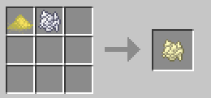

將樹苗放進發酵室可以獲得桐油

將原木跟桐油放進研磨機可以獲得防潮原木。

將含蜜的蜂巢放進研磨機可以獲得蜂蜜。

蜂蜜可用於釀造蜂蜜酒、與食物合成。

與食物合成後食用會恢復額外的耐力及獲得甜蜜效果，持續時間內獲得提高總傷害增加效果。

蜂蜜酒合成詳見烹飪技巧。

瓶裝蜂蜜：放入玻璃瓶\*1、蜂巢\*1，使用研磨機獲得。

將普通的含蜜蜂巢放進果汁機可以獲得蜂膠，用於合成完美蜂王漿。

任何女王蜂都可以合成為蜂王漿，用於合成完美蜂王漿或者配種用。

將對應的含蜜蜂巢放進蜂巢分離器可以獲的對應的物品。

完美蜂王漿:蜂蜜\*1、蜂王漿\*1、蜂膠\*1、花粉\*1、永恆之粉\*1、混沌之粉\*1、彩虹之粉\*1、智慧之粉\*1。食用後獲得攻擊力+1，40 為上限。

發酵室:放入鐵磚\*1、鐵錠(煉獄鐵錠)\*4、鐵棍\*2、齒輪\*2，使用工作檯獲得。

研磨機：放入熔爐\*1、鐵錠(煉獄鐵錠)\*4、鐵棍\*2、齒輪\*2，使用工作檯獲得。

果汁機：放入投擲器\*1、鐵錠(煉獄鐵錠)\*4、鐵棍\*2、齒輪\*2，使用工作檯獲得。

蜂巢分離器:防潮木板\*6、齒輪\*3

蜜蜂育種器: 防潮木板\*8、蜂王漿\*1

接下來就是我們養蜂技巧最重要的部分了(大概吧)

魔法金屬的女王蜂種類多達 37 種，其中最初階的八種在野外對應的地區可以找到普通、沼澤、叢林、魔法、下界、終界、冰雪、蘑菇，剩下的 29 種都必須自己配種!
(請愛用 NEI 或者 M3 百科否則配種一年可能還配不出來)

我們先使用花肥收集各種花朵。

將我們收集來的女王蜂放進我們的育種器裡頭，中間愛心上的機率代表配種成功率，蜂王漿美消耗一次會進行一次配種，配種時女王蜂有機率死亡，成功時就會誕生對應的幼蟲(女王蜂將會死亡)。

每一種女王蜂都會有對應的花用來提高(降低)成功率(正負 10%)

幼蟲後面的編號對應相對的女王蜂。

獲得新女王蜂建議先將其放置蜂箱工作，獲得更多對應的幼蟲。

### (五)養龍技巧

| 等級    | 敘述                                                    |
|---------|-------------------------------------------------------|
|LV : 2|增加馴服龍時的成功率|
|LV : 3|小幅加快龍族探險隊的速度|
|LV : 4|馴服龍時，永遠不會失敗|
|LV : 5|造成傷害提高 10%|
|LV : 6|從龍族探險隊獲得更好的獎品|
|LV : 7|更容易與龍提高親密度|
|LV : 8|增加食物對龍的工作時間時長|
|LV : 9|大幅加快龍族探險隊的速度|
|LV : 10|從龍族探險隊獲得最好的獎品，造成傷害提高 20%|
打倒影王龍後獲取冒險方塊後就能開始龍龍的冒險。

右鍵方塊後即可開啟冒險介面，每個區域會有對應屬性的，龍本身也有對應的技能跟等級都會影響收穫道具。

手持金屬蘋果餵食有機率訓服龍龍，龍龍的繁殖也是使用金蘋果餵食。繁殖以及訓服龍龍都能拿到龍幣到龍龍商店兌換物品。

前三個箱子分別是，黃金龍箱、錢幣龍箱、靈力龍箱。餵食龍龍肉類食物，龍龍會進入工作狀態(不管趴下或是站者)替你去收集對應龍箱的物品，收集的效率會被親密度、種類、技能所影響，同時多個箱子會降低收集效率。

(把影王龍打到殘血之後可以用附魔金屬蘋果馴服)

### (六)寶石工藝

現在寶石工藝所涵蓋的寶石種類共有 25 種，每一種寶石都可以在大地礦坑世界的深度豐富寶石礦挖掘得到，或者是使用[黑暗轉換](#%E9%BB%91%E6%9A%97%E8%BD%89%E6%8F%9B-)來複製寶石。

將寶石與寶石分解劑合成可以獲得碎裂的寶石，下圖是寶石分解劑的合成圖與碎裂的海藍寶石合成圖。

接下來將 4 個碎裂的寶石放入寶石合成桌可以合成出一個晶狀的寶石。

除了碎裂的寶石升級時有機率失敗(失敗時返還 2 個碎裂的寶石)以外，其餘都是必定成功，且生成 2 個下一級的寶石。

寶石升級從低到高分別是碎裂-晶狀-剔透-精良-上等-絕佳-無暇-極佳-完美

而這些不同的等級的寶石都將會在寶玉的升級上面用到。

使用珠寶研磨機升級寶玉時可以獲得寶石工藝的經驗值與**硬幣**。

寶玉共有 3 種，分別是紅色、藍色、黃色，(紅色寶玉可以在部分 BOSS 獎勵箱獲得，藍色寶玉可以在亡靈古墓的箱子中隨機獲得，黃色寶玉可以在遠古銩遺跡的箱子中隨機獲得，最後還有亡靈古墓中的水道解謎有機率獲得 3 種寶玉)

未知的寶玉可以用珠寶鑑定桌鑑定，珠寶的鑑定需要耗費 60 秒，並且可以獲得寶石工藝的經驗值。

使用寶玉鑲嵌台可以將寶玉鑲嵌入武器上面或是將寶玉從武器上面撥離。

使用珠寶研磨機可以升級寶玉，不同種類、等級的寶玉所需要的寶石都是不同的

以下會介紹各種寶玉的效果
: 紅色寶玉 
: 可以賦予武器諸多特殊能力的強大寶玉(截至 602 版本共有 66 種不同的紅色寶玉)，共分三個等級
破碎-無暇-完美，不同等級的紅色寶玉會有不同的增強效果，下圖舉例完美與無瑕的增強差異。

黃色寶玉 
: 黃色寶玉為增強用寶玉，效果是增強玩家的爆擊傷害，共有 50 個等級，從等級 1 到等級 50，分別代表爆擊傷害+1%到爆擊傷害+50%。

藍色寶玉 
: 藍色寶玉也是增強用寶玉，不過有分物理藍色寶玉和魔法藍色寶玉，共有 50 個等級，從等級 1 到等級 50，分別代表物理/魔法攻擊力+1 到物理/魔法攻擊力+50。

護石系統
: 護石是可以隨機在古代陵墓世界的箱子中取得或是在古代陵墓中的水道解謎中獲得，需要使用珠寶鑑定桌來鑑定，鑑定時可以從下面 5 種屬性中隨機取得 3 樣。

造成的傷害+1%\~+5%
物理攻擊力+5\~+15
魔法攻擊力+5\~+15
暴擊率+5\~+15
穿透值+1\~+3
護石共有分 4 種部位，分別是頭盔、盔甲、褲子、靴子

使用護石鑲嵌器可以將不同部位的護石鑲嵌到指定部位的防具上面

### (七)精鑄技巧

| 等級    | 敘述                                                    |
|---------|-------------------------------------------------------|
|LV : 2|提高所有成品的鍛造獎勵|
|LV : 3|減低鍛造時，耐久消耗的機率|
|LV : 4|減低鍛造時，鎚子的耐久消耗機率|
|LV : 5|防禦力提高 9 點|
|LV : 6|提高鍛造硬幣的掉落量，分解物品時將不會有損耗|
|LV : 7|鍛造武器成品，將永遠不會出現不對應的攻擊屬性前綴|
|LV : 8|鍛造成品將永遠不會出現垃圾前綴|
|LV : 9|提高所有成品的鍛造獎勵|
|LV : 10|提高鍛造成品出現神話的機率，防禦力提升 18 點|
精鑄合成為魔法金屬後期的裝備及武器製造系統。

基岩等級以上的武器跟裝備都需要透過精鑄合成來製作。

為了要進行精鑄合成，玩家需要
精鑄工作檯、金屬火爐、金屬鍛造砧(ㄓㄣ)、焊接台、磨石基座。

火爐以及鍛造砧都有 7 種金屬材質 :銅、鉛、鐵、鋼、鈦、鉻、鎢
從左到右最低級的材料是銅，最高級的材料是鎢
火爐的金屬材質越好，加熱速度最快
鍛造砧的金屬材質越好，可提升物品可敲打的次數，降低敲打時錘子耐久的消耗機率。

設備準備完成後就可以開始加工
首先打開精鑄合成台，點開旁邊的製作列表(這裡以基岩合金劍為例)，選擇欲製作的物件後按下確認選擇。

1. 製作基岩合金劍所需的材料列表

2. 製作基岩合金劍所需的金錢

3. 用來放置玩家身上的材料，當這欄中的材料足夠時才能夠開始製作

4. 用來放置鍛造大師的(武器、工具、防具)卷軸，製作時會自動消耗符合類型的卷軸，其效果是大幅提高出現傳說前綴的機率。

   製作完成後會獲得 未完成的基岩合金劍 此時要放入金屬火爐加熱
   

   未完成的裝備放上面，燃料放下方
   溫度以星數表示，最高 10 星，加熱後此階段完成
   取出後溫度會隨著時間逐漸散去，要注意進行接下來的步驟時都需要有溫度至少 1 星
   如果溫度全部流失了的話會無法進行程序，此時請重新放回火爐加熱
   接下來會進入精鑄合成最麻煩的部分，鍛造砧
   左側放入未完成的裝備，~~右側放任意戰槌(戰槌的材質不會影響鍛造結果，推薦用從傳奇箱中開出來的傳奇戰槌，其耐久值十分的高)~~
   5\. 7.5 後須使用鍛造鋼槌鍛造。

   

5. 8 個不同的鍛造操作，紅色的是將黃色指標往左側移動，藍色的是將黃色指標往右方移動，每一個按鈕所移動的間隔都不相同。

6. 黃色為目前敲打的指標，紅色為目標，必須將黃色指標敲到跟紅色指標完全重疊才是鍛造成功

7. 下方(5.)的 7 格中至少要有三格是這三種特定操作

8. 耐久條，每操作一次就會損失耐久條，當耐久條歸零時會鍛造失敗，未完成的裝備會變成破銅爛鐵
   。

9. 操作時會從 1\~7 格分別顯示你所選擇的操作，後面的操作會覆蓋前面的操作，比如說我執行了 8 個操作，那畫面上從 1\~7 格分別會顯示我第 2\~8 個操作，以此類推。

   鍛造完成後會獲得第二階段的裝備
   將第二階段的裝備放入焊接台的左側，右側放焊接粉進行焊接(焊接粉的種類並不會影響成品)

   

   焊接完成後會獲得第三階段的裝備

   最後將第三階段的裝備放入磨石基座左側，右側放入磨石

   

   裝備就大功告成了

   

   裝備會隨機附上一個前綴詞，不同的前綴詞有著不同的能力加成。

-   無鍛造效果

    -   平凡

    -   標準

    -   正常

    -   普通

-   造成傷害 -10%

    -   破爛

    -   碎裂

    -   粗糙

    -   破損

    -   垃圾

-   挖掘速度提高 30%,掉寶率提高 30%

    -   神聖

-   防禦力提高 5 點,迴避值提高 4 點 (防具)

    -   神話

-   傷害提高 9%,暴擊值提高 8 點,穿透值提高 2 點 (武器)

    -   傳奇

-   掉寶率提高 30%、20%、10%

    -   祝福 30%

    -   祈禱 20%

    -   幸運 10%

-   挖掘速度提高 30%、20%、10%

    -   超速 30%

    -   極速 20%

    -   快速 10%

-   迴避率提高 6 點、4 點、2 點

    -   迅捷 6 點

    -   輕快 4 點

    -   輕盈 2 點

-   防禦力提高 7 點、5 點、3 點

    -   神盾 7 點

    -   堅固 5 點

    -   堅硬 3 點

-   物理近戰傷害提高 12%、8%、4%

    -   強大 12%

    -   強壯 8%

    -   強力 4%

-   物理遠程傷害提高 12%、8%、4%

    -   迅猛 12%

    -   準確 8%

    -   精準 4%

-   魔法攻擊傷害提高 12%、8%、4%

    -   魔導 12%

    -   神秘 8%

    -   神奇 4%

-   暴擊率提高 12 點、8 點、4 點

    -   暴怒 12 點

    -   狂暴 8 點

    -   暴力 4 點

-   傷害提高 9%、6%、3%

    -   惡魔 9%

    -   鋒利 6%

    -   尖刺 3%

溫度並不會影響前綴詞，純粹人品問題

### (八)烹飪技巧

| 等級    | 敘述                                                    |
|---------|-------------------------------------------------------|
|LV : 2|小幅提高烹飪鍋料理的美味度|
|LV : 3|食用料理時，小幅增加效果持續時間|
|LV : 4|減低失敗料理的機率|
|LV : 5|最大魔力值提高 300 點|
|LV : 6|食用料理時，增加恢復的健康度|
|LV : 7|食用料理時，增加恢復的疲勞值|
|LV : 8|增加烹飪鍋料理的份量|
|LV : 9|食用料理時，大幅增加效果持續時間|
|LV : 10|大幅提高烹飪鍋料理的美味度，最大魔力值提高 600 點|

#### 烹飪

通過烹飪可獲得料理，食用後可恢復生命值、飽食度、疲勞值、健康度，並獲得 buff，大幅提升屬性。

在副本中有機會找到傳奇料理的配方，食用後獲得更好的效果(傳說料理必須有配方才有機率製作成功)！
使用烹飪桌來製作**真。傳奇料理**，食用後還會獲得額外的 buff 如下
: 蘑菇奶油湯 - 鐵壁
黯然消魂飯 - 魔藥
王牌牛肉麵 - 看穿
番茄巧達湯 - 感性
牛肉羅宋湯 - 看穿
馬鈴薯燉肉 - 幸運
豬肉辣醬湯 - 毅力
提升料理等級時，可提升料理美味度、分量及傳說料理製作成功率，並降低出現失敗料理的機率。

準備好烹飪鍋、料理碗與打火石，即可開始烹飪。

放入相應的食材，並可放入調味料獲得額外加成效果，再使用打火石右擊烹飪鍋。

一段時間後右鍵打開烹飪鍋可獲得烹飪經驗與烹飪硬幣，並收穫料理。

正常烹飪時有機率出現噁心的失敗料理，配方不存在時必定出現失敗料理。

通過鹽田曬鹽，再與紙、魔法粉來合成基礎調味料粉，再一次合成獲得各種調味料。

使用調味金粉做為調味料，料理成品將不會腐敗。

可透過烹飪技巧商店購買飾品菜刀、料理刀，或是各種疲勞藥水、高級烹飪鍋、打火石。

#### 釀造

手持材料右鍵放入釀酒桶開始釀造，再次右鍵可以查看現時釀酒狀態。

釀造完成後，拿玻璃瓶右鍵釀酒桶即可裝取酒(該過程通常需要數個小時)。

每 8 個材料可釀造 1 瓶酒，向下取整。可釀造的酒及配方如下
: 沙瓦娜：蘋果
紅酒：葡萄
白蘭地：草莓
威士卡：小麥
龍舌蘭：龍舌蘭草
蜂蜜酒：蜂蜜
琴酒：甘蔗
伏特加：馬鈴薯
酒的最大堆疊為 4，營養價值為 10，飲用後可補充 500 點水量並獲得 120 秒的酒精 buff。

使用每種酒 1 份+1 個賢者之石可無序合成為仙饌蜜酒，飲用後，將獲得 120 秒的酒精 buff 並提升 100 點最大魔力，最多可提升 10 次。

注意：短期內飲用超過 6 次酒會導致死亡。

### (九)裁縫技巧

| 等級    | 敘述                                                    |
|---------|-------------------------------------------------------|
|LV : 2|小幅減少背包的耐久消耗機率|
|LV : 3|提高紡織獲得的生產經驗量|
|LV : 4|中幅減少背包的耐久消耗機率|
|LV : 5|最大疲勞值增加 150 點，最大負重增加 30 點|
|LV : 6|完成的皮革收穫量小幅增加|
|LV : 7|提高紡織獲得的經驗量|
|LV : 8|大幅減少背包的耐久消耗機率|
|LV : 9|完成的皮革收穫量大幅增加|
|LV : 10|最大疲勞值增加 300 點，最大負重增加 60 點|

要開始裁縫首先需要大量的線，目前最有效取得線的方法是種植棉花，棉花種子可以在農耕商店中買到，棉花可以用來合成棉繩(棉花布料材料)，而棉繩則可以合成線(絲綢布料材料)。

紡車的介紹 
: 紡車是一種可以將各種線製成對應紗線的設備，界面如下

在左側的格子中放入材料，紡車就會自動運行，約 4.15 秒即可完成一次紡織。

通過紡車可以製作出紗線、金紗線、魔法紗線和棉紗線。

紡車每次執行都將提供 3 點紡織經驗，右鍵打開界面時將獲得。

1. 6\.2 版本開始，每次執行還會獲得 1 個紡織硬幣。

#### 織布機的介紹

織布機是一種可以將各種紗線製作為對應布料的設備，界面如下

在上方的格子中放入材料，設備就會自動開始運行，經過 10 秒即可製作完成。

通過織布機可以製作絲綢布料、棉花布料、魔法布料、金布料、混合紡織布料、魔法絲綢、終界魔布、羊毛布料、蠶絲布料和傳說絲綢。

織布機每次執行都將提供 3 點紡織經驗，右鍵打開界面時將獲得。

1\.6\.2 版本開始，每次執行還會獲得 2 個紡織硬幣。

#### 曬皮架介紹

擊殺動物可以取得生皮，將生皮蹲下右鍵放在地板上接著拿任意匕首(夜行者的武器)對著生皮按壓右鍵可以獲得刮製的皮革，接著將刮製的皮革對著裝著水的鍋釜右鍵即可得到浸泡的皮革，最後將浸泡的皮革右鍵曬皮架

可以將浸泡的皮革掛上曬皮架，等待 10 分鐘後即可右鍵取得完成的皮革。

完成的皮革的取得數量取決於玩家的裁縫等級，5 級及以下為 4 個，6 級至 8 級為 5 個，9 級及以上為 7 個。

收穫完成的皮革時可以獲得裁縫經驗值。

#### 蠶寶寶的介紹

可在裁縫技巧商店使用 250 紡織硬幣購買。

蠶寶寶被放置時為未餵養狀態，手持任意樹葉右擊蠶寶寶，即可變為生產狀態，消耗 1 個樹葉。

生產狀態下經過一段時間即可轉變為收穫狀態，時長隨機。

右擊收穫狀態的蠶寶寶即可收穫 2-4 個蠶絲，並退回未餵養狀態。

蠶寶寶方塊的三種狀態如下

如果玩家在過程中破壞了蠶寶寶方塊，進度將會被保存。

#### 衣物成型桌的介紹

衣物成型桌是可以製作精緻編製衣物飾品的設備，可用於製作精緻編織斗篷/圍巾/襪子，界面如下

在左側的格子中放入材料，點擊開始紡織，就會開始修補絲線的小遊戲。

單擊斷裂的絲線即可將其變為完整的絲線，同時使積分+1；若單擊了完整的絲線，則會將其變為斷裂的絲線，同時使積分-1。

當前頁面的絲線全部修補完畢後，積分+10，同時重新生成一頁絲線。

小遊戲共持續 20 秒，下方進度條滿後即可完成遊戲，在右側格子中產生成品，同時獲得 50 個紡織硬幣。

成形桌小遊戲可有多名玩家同時操作，類似於釀造融合台。

小遊戲的積分將會影響成品增加的屬性，小遊戲的積分上限是 200 分，每點積分可使該飾品的最大生命值+5，最大魔力值+5，如下

鑑定的屬性可以用重組寶珠重組。

### (十)釀造技巧

| 等級    | 敘述                                                    |
|---------|-------------------------------------------------------|
|LV : 2|使用生命藥水時，小幅增加恢復量|
|LV : 3|使用魔藥時，增加效果的時長|
|LV : 4|小幅增加釀造融合時限|
|LV : 5|生命恢復提高 16 點，魔力恢復小幅提高|
|LV : 6|小幅增加融合積分|
|LV : 7|增加釀造鍋的額外成品數量機率|
|LV : 8|大幅增加融合積分|
|LV : 9|使用生命藥水時，大幅增加恢復量|
|LV : 10|大幅增加融合時限，生命恢復提高 32 點，魔力恢復大幅提高|

使用進階釀造台、釀造鍋、釀造融合台時會獲得經驗，且有機率獲得釀造硬幣。

釀造硬幣可在釀造技巧商店內使用。(下方有詳細的釀造技巧商店介紹)

釀造技巧提高時可以提高藥水時間或提高產量。

高級釀造台:魔法鋼錠\*4、銅錠\*4、金磚\*1，使用魔法合成台獲得。

魔藥瓶：鐵錠(煉獄鐵錠)\*1、魔法粉\*1、玻璃\*3，使用工作檯獲得。

對水源右鍵可獲得裝水魔藥瓶。

用於釀造魔藥，在紅框內放入藥草(可重複)，藍框內放入裝水魔藥瓶，黃框內放入魔法粉，按下釀造即可獲得魔藥。

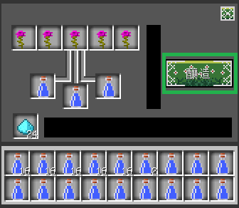

魔藥的效果與效果等級及持續時間取決於藥草的效果，將同樣的藥草疊加有機率提高效果等級或持續時間(也可能降低)。

部分藥草具有隱藏效果，請玩家自行探索。

釀造融合台:玻璃瓶\*3、魔法鋼錠\*2、普通釀造台\*1、石頭\*3，使用合成台獲得。

用於釀造秘藥，秘藥有更長的藥水持續時間和秘藥效果，在紅框內放入魔藥，藍框內放入藥水融合劑，按下釀造，在釀造過程中進行消消樂小遊戲可以提高秘藥時效。

釀造融合臺右上方的格子中可放入時間增強劑與效果增強劑，每次釀造時各消耗一瓶。

時間增強劑可新增小遊戲時間 5 秒，效果增強劑可新增小遊戲初始積分 10 分。

藥水融合劑:賢者之石\*1、糖\*1、魔法粉\*1、螢光石粉\*1、紅石粉\*1、烈焰粉\*1、紙\*1，使用合成台獲得。

飲用秘藥會獲得秘藥效果，持續期間內會獲得全能力大幅提升、職業經驗獲取量+10%的效果。

釀造鍋:鐵錠(煉獄鐵錠)\*7、魔法粉\*1，使用工作檯獲得。

將同種類型藥草以 Q 鍵(預設值)投入釀造鍋內，並手持釀造瓶右擊釀造鍋來製得藥水。(以黃色藥草為例)

藥草種類取決於詳細說明而非藥草圖示，請詳閱說明。

釀造瓶(此處合成範例為大型釀造瓶)
: 魔法粉\*1、原版玻璃瓶\*1、玻璃\*5

使用工作檯獲得。

釀造瓶大小取決於玻璃的數量，最小值為 1，最大值為 5。

不同大小的釀造瓶在製得藥水時，獲得的釀造經驗與釀造硬幣不同，且消耗的溶液量與獲得的藥水的大小也不同。

釀造瓶大小影響藥水效果、需求等級。

共有五種藥水效果，分別為
 
-   紅色藥草(hp 藥水)

-   藍色藥草(mp 藥水)

-   黃色藥草(疲勞藥水)

-   綠色藥草(飽食藥水)

-   白色藥草(混合藥水，綜合上述藥水效果)

-   黑色藥草(無效果，無法從釀造鍋取出成品)

釀造商店

釀造商店建議兌換之物品

托米爾的黃金試管組，穿戴後提高造成傷害 10%、最大疲勞值+300。(建議直接兌換最高階之黃金試管組。)

托米爾的黃金釀造鍋，可使藥水產量額外+2，銀釀造鍋為+1，但不會增加釀造硬幣的獲得量。

## 四、副本

萬象神廟又稱地下城，自然生成於主世界，玩家可以從中獲得大量經驗與豐富的寶物，或是值錢的寶藏。

目前共有 11 種地下城，它們的玩法、敵人、boss 都不同，進入時需要的職業等級也不同，玩家可透過觀察萬象神廟柱子的裝潢或是傳送柱的圖示來判斷。

空手右擊傳送柱最下方的格子可查看當前地下城的重繪情況。

地下城共有 4 種難度，每種難度需要的穿透值基數不同，也會影響怪物的血量、經驗，以及寶箱、BOSS 獎勵箱的品質。

手持資料右擊即可進入，每次消耗 1 個資料。

-   簡單：金錠(穿透值 1)

-   普通：下界之星(穿透值 3)

-   困難：賢者之石(穿透值 6)

-   地獄：黑暗碎片(穿透值 10)

玩家穿透值不足時，造成傷害將會減半(部分特殊副本中減傷將會更多)。

不同地下城的穿透值倍率如下(小數點部分將被捨去)
:   (5 等級需求) 火焰神殿:\*0.5，即 0/1/3/5。

    (10 等級需求)水之宮殿:\*1.0，即 1/3/6/10。

    (15 等級需求)自然神殿:\*1.2，即 1/3/7/12。

    (20 等級需求)寒冰神殿:\*1.5，即 1/4/9/15。

    (25 等級需求)沙漠迷城:\*2，即 2/8/12/20。

    (30 等級需求)骷髏地窖:\*2.5，即 2/7/15/25。

    (35 等級需求)黃金神廟:\*3.0，即 3/9/18/30。

    (40 等級需求)失落聖殿:\*3.5，即 3/10/21/35。

    (45 等級需求)白蛇神廟:\*3.8，即 3/11/22/38。

    (50 等級需求)薔薇高塔(固定)：40。

    (55 等級需求)薔薇要塞:\*5.0，即 5/15/30/50。

    (60 等級需求)天空高塔:(固定)：混沌黑龍 40，炙焰鳳凰 60，星辰之龍 80，赤血惡龍 100，艾莉西亞 130，鏡中夢魘 135。

    (70 等級需求)大地神殿:\*5.5 穿透值要求為 5/16/33/55
    (80 等級需求)機關神廟:跑庫副本，無穿透值要求。

    (85 等級需求)白蛇書庫:\*6.0 穿透值要求為 6/18/36/60
    (90 等級需求)戰神神殿:\*6.5 穿透值要求為 6/19/39/65。

    (95 等級需求)末日要塞:(固定):170
    (100 等級需求)英雄聖殿:\*7.0 穿透值要求為 7/21/42/70

每個副本都存在 BOSS，且在 BOSS 存活時玩家無法離開副本。擊殺 BOSS 時，所有對 BOSS 有造成過傷害的玩家都將獲得獎勵箱，數量根據掉寶率最高的玩家來計算。

小知識
 
-   大部分地下城都有跑酷房間，有些入口比較隱蔽。跑酷房間的獎勵品質會優於一般寶箱。

-   地下城中除武器、背包、食品外，幾乎無法使用其他道具。創造模式則不會受到此限制。

-   玩家在地下城死亡後不會掉落物品，且會重生在地下城起點。

-   地下城怪物有專屬的戰利品掉落，比一般的戰利品更值錢。

-   ~~如果有玩家在地下城中出現過掉線的情況，則無法獲得 BOSS 獎勵箱，需要重啟伺服器後才可正常獲得。~~

-   地下城重繪時間預設為 60 分鐘(72000tick)，從玩家右擊進入時開始計算。可在 config 檔案中找到 DungeonResetTime 來修改，單位為 tick。

-   可通過修改 config 檔案中的 SpawnProbability_Dungeon 來調整地下城距離，值越大則生成間距越大。

## 五、世界

#### 遠古銩遺跡

相關道具
遠古銩遺跡魔杖合成公式

 銩錠、鑽石。

遠古銩遺跡傳送門框架合成公式

銩粒、青金石、[符紋鋼](#%E7%AC%A6%E7%B4%8B%E9%8B%BC-)。

兩樣物品做完後，將框架擺成地獄門架構，並使用魔杖對下方兩塊其中一塊的頂面點一下，即可開啟遠古銩遺跡世界。

 亡靈古墓世界

#### 區塊型無限迷宮

相關道具
金-地獄之星合成公式

魔法粉錠、金磚、地獄之星。

亡靈古墓權杖合成公式

基岩合金錠、金-地獄之星。

亡靈古墓門框合成公式

基岩合金錠、金磚、金-地獄之星。

權杖與框架做完後，將框架擺成地獄門架構，並使用魔杖對下方兩塊其中一塊的頂面點一下，即可開啟亡靈古墓世界。

#### 天界

相關道具
天界魔杖\

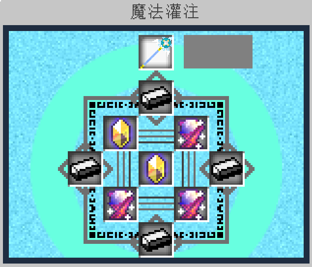

[黑暗鋼](#%E9%BB%91%E6%9A%97%E9%8B%BC%E9%8C%A0-)、賢者之石、神祕寶石，並透過魔法灌注製作。

右鍵使用後，魔杖將會生成一座天界傳送門，並且損壞消失。

成功開啟傳送門的時候，在聊天視窗中對你發送
: 「通往天界的傳送門出現在蒼芎之中...」這樣的一段訊息。

由於魔杖是無條件在 y+60\~y+68 的範圍內生成傳送門，傳送門的架構為 8x8x9(長寬高)，所以請確保頭上有足夠空間讓它建築。

#### 遠古世界

遠古世界是當玩家打敗凋零至尊，進入奧哈立爾鋼時代之後可以進入的世界。

玩家首次打開凋零至尊獎勵箱時會獲得時間核心，時間核心每個玩家只能獲得一次，時間核心能夠用來合成時間機器，合成圖如下。

需要 4 個宇宙能量錠、2 個彩虹鑽石、2 個時間沙漏以及 1 個時間核心。

造出時間機器之後可以拿來加速設備([時間機器用法](#%E6%99%82%E9%96%93%E6%A9%9F%E5%99%A8-))，或是拿古老鑰匙右鍵時間機器開啟遠古世界傳送門。(古老鑰匙擊殺凋零至尊獲得)

目前的版本敲掉上圖的傳送門時會掉落時間核心。

遠古世界傳送門 非 常 吵 建議放置離家一點距離。

遠古世界是個原始的生態系，只有黑夜(即使光源充足並且使用抵抗水晶依舊會自然生成遠古世界怪物)，怪物等級大約落在 45\~50 等。

地下會生成銻礦，需要使用挖掘等級 30 的稿子才能採集(覺醒遠古銩稿子)

銻錠是合成許多強力飾品的必要材料。

遠古世界中的任何生物都會掉落混沌魔晶，是合成許多強力飾品的必要材料。

(由於任何生物都會掉落混沌魔晶，建議玩家在遠古世界放置惡魔水晶召喚主世界的怪物或是砸一堆蛋靠屠殺雞來刷混沌魔晶)

#### 大地礦坑

用 5 萬礦幣在採礦商店購買大地之門核心，合成傳送門後使用，合成圖如下。

大地礦坑是個充滿礦物的世界，大多數基本的礦物都能在此取得，而且名稱前方有深度豐富字樣的礦物都能燒出平常的 10 倍的產量。

第一層是鵝卵石層，充滿鵝卵石。

第二層是石頭層，充滿石頭。

第三層是輝長岩層，充滿主世界的基礎金屬，包刮深度豐富(銅、鐵、鉛、銀、鎢、鋅、鈷、鈀)礦。

第四層是板岩層，充滿深度豐富寶石礦，會隨機掉落主世界的寶石礦。

第五層是細晶岩，充滿主世界的傳奇礦，包刮深度豐富(泰坦、山銅、碧鋼、硫銅、奧鋼、虹鋼)礦。

第六層是含金流紋岩，充滿地獄的傳奇礦，包刮深度豐富(秘銀、魂鋼、玄鐵、精金、聖銅)礦。

第七層是豐金玄武岩層，有奇蹟之粉礦、世界精華礦、暗影秘金礦。

(玩家剛進大地礦坑會出現在第五層)

#### 古代陵墓世界

區塊型無限迷宮。

有兩種生物，一種是古代木乃伊，等級範圍為 70\~75，
怪物生命為 9000+(怪物等級)，面板傷害為 869，大地屬性，
手上會持各種職業的武器。

另一種為影魔，不要問為什麼會有，我也不知道。

相關道具 真-地獄之星

金-地獄之星、鉑磚、魔法粉錠。

古代陵墓魔杖

安普洛斯天空力量錠、真-地獄之星
陵墓金鑰

地獄之星、金錠 (備註：無論是擺成 ↖ 還是 ↗ 都能合成出來。)

金磚、真-地獄之星、陵墓金鑰

權杖與框架做完後，將框架擺成地獄門架構，
並使用魔杖對下方兩塊其中一塊的頂面點一下，即可開啟古代陵墓世界。

#### 混沌石世界

 沒有取得方式，僅能透過創造模式獲得，該道具為魔法金屬前置模組 Muya 產生。堆疊上限為 64，右鍵使用後會消耗，並把玩家送至混沌石的內部世界。

進入混沌石世界時，x 與 z 必定為 0，再使用一次混沌石會離開世界，並回到主世界重生點上。該世界為永晝，世界內只有無盡的草原與史萊姆，等級範圍為 10\~15。

地表上會生成魔法金屬的藥草花、魔法花、小石頭、原版橡樹、原版花、南瓜。

地底下也會自然生成礦物。

#### 無垠深海

在釣魚商店用 50000 釣魚硬幣兌換

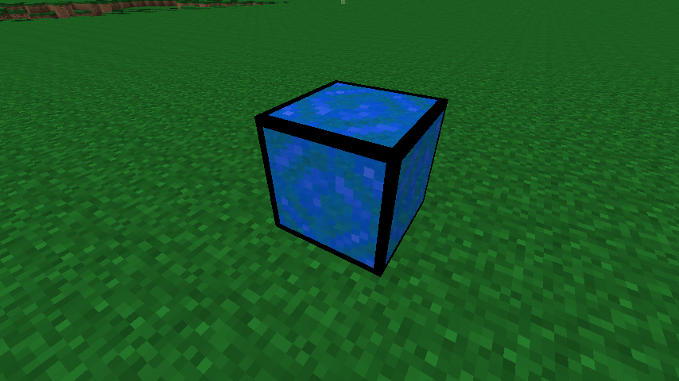

龐大的海世界，目前只有釣魚的作用，一些限定種類的魚在無垠深海才釣的到。

#### 遠古秘林

遠古秘林傳送門需要 9 個未活化遠古秘林傳送方塊及 16 個遠古秘林門框

水平擺好之後使用聚魔法杖右擊正中間的未活化遠古秘林傳送方塊即可打開前往遠古秘林的大門。

遠古秘林裡面像翻版的地獄，叢林石替代了地獄石，頂部的螢石被古代螢石替代且極為密集，生長著大量的常春藤，底下的岩漿海被湛藍之泉替代。

世界內部有石英組成的地獄要塞，建築其上會生成地獄的怪物。

遠古秘林為 85 級玩家的練等世界，其中有秘林樹魔，老樹妖，秘林魔蛛等怪物。

擊殺遠古秘林的怪物有機率獲得原初碎片，原初碎片能用於合成幻金系列飾品。

遠古秘林內會自然生成紫晶洞、深鐵礦(採礦等級 40)、劇毒晶礦(採礦等級 45)、幻金礦(採礦等級 45)。

世界各處生長著橡樹，地表覆蓋著大量的杜鵑、古代蕨、捲曲草。

#### 終界

除了找尋原版 minecraft 生成的終界祭壇之外，在魔法金屬模組中還可以建造仿造終界祭壇，仿造終界祭壇有著跟原版終界祭壇相同的效果。

仿造終界祭壇結構如下圖所示

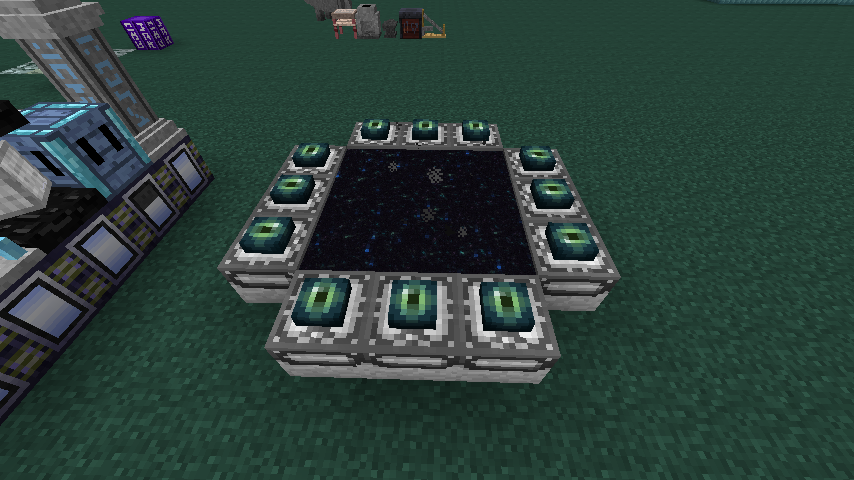

要注意仿造終界祭壇有特定的放置方向，目前已知的是玩家站在中間放置一圈的仿造終界門框然後放上終界之眼可以成功開啟終界門。

進入終界之後看不到終界龍屬於正常的現象，要召喚終界龍需要將黑暗召喚台搬到終界後才可以召喚，
要從終界回到主世界需要合成終界糖果，用 1 個龍石、1 個龍木、3 個歌萊果合成，使用終界糖果即可回到主世界。

#### 豐饒之地

在農耕商店用 50000 農耕硬幣換到
生長者大量的紫羅蘭樹木，地表會自然生成甜瓜、鑽石莓、金甘蔗、銀竹
地表生成的園藝草及開花園藝草可大幅加快作物的生長速度，並且豐饒世界為永晝，所以不會有怪物生成。

#### 末日城

末日城傳送們需要至少 10 個末日個末日城門框，按照地獄門的樣式擺好後用末日城之杖開啟。

## 六、BOSS

玩家進入法力金屬時代後，可以開始挑戰魔法金屬的各個 BOSS，從基岩錠開始，每一個階段的法力合金皆有一個 BOSS 可以召喚。

擊倒 BOSS 可以獲得 BOSS 獎勵箱(會受到掉寶率及難度的影響，有機率能得到複數的獎勵箱)，BOSS 獎勵箱包含稀有素材、飾品、徽章以及當前階段的法力合金。

※擊倒 BOSS 的當下 BOSS 獎勵箱會自動出現在你的背包中，若擊倒 BOSS 的當下背包是滿的，BOSS 獎勵箱則會掉落在地板上
※玩家至少需要攻擊 BOSS 一次才會獲得 BOSS 獎勵箱
當 BOSS 死亡時，會掉落聖器以及藏寶箱(長期經營漠視不會掉落藏寶箱)。

※藏寶箱擁有 300HP，攻擊藏寶箱就會掉落獎勵
若頭盔附魔**解析**，則可以觀察到 BOSS 的詳細資訊，如下圖所示，
左邊三個為血量、物理攻擊力、M3 防禦點數(需求穿透值)，
右邊三個則是原版防禦點數、基礎移動速度、增傷。

#### ~~BOSS 召喚磚使用方法~~

~~首先將 BOSS 召喚方塊放置在符文石磚上面。~~
~~點擊右鍵即可召喚 BOSS，召喚 BOSS 的瞬間會導致畫面搖晃和打雷。~~
~~※此結構在遊戲內的魔法金屬辭典中的法術儀式-魔物召喚中有詳細記載~~
~~\-召喚前-~~

~~\-召喚後-~~

~~※召喚後的魔力水晶顏色會變淡，敲掉重放或是拿魔法粉對著失去顏色的魔力水晶按下右鍵即可再次召喚。~~

1. 0\.0 版本之後魔王召喚方法大改，上述是舊版的召喚方式

#### 魔物召喚台使用方法

要成功使用魔物召喚台首先需要準備一個魔物召喚台、8 個蠟燭(養蜂獲得)、24 個巫術符文(可前往遠古銩世界或是亡靈古墓獲得)，並且清出 25\*25 可看見天空的開闊場地，並且地板上不能有空洞(若是有特殊需求的話可以用地板門擋住，系統會判定為空洞已經被堵住)，否則會無法成功召喚。

手持相應的 BOSS 召喚材料可以右鍵魔物召喚台來將魔王訊息儲存至魔物召喚台中，之後只需消耗魔力水晶即可反覆召喚出已經儲存了訊息的魔王。(6.0.2 版本後即使拆除魔物召喚台已經登錄過的魔王資料依舊會儲存在該魔物召喚台之中)

各魔王的召喚材料與消耗的魔力水晶如下
: |魔王|召喚材料|所需魔力水晶|
|-|-|-|
|破壞神|大地守護石|8|
|死亡收割者|死亡水晶|8|
|影王龍|暗影龍晶|8|
|熔岩巨人|充滿火焰的結晶體|10|
|死亡天使|墮落枷鎖魔器|10|
|凋零至尊|君王的遺物|10|
|黑暗騎士|混沌結晶|16|
|暴風魔蛇|風暴之力|16|
|赤瞳魔龍|遠古龍魂|16|
|九頭怪蛇|充滿怪異氣息的石頭|20|
|符文巨人|符文刻印之石|20|
|蕎薇巨象|深紅咒術石|20|
|天空守護龍|天界守護結晶|20|

備註:以下魔王(破壞神-天空守護龍)為難度 0 血量，詳細血量倍率請看[百科](https://www.mcmod.cn/item/460644.html)

#### 破壞神

基岩階段的 BOSS 是破壞神。

為了召喚破壞神，需要製作大地守護石。

破壞神等級:20\~25 等(等級範圍內隨機)，血量 6500 ，屬性:魔法。

**攻略破壞神注意事項**

每過一段時間會召喚 2 個破壞神分身，等級會在 1\~10 之間分布，各屬性皆比本體弱，如下圖所示

當破壞神血量低於一定程度時，會召喚骷髏菁英來助戰。

當破壞神血量低於一定程度時，會施放詛咒，如下圖所示

#### 死亡收割者

黑暗鋼階段的 BOSS 是死亡收割者。

為了召喚死亡收割者，需要製作死亡水晶

死亡收割者等級 20\~25 等(等級範圍內隨機)，血量 9500，屬性:大地。

**攻略死亡收割者注意事項**

死亡收割者會在四周召喚 4 個守護水晶，守護水晶有 100HP，在所有守護水晶被打掉之前無法對死亡收割者造成傷害

死亡收割者會給予附近玩家壓力、飛行無效負面狀態。

#### 影王龍

闇血鋼階段的 BOSS 是影王龍。

為了召喚影王龍，需要製作暗影龍晶。

龍魂水晶可在終界挖掘取得

影王龍等級 20\~25 等(等級範圍內隨機)，血量 20000，屬性:暴風。

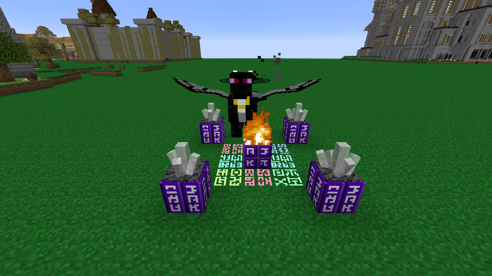

**攻略影王龍注意事項**

影王龍每隔一段時間會製造出附近玩家的分身攻擊玩家，名字叫做 player，外觀除了臉以外都跟該名玩家一模一樣，如下圖所示
(影王龍死去之後玩家的分身不會死去)

影王龍會給予附近玩家壓力 II、飛行無效負面狀態。

當影王龍的血量低於一定程度時，會進入暫時的無敵狀態。(背後多出五把劍)

當影王龍的血量低於一定程度時，會飛至空中並連續發射火焰彈，持續一段時間後會停止發射且降落。

當影王龍血量低於一定程度時，會召喚巨大黑暗法陣，若沒有在 60 秒內擊殺影王龍，附近玩家會受到 96500%重力傷害。

#### 熔岩巨人

紅蓮金屬階段的 BOSS 是熔岩巨人。

為了召喚熔岩巨人，需要製作充滿火焰的結晶體。

熔岩巨人等級 30\~35 等(等級範圍內隨機)，血量 40000，屬性:火焰。

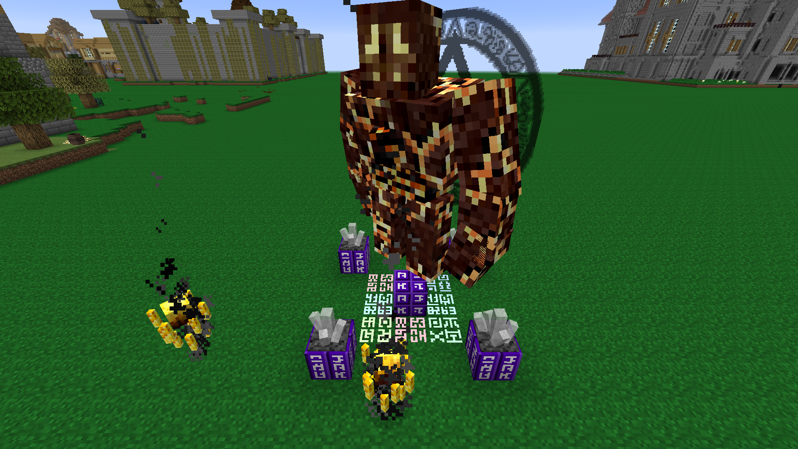

**攻略熔岩巨人注意事項**

熔岩巨人會給予附近玩家壓力 II、飛行無效負面狀態。

熔岩巨人會在周遭召喚烈焰神助戰。

熔岩巨人會破壞方塊，請玩家記得保護自家設備。(可以用/gamerule 開啟防爆防止破壞方塊)

熔岩巨人會召喚火焰魔法陣在玩家腳下，10 秒後對此區域造成 30%重力傷害。

熔岩巨人會不定期給予玩家遠古咒法負面狀態，會增加玩家 300%承受傷害。

當熔岩巨人血量低於一定程度時，會進入暴走狀態，外觀會變成紅色，且會從高處朝玩家連續發射傷害極高的火焰爆炸彈。地板上會有法陣顯示彈著點。

※熔岩巨人自身亦會受到火焰爆炸彈的傷害※

#### 死亡天使

無限鋼階段的 BOSS 是死亡天使。

為了召喚死亡天使，需要製作墮落枷鎖魔器。

死亡天使等級 30\~35 等(等級範圍隨機)，血量 45000，屬性:光明。

※死亡天使是唯一會掉落大地結晶的 BOSS※

**攻略死亡天使注意事項**

死亡天使會給予附近玩家壓力 II、飛行無效負面狀態。

死亡天使每隔一段時間會飛到空中召喚亡靈戰士助戰。

當死亡天使血量低於一定程度時，會給予自身和附近玩家同命效果，若玩家在有同命效果的狀態下擊殺死亡天使，玩家亦會死亡。

#### 凋零至尊

奧哈立爾鋼階段的 BOSS 是凋零至尊。

為了召喚凋零至尊，需要製作君王的遺物。

前期可以在主世界的遺跡找尋亡靈戰士、亡靈骷髏、凋零骷髏生怪專來刷凋零骷髏頭顱，後期則可以建造黑暗召喚台來大量召喚凋零怪。

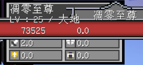

凋零至尊等級 30\~35 等(等級範圍內隨機)，血量 60000，屬性:大地。

※凋零至尊是唯一會掉落古老鑰匙的 BOSS※
**攻略凋零至尊注意事項**

凋零至尊的行為模式和凋零怪完全相同。(會破壞周遭的地形)

凋零至尊會給予附近玩家壓力 III、飛行無效負面狀態。

當凋零至尊血量低於一定程度時，會召喚兩隻被馴服的影王龍助戰，牠們和影王龍的行為模式完全相同。

#### 黑暗騎士

黑暗騎士是遠古銩遺跡的第一個 BOSS。

為了召喚黑暗騎士，需要擊敗凋零至尊取得古老鑰匙。

手持古老鑰匙對黑暗誓言點擊右鍵即可召喚。

或是製作渾沌結晶。(騎士團的徽記由擊殺影魔掉落取得)

黑暗騎士等級 30\~35 等(等級範圍內隨機)，血量 120000，屬性:黑暗。

**攻略黑暗騎士注意事項**

黑暗騎士會給予附近玩家壓力 IV、飛行無效負面狀態。

黑暗騎士會不定時在附近召喚超防守水晶，超防守水晶會每秒回復黑暗騎士 1000 點生命，超防守水晶如下圖所示。

當黑暗騎士血量低於一定程度時，會在玩家附近召喚大量強化異教騎士來助戰。

#### 暴風魔蛇

暴風魔蛇是遠古銩遺跡的第二個 BOSS。

為了召喚暴風魔蛇，需要擊敗黑暗騎士取得魔蛇之血。

將魔蛇之血丟入血池即可召喚暴風魔蛇。

或是製作風暴之力。(蘊含風之氣息的羽毛會隨機生成在遠古銩遺跡的箱子內)

暴風魔蛇等級 30\~35 等(等級範圍內隨機)，血量 200000，屬性:暴風。

**攻略暴風魔蛇注意事項**

暴風魔蛇會給予附近玩家壓力 IV、飛行無效、失手負面狀態。

當暴風魔蛇血量低於一定程度時會召喚守護羽蛇，玩家需要在戰鬥中保護守護羽蛇不被暴風魔蛇擊殺。

※若守護羽蛇死亡，暴風魔蛇會秒殺附近玩家且自動消失※

守護羽蛇的血條會出現在 BOSS 血條的下方，如下圖所示。

當暴風魔蛇血量低於一定程度時會召喚暴風無敵塔，暴風無敵塔會給予暴風魔蛇無敵狀態。

※暴風無敵塔免疫所有傷害，只能被守護羽蛇破壞。※

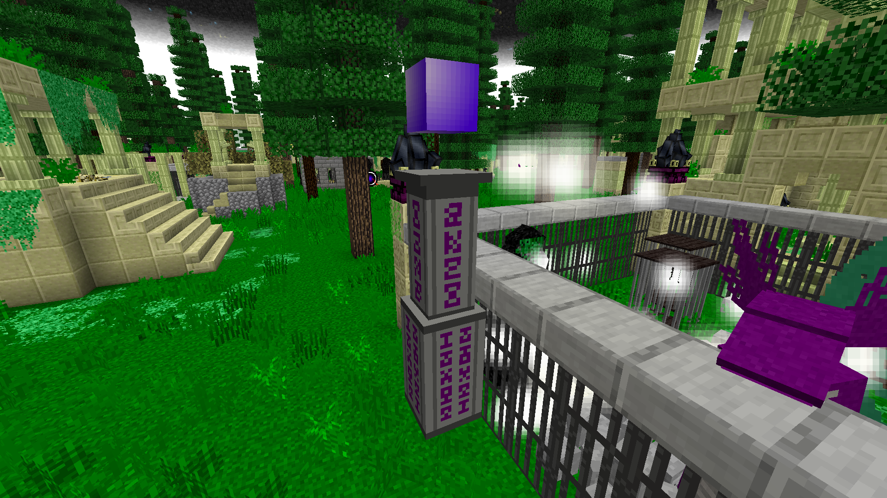

當暴風魔蛇血量低於一定程度時，會給予附近玩家破滅祈禱狀態，持續 60 秒。

※當破滅祈禱狀態結束時，玩家會直接死亡※
※5.1.7 版本更新後，玩家可以對守護羽蛇點擊右鍵來消除破滅祈禱狀態※
暴風魔蛇會在周遭製造出小旋風，被小旋風捲到的話會飛至高空。

#### 赤瞳惡龍

赤瞳惡龍是遠古銩遺跡最後一個 BOSS。

為了召喚赤瞳惡龍，需要擊敗黑暗騎士或暴風魔蛇取得黑暗碎片。

將黑暗碎片丟入血池即可召喚。

或是製作遠古龍魂。(混沌龍麟由深淵影王龍掉落)

赤瞳惡龍等級 35\~40 等(等級範圍內隨機)，血量 250000，屬性:閃電。

**攻略赤瞳惡龍注意事項**

赤瞳惡龍會給予附近玩家壓力 IV、飛行無效、失手負面狀態。

赤瞳惡龍會不定時召喚三種顏色的無敵塔，~~紅色無敵塔需使用物理攻擊破壞，藍色無敵塔需使用魔法攻擊破壞，黃色無敵塔需使用遠程攻擊。~~
現在能用任意攻擊破壞

#### 九頭怪蛇

九頭怪蛇是天界空島上的 BOSS(但是不一定要在天界召喚)

~~為了召喚九頭怪蛇，需要先擊殺赤瞳惡龍取得天空之鑰並且製作九頭怪蛇召喚方塊~~
為了召喚九頭怪蛇，需要擊殺暴風魔蛇取得 2 個黑暗暴風羽毛並且製作充滿怪異氣息的石頭

九頭怪蛇等級 40\~45 等(等級範圍內隨機)，血量 600000，屬性:大地。

**攻略九頭怪蛇注意事項**

九頭怪蛇會給予玩家壓力 IV、飛行無效負面狀態。

九頭怪蛇會不定期的施放光柱和黑柱，光柱需靠近柱子來避免受到傷害，黑柱須遠離柱子來避免傷害。

當九頭怪蛇血量低於一定程度時，會召喚六根藍柱和一根紅柱，並進入無敵狀態。

紅柱會有六種顏色和形狀皆不同的寶石，玩家須從各個藍柱中找出相對應顏色、形狀的寶石，放入紅柱中。

六種寶石皆配對完成後，即可消除九頭怪蛇的無敵狀態。

#### 符紋巨人

符紋巨人是天界空島的 BOSS(不一定要在天界召喚)

~~為了召喚符紋巨人，必須先擊敗赤瞳惡龍取得天空之鑰之後製作符文巨人召喚方塊。~~

為了召喚符紋巨人，必須先擊殺黑暗騎士取得黑暗徽記並且製作符文刻印之石。

符紋巨人等級 40\~45 等(等級範圍內隨機)，血量 600000，屬性:大地。

**攻略符紋巨人注意事項**

符紋巨人會給予玩家壓力 IV、飛行無效負面狀態。

當符紋巨人血量低於一定程度時，會召喚大量的符紋守護者來助戰，並召喚無敵防守水晶柱後進入無敵狀態。

無敵防守水晶柱擁有 10e 血量，使用水晶破壞之劍可以直接破壞無敵防守水晶柱。

每把水晶破壞之劍只能使用一次。

擊倒符紋守護者會獲得反魔法碎片，9 個反魔法碎片可以合成 1 個反魔法碎塊。

3 個反魔法碎塊可以合成一個水晶破壞之劍。

將水晶柱破壞之後，即可消除符紋巨人的無敵狀態。

#### 薔薇巨象

薔薇巨象是薔薇騎士團的 BOSS
為了召喚薔薇巨象，需要先製作薔薇十字軍傳送門，拿著古老鑰匙對著薔薇十字軍門按右鍵即可開啟薔薇十字軍傳送門，之後薔薇十字軍傳送門會持續的召喚出薔薇十字軍團成員，直到召喚出薔薇巨象後才會停止召喚更多增援。

或是製作深紅咒術石(血腥信標可由擊殺任意蕎薇系列怪物低機率取得，建議藉由蕎薇十字軍門召喚魁儡、攻城武器取得，掉落機率較高)

薔薇巨象等級 30\~35 等(等級範圍內隨機)，血量 400000，屬性:大地。

#### 天空守護龍

天空守護龍是天界空島的 BOSS。

~~為了召喚天空守護龍，需要先擊敗血腥魔像、符紋巨人、九頭怪蛇取得薔薇巨象之眼、符紋巨人碎片、九頭怪蛇魔晶並製作天空守護龍召喚方塊。~~

為了召喚天空守護龍，需要先擊殺赤瞳惡龍取得漆黑龍角並且製造天界守護聖晶。

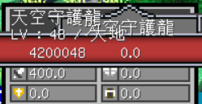

天空守護龍等級 45\~50 等(等級範圍內隨機)，血量 2000000，屬性:大地。

**攻略天空守護龍注意事項**

天空守護龍會給予玩家失手 II、飛行無效負面狀態。

當天空守護龍的生命值低於一定程度時，會變換型態(改變外觀顏色)並召喚兩顆隱形的真理水晶。

當真理水晶存在時，對天空守護龍造成的傷害都會降至 1。

攻擊天空守護龍時，有低機率會使天空守護龍掉落天空龍鱗，食用天空龍鱗會獲得短暫的看穿效果。

當玩家有看穿效果時，可以看見並對隱形的真理水晶造成傷害。

天空守護龍會使用黑洞彈，會吸引附近的玩家，若被吸引至黑洞彈的正中心，會受到 1000%重力傷害。

天空守護龍會使用光束噴射，持續造成約 25%重力傷害，站在實體方塊後面可以躲避此攻擊。

#### 瑪夏達巴

瑪夏達巴是黑魔法時代的 BOSS。

為了召喚瑪夏達巴，必須先擊殺天空守護龍取得薔薇高塔之鑰，然後對著薔薇高塔副本二樓正中間的那個方塊按右鍵即可召喚。

瑪夏達巴等級 50 等，血量 2000000(不同難度的 BOSS 血量不同)，屬性:黑暗，移動速度:0.25。

**攻略瑪夏達巴注意事項**

(薔薇高塔副本中召喚 BOSS 後所有人在內最多只能死 10 次，一旦死超過 10 次瑪夏達巴會消失)

##### 固有技能

落雷
: 瑪夏達巴瞬移至場地中間，並施放一圈落雷，落雷傷害與速度隨階段提高而增加。

重力球 
: 發射四波扇形重力球攻擊，傷害隨階段提高而增加。

連射 
: 在短時間內已極快的速度連發魔法球，傷害隨階段提高而增加。

狀態 
: 瑪夏達巴給予附近所有玩家壓力與飛行無效效果。

隨著瑪夏達巴的血量減少會出現 4 個不同的階段

**階段 1**

召喚水晶

: 瑪夏達巴召喚 4 個魔法防守水晶在場地四角，每顆水晶可發射重力球攻擊，且水晶存在時，瑪夏達巴獲得 25%減傷效果。

**階段 2**

失落之城

: 瑪夏達巴瞬移至場地中間，召喚巨大的光環在上方，每秒落下遺跡碎塊，碰撞碎塊會造成傷害，碎塊落地後會造成爆炸傷害。

沉默 

: 瑪夏達巴每間隔一定時間就會施放沉默術，給予附近玩家沉默效果。

**階段 3**

冰風暴

: 瑪夏達巴瞬移至場地中間並進入無敵模式，持續時間內以很快的速度落下極冰隕石，攻擊大範圍目標。

**階段 4**

黑暗力量

: 瑪夏達巴瞬移至場地中間並進入無敵模式，隨後召喚大量黑暗水晶與四個天空龍幻影，當水晶存在時，瑪夏達巴獲得 25%減傷效果。

##### 被動技能

動態仇恨
: 魔王將自動尋找攻擊力輸出高的角色做為目標(除非被嘲諷)。

反魔法 
: 魔王將使用反魔法收走玩家的終極武器。

##### 備註

- 瑪夏達巴是首個具有台詞的角色魔王。

- 瑪夏達巴的生命與攻擊力、等級將因為地牢難度而改變。

- 瑪夏達巴之戰使用的音樂是唯一的。

- 瑪夏達巴若被召喚在場地以外的環境，將無法召喚水晶、使用落雷.。

- 從故事上來看，瑪夏達巴並不是壞人，牠是被逼的。

#### 真瑪夏達巴

使用薔薇高塔之鑰和以太水晶合成後在薔薇高塔中心召喚。

真瑪夏達巴等級 56 等，血量 12000000

**攻略真瑪夏達巴注意事項**

(薔薇高塔副本中召喚 BOSS 後所有人在內最多只能死 10 次，一旦死超過 10 次真瑪夏達巴會消失)

除瑪夏達巴固有技能外，真瑪夏達巴還會施放其他技能。

1. 真瑪夏達巴將不定期向附近玩家施加劇毒的 debuff。

2. 真瑪夏達巴血量低於 50%後，將不定期向附近玩家施加 15 秒的失明及 60 秒的沉默 debuff。

##### 備註

3. 無論使用什麼祭品進入地下城，真瑪夏達巴始終為困難等級。

#### 混沌黑龍

混沌黑龍是拉普達階段的 BOSS，為了召喚混沌黑龍需要製作混沌黑龍魔晶，需要 1 個飛行石結晶、1 個乙太結晶以及 4 個黑暗碎片，且會消耗玩家的角色等級 200 等。

混沌黑龍等級 50 等

血量 4000000(不同難度的 BOSS 血量不同)

屬性:黑暗

穿透值要求:40

拿著混沌黑龍魔晶對著天空高塔副本正中間的方塊按右鍵即可召喚混沌黑龍。

**攻略混沌黑龍注意事項**

(天空高塔副本中召喚 BOSS 後所有人在內最多只能死 10 次，一旦死超過 10 次混沌黑龍會消失)

##### 固有技能

劇毒
: 召喚劇毒魔法球隨機散落在四周，地板上將會冒出劇毒泡沫，玩家踩到泡沫會受到劇毒效果。

重力球 
: 發射四波扇形重力球攻擊，傷害隨階段提高而增加。

連射 
: 在短時間內以極快的速度連發魔法球，傷害隨階段提高而增加。

混沌黑龍血量不同時會進入不同的階段

**階段 1**

黑暗連射 
: 混沌黑龍朝向一定的方向旋轉同時已極快的速度連發魔法球攻擊。

黑洞彈
: 混沌黑龍發射黑洞彈，黑洞彈巨有引力效果，並可以在撞擊時造成巨大傷害(1000%重力傷害)，持續 35 秒
**階段 2**

沉默魔晶
: 召喚沉默魔晶到場地正中間，沉默魔晶將給予玩家沉默效果，且沉默水晶擁有 120000 血量，破壞沉默水晶即可解除沉默效果。

追蹤彈 
: 瞄準目標連環發射寒冰追蹤彈攻擊。

**階段 3**

失落之城
: 召喚巨大的光環在上方，每秒落下遺跡碎塊，碰撞碎塊會造成傷害，碎塊落地後會造成爆炸傷害。

##### 被動技能

動態仇恨 
: 魔王將自動尋找攻擊力輸出高的角色做為目標(除非被嘲諷)

反魔法 
: 魔王將使用反魔法收走玩家的終極武器

#### 炙焰鳳凰

炙焰鳳凰是拉普達階段的 BOSS，為了召喚炙焰鳳凰需要製作炙焰鳳凰魔晶。

製作炙焰鳳凰魔晶需要消耗 1 個飛行石結晶、1 個乙太水晶以及 4 個安普洛斯天空力量錠，且會消耗玩家的角色等級 200 等。

炙焰鳳凰等級 50 等，血量 4000000(不同難度的 BOSS 血量不同)，屬性:火焰，穿透值要求:60。

拿著炙焰鳳凰魔晶對著天空高塔副本正中間的方塊按右鍵即可召喚炙焰鳳凰。

**攻略炙焰鳳凰注意事項**

(天空高塔副本中召喚 BOSS 後所有人在內最多只能死 10 次，一旦死超過 10 次炙焰鳳凰會消失)

##### 固有技能
火焰
: 召喚火焰魔法球隨機散落在四周，地板上將會冒出火焰，玩家踩到火焰會受到燃燒傷害，並且會獲得名為致命熔岩的 debuff，致命熔岩會使持有這個狀態的玩家受到的傷害極大幅提升。

重力球 
: 發射四波扇形重力球攻擊，傷害隨階段提高而增加
連射 在短時間內已極快的速度連發魔法球，傷害隨階段提高而增加

炙焰鳳凰隨著血量的降低會有 4 種不同的階段

**階段 1**

黑洞彈
: 發射黑洞彈，黑洞彈巨有引力效果，並可以在撞擊時造成巨大傷害，持續 35 秒
追蹤彈 瞄準目標連環發射火焰追蹤彈攻擊。

沉默魔晶
: 召喚沉默魔晶到場地正中間，沉默魔晶將給予玩家沉默效果，且擁有 120000 血量，破壞沉默水晶即可解除沉默效果。

**階段 2**

烈焰召喚 
: 召喚多個真\*烈焰神到附近來協助戰鬥
    
**階段 3**

不滅神焰
: 炙焰鳳凰進入無敵模式，並召喚滅焰神泉在附近隨機位置，玩家待在烈焰神泉的周圍能夠獲得名為火之剋星的 buff ，唯有持有火之剋星才能夠對炙焰鳳凰造成傷害，烈焰神泉擁有 50000 血量，注意烈焰神泉是可以被炙焰鳳凰破壞的，所以需要有玩家持續對炙焰鳳凰施展嘲諷避免烈焰神泉被炙焰鳳凰破壞。

**階段 4**

末日隕石
: 炙焰鳳凰在場地正中間召喚末日隕石，末日隕石會緩慢的下降直到擊中地面，造成 2000%重力傷害(基本必死)，末日隕石可以被攻擊並擊退(但是不能被投擲物擊退)。

##### 被動技能

動態仇恨 
: 魔王將自動尋找攻擊力輸出高的角色做為目標(除非被嘲諷)

反魔法 
: 魔王將使用反魔法收走玩家的終極武器

#### 星辰飛龍

星辰飛龍是拉普達階段的 BOSS，為了召喚星辰飛龍，需要製作星辰飛龍魔晶，需要 3 個不死鳥羽毛以及 3 個安普洛斯天空錠，合成圖如下。

星辰飛龍 70 等，血量 4000000 (隨著副本難度提升)，屬性 :黑暗，穿透值要求 :80
拿著星辰飛龍魔晶對著天空高塔副本正中間的方塊按右鍵即可召喚星辰飛龍。

(天空高塔副本中召喚 BOSS 後所有人在內最多只能死 10 次，一旦死超過 10 次炙焰鳳凰會消失)

**攻略星辰飛龍注意事項**

**固有技能**

致殘
: 星辰飛龍會不定時召喚大量黑色魔法球傘落在競技場中，當玩家接觸地板上的魔法球時，將會獲得**致殘**debuff，倒地時無法被救起，也無法使用免死金牌。

震懾 
: 星辰飛龍會不定時向玩家施加**抽搐**debuff，大幅降低玩家的迴避率。

**階段 1**

重力波
: 星辰飛龍發射四波重力球，造成大量傷害，並且隨著戰鬥階段的提升，傷害也會提高。

星星機關槍
: 星辰飛龍朝玩家快速發射大量的星形彈射物，有著強力的擊退效果，若是沒有抗擊退被打中就只能等死了。隨著戰鬥的階段提升，傷害也會提升。

**階段二**

末日隕石
: 星辰飛龍在場地正中間召喚末日隕石，末日隕石會緩慢的下降直到擊中地面，造成 2000%重力傷害(基本必死)，末日隕石可以被攻擊並擊退(但是不能被投擲物擊退)。

麻痺球
: 星辰飛龍不定時向 8 個方向施放多波黃色麻痺魔法球，玩家接觸到會受到大量傷害並且獲得數秒的**麻痺**debuff，期間無法執行任何操作。

黑色重力波
: 星辰飛龍有機率會朝玩家發射大量黑色重力球，傷害極高，而且伴有擊退效果，一般被打到 2\~3 發就死了。

#### 赤血惡龍

赤血惡龍是拉普達階段的 BOSS，為了召喚赤血惡龍需要製作赤血惡龍召喚水晶並且於天空高塔副本中召喚，需要星辰飛龍魔晶、混沌黑龍魔晶、炙焰鳳凰魔晶，合成圖如下。

赤血惡龍 75 等，血量 12000000 (血量隨著副本難度提升)，屬性 
: 黑暗，穿透值需求 : 100

(天空高塔副本中召喚 BOSS 後所有人在內最多只能死 5 次，一旦死超過 5 次赤血惡龍會消失)

**攻略赤血惡龍注意事項**

- 戰鬥中赤血惡龍將持續對玩家施加 2 級的**血之詛咒**debuff，血量低於 50%時，傷害-100%、爆擊率迴避率-30。

- 赤血惡龍會不定時召喚大量黑色魔法球傘落在競技場中，當玩家接觸地板上的魔法球時，將會獲得**致殘**debuff，倒地時無法被救起，也無法使用免死金牌。

- 赤血惡龍會連續發射大量的紅色魔法彈，玩家被命中後會獲得 30 秒的**劇毒**debuff。

   

- 赤血惡龍發射 5 波重力球，造成大量傷害，最後一波夾雜 3 顆特殊重力球，造成巨量傷害。

- 赤血惡龍每隔一段時間在玩家腳下召喚魔法陣，每次召喚 5 個，每隔 1 秒召喚 1 個，5 個法陣生成完畢 3 秒後將在法陣上觸發閃電，造成巨量傷害。

- 赤血惡龍連續發射魔法彈，造成巨量傷害，持續 30 秒，期間赤血惡龍處於無敵狀態。

   

- 當赤血惡龍生命低於 50%以下時，赤血惡龍將瞬移至中心並且呈現無敵狀態，此時戰鬥進入第二階段，在四周召喚 4 顆血之水晶，每顆血之水晶固定 400w 生命值，血之水晶每 2 秒發射一顆愛心，每顆愛心能夠為赤血惡龍恢復 1%最大生命值，血之水晶被摧毀或是在赤血惡龍生命值回滿時會自動消失，每場戰鬥只會觸發一次。

- 赤血惡龍第二階段開始會不定期召喚沉默水晶，對附近玩家施加**沉默**debuff，使玩家無法施放技能。

- 赤血惡龍第二階段開始將不定期向 8 個方向施放多波黃色麻痺魔法球，玩家接觸後會受到大量傷害並且獲得數秒的**麻痺**debuff，期間無法執行任何動作。

- 赤血惡龍從第二階段開始會有機率釋放黑洞，黑洞對玩家有非常大的牽引力，若玩家被吸到黑洞中，將會受到 1000%的重力傷害，通常必死。

- 當赤血惡龍生命值低於 10%時，會瞬移至中心並且呈現無敵狀態，同時在四周召喚 4 座鮮血高塔，鮮血高塔固定血量 800w，鮮血高塔生成 30 秒後赤血惡龍會施放終極技能，召喚無數雷霆，並且升成一顆下落速度較快，大地屬性，10 億生命值的終極重力彈，終極重力彈接觸地面時會爆炸，對在場全部玩家造成 2000%重力傷害，鮮血高塔在觸發終極技能之後會失去作用，每場戰鬥只會觸發一次。

#### 艾莉西亞

為了召喚艾莉西亞需要 6 個銀河能量碇、1 個斷裂染血劍、1 個飛行石、1 個赤血惡龍之皮來製造艾莉西亞召喚水晶並且於天空副本中召喚。

生命值：簡單：1200 萬，普通：2400 萬，困難：3600 萬，地獄：4800 萬。

(天空高塔副本中召喚 BOSS 後所有人在內最多只能死 5 次，一旦死超過 5 次艾莉西亞會消失)

**攻略艾莉西亞注意事項**

非二轉角色造成的傷害視為空手傷害，傷害固定為 1 點。空手傷害不會記入傷害列表，故而非二轉角色無法獲得艾莉西亞獎勵箱。

1.  艾莉西亞向玩家連續發射 5 波重力球，每波 5 顆，每顆造成 20%重力傷害，當艾莉西亞生命值低於 50%時，重力球傷害提升至 50%，重力傷害無法被迴避率屬性迴避。

2.  艾莉西亞向玩家發射大量紅色魔法球，艾莉西亞剩餘生命值大於 90%/50%/0%時，每顆魔法球造成 3200/3350/3950/點傷害，被命中後還會獲得 30 秒的劇毒 debuff。

3.  艾莉西亞生命值低於 90%後，有機率釋放，在玩家腳下召喚魔法陣，每次召喚 5 個，每格 1 秒召喚一個，5 個法陣生成完畢 2 秒後將在法陣上觸發閃電，造成 100000 點傷害。

4.  艾莉西亞生命值低於 90%後，有機率釋放，召喚大量跟蹤魔法彈，每顆造成 1200 點傷害。

5.  艾莉西亞生命值低於 90%後，有機率釋放，召喚大量黑色魔法球隨機散落在競技場中，玩家接觸地板上的魔法球時，將獲得 30 秒至殘 debuff，無法使用免死金牌，也無法被救起。

6.  艾莉西亞生命值低於 70%後，有機率釋放，瞬移至競技場中心，並在競技場內隨機位置召喚一顆誘餌水晶，會將玩家持續向誘餌水晶方向拉扯，誘餌水晶擁有 100 萬點生命值。

7.  艾莉西亞生命值低於 50%時，會瞬移至競技場中心並無敵 60 秒，此時戰鬥進入第二階段，在四周召喚 4 顆血之水晶，大地元素，血之水晶固定 100 萬生命值，每顆血之水晶每 2 秒發射一顆愛心，每顆愛心可以為艾莉西亞恢覆 1%最大生命值，水晶在摧毀或存在 60 秒後消失，每場戰鬥只會觸發一次。

8.  艾莉西亞生命值低於 50%時，有機率釋放，在競技場中心召喚一個艾莉西亞純金沙漏，艾莉西亞純金沙漏存在時，會向玩家持續施加沉默與抽搐 debuff，艾莉西亞純金沙漏擁有 30 萬點生命值(5.6.9 版本為 300 萬生命值)。

9.  艾莉西亞生命值低於 50%時，有機率釋放，瞬移至競技場中心，並環繞自身連續發射重力彈，造成 80%的重力傷害，持續 40 秒，期間艾莉西亞處於無敵狀態。

10. 艾莉西亞生命值低於 30%時，進入戰鬥第 3 階段，給予競技場內玩家 300 秒的癱瘓 debuff，每場戰鬥只會觸發一次。

11. 艾莉西亞生命值低於 30%時，有機率釋放，瞬移至競技場中心，並在腳下生成綠色魔法陣，對附近玩家持續造成大量傷害，每秒受到最大生命值 10%的傷害，持續 20 秒，施法期間艾莉西亞保持無敵狀態。

12. 艾莉西亞生命值低於 30%時，會頻繁釋放，向四周發射 8 顆麻痺魔法球，對接觸到的玩家造成 30%最大生命值傷害，並給予 2 秒的麻痺 debuff。

13. 艾莉西亞生命值低於 20%時，將瞬移至競技場中央，並在高空生成一顆末日隕石，隕石將緩慢下落，接觸地面時產生爆炸，對地下城內的所有玩家造成 200000%混沌傷害，並清除所有魔法物件。玩家可用劍等武器左鍵攻擊隕石來將其擊退至高空。隕石爆炸後，將會在高空立刻生成下一顆隕石，直到玩家擊敗 BOSS 或戰鬥失敗。

14. 艾莉西亞生命值低於 10%時，將瞬移至競技場中央並進入無敵狀態，同時在腳下生成黑色魔法陣，短時間後召喚 4 個時間守護者，時間守護者擁有 125 萬點生命值，擊敗艾莉西亞後，時間守護者也會消失。

15. 艾莉西亞生命值低於 5%時，將會持續恢覆生命值，每秒 2000 點，直到恢覆至 5%生命值或戰鬥結束。

#### 鏡中夢魘

召喚鏡中夢魘需要 1 個艾莉西亞召喚水晶+4 個阿達曼曼錠製造金光魔鏡在天空高塔中心召喚

生命值：簡單：1200 萬，普通：2400 萬，困難：3600 萬，地獄：4800 萬。

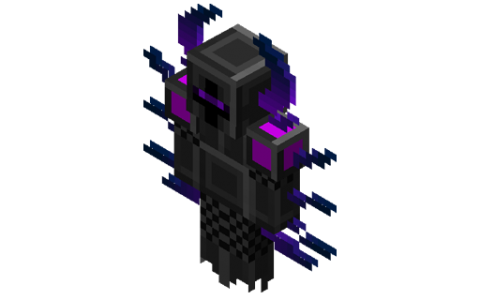

(天空高塔副本中召喚 BOSS 後所有人在內最多只能死 10 次，一旦死超過 10 次鏡中夢魘會消失)

**攻略鏡中夢魘注意事項**

非二轉角色造成的傷害視為空手傷害，傷害固定為 1 點。空手傷害不會記入傷害列表，故而非二轉角色無法獲得鏡中夢魘獎勵箱。

1. 鏡中夢魘被召喚時，競技場中央會同時生成一面[夢魘之鏡](https://www.mcmod.cn/item/554252.html)(初始為紅鏡)，隨著時間推移，夢魘之鏡會在紅、綠、藍、黑四種狀態間按順序循環切換，每 30 秒切換一次。

2. 鏡中夢魘對玩家發射大量紅色魔法彈，造成 2650 點傷害，同時給予玩家 30 秒的[劇毒](https://www.mcmod.cn/item/425688.html)DEBUFF。

3. 鏡中夢魘對玩家發射 5 顆扇形分佈的重力彈，對玩家造成 20%重力傷害。

4. 鏡中夢魘在 3 秒內每隔 1 秒召喚 3 座[鮮血高塔](https://www.mcmod.cn/item/459586.html)，鮮血高塔在 1 秒後爆炸，同時造成 1000 點傷害，並向四周發射 8 顆麻痺魔法球，造成 30%重力傷害同時給予玩家 2 秒[麻痺](https://www.mcmod.cn/item/438508.html)DEBUFF。

   夢魘之鏡夢魘之鏡(夢魘之鏡)

   查看編輯加合成表
   召喚 BOSS 鏡中夢魘的同時會在競技場中央生成夢魘之鏡，隨著時間推移，夢魘之鏡會在紅、綠、藍、黑四種顏色之間切換，每 30 秒切換一次。每次切換時會伴有雷聲並使玩家進入短暫的失明狀態，隨後 BOSS 瞬移至競技場中心。玩家可以右擊鏡子來與鏡子交互，根據鏡子狀態不同，會有不同的效果。鏡子的每個階段只能交互一次，切換時重設。

   夢魘之鏡擁有 100 點生命值，玩家無法對夢魘之鏡造成傷害。

###### 紅鏡

出現時
: 給予鏡中夢魘 90%傷害減免
在競技場上空生成一顆末日隕石，當隕石落地時會對競技場內玩家造成 200000%混沌傷害，玩家可以使用任意近戰攻擊將隕石擊退至高空，或使用箭矢擊退隕石，但效果極低。

在競技場周圍散佈大量紅色藥水雲，玩家觸碰後會獲得持續 5 秒的緩慢 Ⅲ
DEBUFF，藥水雲存在 45 秒。

(首輪紅鏡不會觸發)在競技場周圍生成一個紅色的法陣，同時對話欄出現提示**險惡的腥紅之力將會毀滅一切...**，法陣在 10 秒後爆炸，對法陣範圍內玩家造成固定 20000 點傷害，此傷害無法被防禦力，傷害減免等屬性減免。

交互後：給予玩家持續 180 秒的紅鏡 BUFF，提高 30%造成的傷害及 10%最終傷害。

存在時：持續給予玩家 2 秒的鏡像牢籠 DEBUFF，使玩家無法恢復生命值。

###### 綠鏡

出現時：清除競技場上空的末日隕石，同時生成一顆會持續追蹤玩家的綠色重力魔法彈，對玩家造成 40%重力傷害，魔法彈可以被生物阻擋。

在競技場周圍生成 4 顆夢魘魔種，夢魘魔種擁有 50 萬點生命值，若未在 15 秒內擊破，則夢魘魔種會變為鏡像收割者。

交互後：給予玩家持續 180 秒的綠鏡 BUFF，受到的傷害-30%，提高 10%最終傷害。

存在時：持續給予玩家 2 秒的鏡像牢籠 DEBUFF，使玩家無法恢復生命值。

###### 藍鏡

出現時
: 生成一個鏡中魔影，會對玩家進行攻擊與使用 BOSS 的部分特殊能力。

在競技場周圍生成一個藍色法陣，同時對話欄出現提示**閃光的湛藍之力將會守護一切...**，10 秒後對不處於法陣範圍內玩家造成固定 20000 點傷害，此傷害無法被防禦力，傷害減免等屬性減免。

交互後：給予玩家持續 180 秒的藍鏡 BUFF，提高 40 點攻擊力及 10%最終傷害。

存在時：持續給予玩家 2 秒的鏡像牢籠 DEBUFF，使玩家無法恢復生命值。

###### 黑鏡

出現時
: 清除鏡中夢魘的 90%傷害減免與鏡中魔影。

給予場內玩家 30 秒的癱瘓 DEBUFF。

交互後：回覆玩家 80%最大生命值。

結束時
: 玩家擁有紅鏡、綠鏡、藍鏡 BUFF 時，每擁有一個 BUFF 使 BOSS 挑戰次數-1。若沒有任何 BUFF，則 BOSS 挑戰次數+1。

清除玩家身上所有的鏡面效果。

#### 末日黑龍

使用金光魔鏡和 4 個黑洞頻率錠合成末日黑龍召喚水晶，在末日要塞的中心召喚。

生命值:簡單:1 億、普通:2 億、困難:3 億、地獄:4 億
(末日要塞副本中召喚 BOSS 後所有人在內最多只能死 10 次，一旦死超過 5 次末日黑龍會消失)

**攻略末日黑龍注意事項**

特殊能力(如果沒有特殊說明，更高階段也會使用更低階段的技能)

**階段 1**，被召喚時
 
-   末日黑龍存在時，每 5 秒使周圍玩家身上的[失手](https://www.mcmod.cn/item/424985.html)、[壓力](https://www.mcmod.cn/item/425627.html)、[抽搐](https://www.mcmod.cn/item/425707.html)DEBUFF 置為 200 秒。

-   末日黑龍對玩家發射五波扇形分佈的重力彈，每波 5 顆，每顆對玩家造成 100%[重力傷害](https://www.mcmod.cn/item/463250.html)。階段 7 開始，重力彈會變為紅色，造成的傷害增加為 200%重力傷害。

-   末日黑龍對玩家發射大量紅色魔法球，在第 1/2/4/5/8/10 階段每顆造成 6400/8500/10800/13600/16500/18500 點傷害，並給予 30 秒[劇毒](https://www.mcmod.cn/item/425688.html)DEBUFF。階段 6 至階段 8，末日黑龍不會使用此技能。

-   末日黑龍召喚 6 道雷電，造成 100 點傷害，並在每個雷電的落點生成光柱或黑柱，三秒後光柱對不在周圍的玩家造成 10000 點無法被防禦力減免的傷害，黑柱對周圍玩家造成 10000 點可以被防禦力減免的傷害。階段 6 至階段 8，末日黑龍不會使用此技能。

    **階段 2**，生命值低於 90%後
 
-   末日黑龍在原地釋放小型綠色魔法陣後瞬移至競技場中央，短暫延遲後發射一顆緩慢移動並持續追蹤玩家的魔法球，玩家被魔法球命中將直接死亡，魔法球存在 5 秒。此技能只會在**階段 2** 釋放

-   末日黑龍進入無敵狀態，瞬移至競技場中央同時腳下出現大型綠色魔法陣，持續 20 秒，每秒對競技場內玩家造成 18%最大生命值傷害，無法被防禦力等屬性減免。階段 7 與階段 8 的末日黑龍不會使用此技能。

    **階段 3**，生命值低於 80%後
 
-   末日黑龍瞬移至競技場中央並無敵 60 秒，同時給予周圍玩家 60 秒[沉默](https://www.mcmod.cn/item/425691.html)DEBUFF，周圍生成 8 顆[血之水晶](https://www.mcmod.cn/item/459587.html)，血之水晶擁有 100 萬生命值，每顆血之水晶每 2 秒發射一顆愛心，每顆愛心可以為末日黑龍恢復 1%最大生命值，水晶在摧毀或存在 60 秒後自動消失，每場戰鬥只會觸發一次。此技能觸發後，末日黑龍將不會使用任何技能，直到進入**階段 4**。

    **階段 4**，生命值低於 70%後
 
-   末日黑龍瞬移至競技場中央，並在競技場內隨機位置召喚一顆[誘餌水晶](https://www.mcmod.cn/item/497458.html)，水晶會將玩家的位置與準星持續向自身拉扯，誘餌水晶擁有 100 萬點生命值。

-   末日黑龍瞬移至競技場中央，並在競技場中心位置召喚一顆[沉默魔晶](https://www.mcmod.cn/item/443957.html)與隨機位置召喚一顆[誘餌水晶](https://www.mcmod.cn/item/497458.html)。沉默魔晶擁有 10 萬點生命值(此沉默魔晶不會降低玩家武器面板收益)。階段 6 至階段 8，末日黑龍不會使用此技能。

    階段 5，生命值低於 60%後
 
-   末日黑龍向周圍發射 8 顆麻痺魔法球，對觸碰的玩家造成 30%重力傷害並給予 2 秒[麻痺](https://www.mcmod.cn/item/438508.html)DEBUFF。

    階段 6，生命值低於 50%後
 
-   末日黑龍瞬移至競技場中央，並在競技場高空召喚一顆末日隕石，隕石將緩慢下落，接觸地面時產生爆炸，對地下城內的所有玩家造成 200000%[混沌傷害](https://www.mcmod.cn/item/493241.html)，並清除所有[魔法物件](https://www.mcmod.cn/item/527062.html)。玩家需使用左擊可以造成近戰傷害的物品或箭矢(效果極低)攻擊隕石來將其擊退至高空。隕石爆炸後，將會在高空立刻生成下一顆隕石。直到進入階段 8 或戰鬥失敗。

-   末日黑龍在競技場隨機位置召喚 8 座[鮮血高塔](https://www.mcmod.cn/item/459586.html)，鮮血高塔在一秒後爆炸，造成 1000 點傷害並向周圍發射 8 顆麻痺魔法球，對觸碰的玩家造成 30%重力傷害並給予 2 秒麻痺 DEBUFF。階段 7 開始，末日黑龍將不再使用此技能。

-   末日黑龍在競技場內隨機位置召喚一顆[深紅水晶](https://www.mcmod.cn/item/602934.html)，水晶擁有 10000 點生命值，並每秒減少 700 點生命值，水晶不會受到其它傷害，但是可以被玩家治療(如：[治療術](https://www.mcmod.cn/item/442574.html)，[覺醒秘銀豎琴](https://www.mcmod.cn/item/413399.html))，水晶死亡後對競技場範圍內所有玩家造成 15000 點傷害，此傷害無法被防禦力減免。水晶持續 40 秒後消失。

    階段 7，生命值低於 40%後
 
-   末日黑龍瞬移至競技場中心，清除玩家身上所有狀態效果並在競技場四角召喚 4 顆[古代傳送水晶](https://www.mcmod.cn/item/602788.html)，水晶每 20 秒召喚一隻[末日守護者](https://www.mcmod.cn/item/602789.html)，水晶擁有 5 千萬點生命值，每 30 秒損失略小於 1 千萬點生命值。水晶除了可以被常規手段傷害外，還可以被末日黑龍、末日守護者的魔法球與重力球傷害，或是被範圍治療手段傷害，受到等同於治療量 16 倍傷害。範圍百分比治療技能會為水晶恢復血量(如：[愈療之泉](https://www.mcmod.cn/item/440107.html))。

    階段 8，生命值低於 30%後
 
-   末日黑龍瞬移至競技場中心，並對周圍玩家施加詛咒，若玩家 55 秒內沒有解開詛咒將受到致命傷害。每場戰鬥只會觸發一次。[單人模式](https://www.mcmod.cn/item/471990.html)下末日黑龍不會使用此技能。

    

    階段 9，生命值低於 20%後
:    末日黑龍給予競技場內玩家 200 秒[癱瘓](https://www.mcmod.cn/item/490210.html)與[至殘](https://www.mcmod.cn/item/430381.html)DEBUFF。每場戰鬥只會觸發一次。

-   末日黑龍在玩家腳下召喚魔法陣，每次召喚 5 個，每隔 1 秒召喚一個，5 個法陣生成完畢 2 秒後將在法陣上觸發閃電，造成 100000 點傷害。

    **階段 10**，生命值低於 10%後
: 末日黑龍瞬移至競技場中心，並在競技場內隨機位置生成與競技場內玩家數量相同個數的聖器，每個聖器內含[黑龍無敵藥水](https://www.mcmod.cn/item/602899.html)\*1。在 25 秒後在競技場正上方高空召喚一顆[終極重力彈](https://www.mcmod.cn/item/462384.html)。每場戰鬥只會觸發一次。

## 七、魔法科技

當玩家挖到鑽石之後即可開始進入魔法科技，一開始要先製作魔法合成台，合成表如下。

魔法合成台是製作大部分魔法設備的基礎，製作設備時需要魔法充能，充能的方式可以在下方放置魔法粉或是在魔法合成台旁邊放置魔法能分享石碑。

合成出魔法合成台之後下一步是用魔法合成台做出魔法注入器，合成表如下(建議安裝 NEI 方便查詢合成表)

魔法注入器可以用來製作一些材料或特殊配方，運作原理類似熔爐，不過不同的地方在於魔法注入器需要魔法能來啟動，充能方式除了放魔法粉或其他變種材料在下方之外還可以用魔法能分享石碑。

運用魔法注入器取得魔法鵝卵石以及魔法木板之後，可以製作出下一個功能性設備金屬分離器，合成表如下(建議安裝 NEI 方便查詢合成表)

金屬分離器是魔法金屬中最重要的設備之一，它可以將多餘的金屬錠分解成金屬能量。

金屬能量分為初級、中級、高級、特級、超級、終極以及究極，可以將九個在合成台上重疊後製作成下一個階段的金屬能量，也可以向下分解，如下圖所示。

可推出 1 個究極=9 個終極=81 個超級=729 個特級=5832 個高級=52488 個中級=472392 個初級(然而一個鐵錠僅提供 1 個中級金屬能量)

因此，金屬能量將會作為你在魔法金屬中消耗最為巨大的資源之一，不論是在前期或是後期都扮演著非常重要的角色。

金屬分離器同樣需要魔法能來驅動，可以分解幾乎任何一種金屬錠，但目前無法分解金屬磚及金屬粒等等。

額外補充
: 

當玩家玩到後期需要提升金屬分離器的速度時可以在合成台用 8 個材料升級金屬分離器，光之碎片可以升級成高階金屬分離器，彩虹鑽石可以升級成進階金屬分離器，乙太水晶可以升級成拉普達金屬分離器。

#### 魔法鋼

分解出金屬能量之後可以開始製作魔法金屬中第一個金屬錠 : 魔法鋼。

為了製作魔法鋼需要先製作魔法鋼製造器，合成表如下(建議安裝 NEI 方便查詢合成表)

有了魔法鋼製造器之後，你需要用 1 個中級金屬能量以及 1 個鐵錠來製作魔法鋼，另有 20%機率獲得 1 個魔法鋼粒，同樣此設備需要魔法能來驅動。

做出魔法鋼之後你就可以製作魔法鋼系量的用具了。

作為魔法金屬第一個裝備系列，魔法鋼具有非常優秀的特性，其強度高於鑽石，且防具的耐久度皆比鑽石更加優秀，因此不建議玩家使用鑽石做裝備(可以留著當作其他材料使用)，直接使用魔法鋼系列跟製作鑽石裝備後再進入魔法鋼時代相比效益更高。

進入魔法鋼時代需要大量金屬能量這點對於完加勢必是非常的困擾，在此階段玩家可以考慮前往地獄挖煉獄鐵礦，在地獄可以看到大量的煉獄鐵礦。

煉獄鐵礦因其原礦數量龐大，融煉後又能獲得大量鐵錠，因此是魔法金屬前期的主要的金屬能量來源。

一個煉獄鐵礦可融煉成三個煉獄鐵錠(為鐵的變種且透過將其合成為鐵磚再分解可讓其轉變為一般鐵錠)，此礦物丟入碎石機加倍產量後可變為 4 個鐵粉，且部分如匠魂模組中的大熔爐等設施則也可讓其產量加倍。

除此之外進入魔法鋼時代之後還能製作大量的設備，其中有些必要有些不必要，以下一一介紹。

#### 造版機(必要)

左邊是銅造板機，右邊是鐵製造板機，鐵製造板機需要用銅造板機升級製造。

合成圖如下。

此設備需要用燃料驅動，使金屬錠壓成金屬板，金屬板是製造其他設備的素材之一。

#### 魔法鋼爐(非必要)

魔法鋼爐的作用等同於熔爐，但是燒製的速度比普通融爐快，且使用魔法能來驅動，而不是燃料，合成圖如下。

#### 初級魔法煉造器(非必要)

功能是以超級無敵慢的速度從鵝卵石或礫石提煉出魔法粉，被提煉後鵝卵石會變成礫石，礫石則會變成沙子。(泥土也會變成沙子)

#### 魔法燃料反應器(必要)

這設備的功能是將魔法粉或是魔法粉錠轉換成靈炭以及靈碳粒，靈炭的燃燒時間是煤炭的 4 倍，加上容易製作，因此是一種不錯的燃料。

#### 金屬還原器(非必要)

此設備可以透過消耗魔法能及金屬能量，直接做出除了法力合金以外的金屬錠。

在玩家手邊缺少部分金屬時此設備可提供緊急措施，但是因其需要消耗大量的金屬能量，所以建議只拿來作為應急措施，不推薦當作長期的金屬來源。

以下是所需金屬能量圖表 

#### 魔法經驗提取器(非必要)

此設備可以用魔法粉將玻璃瓶轉化成經驗瓶或是將寶石轉化成經驗碎片。

其中經驗碎片不論玩家目前角色經驗為多少，皆會提升一等角色經驗，所以在後期若是寶石充足的話，可以考慮把寶石轉化成經驗碎片使用。

#### 金屬熔爐&金屬粉碎器

(非必要，金屬融爐不推薦，但金屬粉碎器極度推薦)

這兩排分別為不同等級的熔爐及碎石機，從左到右分別為銅鉛鐵鋼鈦鉻鎢，且性能越來越好
金屬製熔爐的效果與原版熔爐無異，差別在燒製物品的時間明顯減少。

碎石機則可將大多數的金屬原礦粉碎成兩個金屬粉，每個金屬粉皆可融煉成數量等同於原礦產出量的錠(簡單來說就是先粉碎後融煉，礦物產量加倍)

以下所有合成表，可見金屬爐是層遞升級的，齒輪及金屬棍並不用跟著升級，使用任意種類即可。

上圖為熔爐合成表，碎石機只要將中左中右兩個金屬錠改為鐵棍即可。

1. 4\.4 版本新增了拉普達碎石機、熔爐，使用鎢熔爐/碎石機和 8 個以太水晶升級，是目前版本速度最快的熔爐、碎石機。

   

#### 符紋鋼

當魔法鋼時代發展足夠成熟之後，就可以往下一個階段邁進了。

要合成出符紋鋼錠，需要先製造出金屬融合台，合成表如下。

金屬融合台是前期邁入中期的一個標竿，它基本上就是魔法合成台的另一種變體。

符紋鋼錠的合成表非常刁鑽，合成表如下圖。

相信剛看到這個合成表的玩家都是一臉矇逼

你需要兩個魔法粉，兩個中級金屬能量、鈷藍、鈀金、鋰及銥這四種金屬錠各一個才能合成符紋鋼錠
這階段看玩家運氣，可能會卡個一陣子，因為魔法金屬的礦物是分區生成的，如果你在一個地方挖礦卻一直都找不到你所需要的礦物的話，不妨離開該區域，前往遠一點的地方另外開礦，或許能在其他區域找到上個區域沒有生成的礦物，你也可以使用探礦鎬

來加快搜尋礦物的進度，探礦鎬只要使用銀金鈀鉑任意一種金屬錠六個加上兩個魔法鋼，一個任意寶石就可以合成。

合成表如下

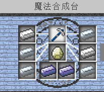

只要拿探礦鎬對方塊右鍵，就可以自動搜尋周圍有哪些礦物，目前不同素質的探礦鎬無任何效能差異。

製造出符紋鋼錠後除了可以用來製作工具、武器以及防具之外，還可正式使用魔法能系統及進入魔法金屬第一個新世界:[遠古銩遺跡](#_stdot8u0dmk5)。

#### 魔法能系統

在符紋鋼時代，魔法能開始從魔法粉這種實體物質開始可以轉換成以能量的方式傳遞。

你會需要以下三種設備魔法能製造器，魔法能分享石碑及魔法能傳遞矩陣

。

三種物品的合成表如下。

其中黑色方塊為祭壇石，合成表如下圖

當物品都準備完成後就可以開始使用魔法能系統了。首先是魔法能製造器，它的功能為將魔法粉，魔法錠等含有魔法能的物品轉換成魔法能。

此設備被破壞後魔法能不會消失，將會儲存在物品中已供下次放置使用。

可以轉換的魔法能分別為
迷你魔法粉：8
魔法粉：100
魔法錠：900
魔法磚：8100
魔法：200
桶裝魔法泉：800
當物品被轉換成魔法能後會儲存在製造器中，製造器上方的設備如有需要魔法能的話製造器會自動將魔法能轉移至上方的設備中。

魔法能分享石碑則可以短距離傳送魔法能，他會自動提取下方魔法能製造器中的魔法能，並以光束型態將魔法能自動分配至範圍 12 格內的所有設備中
此設備被破壞後魔法能同樣不會消失，依然會儲存在物品中以供下次使用

但魔法能分享石碑並不能分享魔法能給其他石碑，因此此設備僅能做短距離的大量輸出
如果想要長距離輸出，則必須使用魔法能分享矩陣，魔法能分享矩陣可發揮類似紅石中繼器的功能，可將魔法能傳送到很遠的地方
使用方法為玩家必須先準備聚魔法杖

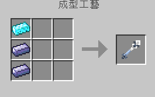

然後蹲下用聚魔法杖右鍵接收魔法能的設備，接著在右鍵預輸出的魔法能分享矩陣，成功後該矩陣及會對你蹲下右鍵的設備開始輸送魔法能
如空手對魔法能分享矩陣右鍵的話他就會改變能量的顏色，使用範例如圖

魔法能矩陣只要距離在 15 格內就沒有任何連結限制，可以垂直連結，也可以進行穿牆連結等行為。

但魔法能分享矩陣無法同時分享給一個以上的設備使用，因此如欲將魔法能傳輸至遠方的多個設備則需要多個矩陣才能完成傳輸。

#### 遠古銩

當玩家在符紋鋼錠階段發展成熟之後將可以進入下一個階段 : 遠古銩錠
遠古銩錠同樣需要使用金屬融合台製作，合成表如下 

由四個銩、兩個中級金屬能量、兩個魔法粉及一個符文鋼錠製作而成。

(以目前的版本推薦去遠古銩世界找尋遺跡寶箱會比較容易取得遠古銩錠)

遠古銩錠同樣可用來製作裝備、武器及防具，另外遠古銩時期可以製作幾樣新設備，分別是魔法傳送板、魔導空刷怪磚及法力附魔，接下來會在下方分別作介紹。

#### 魔法傳送板

合成表如下 

由四個魔法鋼錠、四個魔法粉及一個遠古銩錠在魔法合成台上製作而成，一次可以製作兩個傳送板。

傳送板的是用方法如下 
: 首先你要準備一個聚魔法杖

接著在地上放置傳送板

拿著聚魔法杖對著空氣右鍵可以儲存玩家所在的座標，對著方塊右鍵可以儲存該方塊的座標，對著設備蹲下+右鍵則可以儲存該設備所在的座標，依照不同的情況需求來儲存座標。儲存好座標之後回去手持聚魔法杖然後對著傳送板按下右鍵，成功的話會出現

之後只要站上該傳送板就會傳送到之前儲存的座標位置上。

此外魔法傳送板是單向傳送，若想要來回傳送的話則需要使用兩塊魔法傳送板並且設定兩次才可以。

#### 魔導空刷怪磚

合成表如下 

由六個遠古銩錠、兩個魔法錠以及一個鐵磚在魔法合成台上合成。

使用方法如下 
: 首先需要先準備一個魔物召喚祭壇，~~結構與~~[~~BOSS 召喚祭壇~~](#boss%E5%8F%AC%E5%96%9A%E7%A3%9A%E4%BD%BF%E7%94%A8%E6%96%B9%E6%B3%95-)~~相同~~，同樣的也可以參考魔法金屬辭典

中的法術儀式-魔物召喚
當中有詳細記載結構該如何擺放以及需要什麼材料。

蓋好祭壇之後就是把魔導空刷怪磚放到符文磚上方，如下圖所示 

然後空手對著魔導空刷怪磚按右鍵

將 64 個祭品放入摩導空刷怪磚中，可放置的物品如下所示，刷怪磚會根據放的物品來決定刷出的怪物種類。

腐肉 -> 殭屍
骨頭 -> 骷髏弓箭手
幽靈之淚 -> 地獄幽靈
烈焰棍 -> 烈焰神
火藥 -> 苦力怕
魔法石磚 -> 蠹魚
放置完畢之後，手持聚魔法杖對著刷怪磚右鍵。

接者祭品以及魔力水晶會被消耗，魔導空刷怪磚則會變成該怪物的生怪磚。

要注意的是此刷怪磚啟動後即變為原版刷怪磚，因此如果使用鎬等手段將其破壞，它並不會掉落魔導空刷怪磚或該怪物的刷怪磚。

備註:骷髏刷怪專放在地域會生成凋零骷髏，可利用這種方式獲得凋零骷髏的掉落物。

#### 法力附魔

法力附魔可以透過消耗魔法能以及 30 角色等級來給物品附魔，附魔的選擇越多以及附魔等級越高等所需的時間就越久(可以使用急速法杖加速)。

法力附魔台的合成表如下 
: 需要原版的附魔台一個、4 個遠古銩錠、2 個金錠、2 顆鑽石

法力附魔所需的結構如下，詳細結構請翻看魔法金屬辭典-法術儀式-法力附魔

完成法力附魔祭壇之後，點擊法力附魔台可以看到如下圖的 UI 介面 

將欲附魔的物品放上去之後下方會出現藍色的圖樣，每個都代表不同的附魔選項。

點擊圖樣後，右方會預示附魔的結果

確認之後使用附魔法杖對法力附魔台按右鍵即可開始附魔
成功的話會出現音效且法力附魔台無法被打開。

以上是金屬融合台的金屬介紹，接下來是魔王金屬，跟之前的金屬不同的是這些金屬每一種都能夠用來召喚一種獨特的 BOSS，並且需要藉由法力灌注來製造，有著明顯的先後順序。(推薦進入魔王金屬後每一種金屬造出 8 個之後刷 BOSS 獎勵箱來量產該種金屬)

#### 基岩錠

要製造基岩錠首先需要造出基岩術式，需要 1 個基岩術式核心，33 個祭壇石，32 個魔導符文，12 個祭壇石柱，8 個祭壇石符文核心，4 個魔力水晶及 1 個烽火台

基岩術式詳細的結構在魔法金屬辭典

\-法術儀式-基岩合金術式中有詳細記載
基岩術式完成會長這樣

要注意的是基岩術式核心要最後放，且結構有哪裡不正確的話是無法開啟基岩術式核心的，請注意。

建造完成之後右鍵基岩術式核心可以看到下面這個 UI 介面

最上方放置任何方塊(如果想要省方塊的話可以使用半磚，一個半磚跟方塊都算做一個)

左右三格分別放置魔法錠、遠古銩錠及高級金屬能量
左下方則須放置魔法粉供應魔法能，但也能透過魔法能系統將魔法能輸入進基岩術式中。

只要有魔法能供應，便會非常快速的消耗石質方塊並且中間倒梯形的空格會慢慢被填滿，等到消耗的方塊達到 1024 個，便會消耗掉左右共六格的材料並成功製作出一個基岩錠
因為消耗快速且需求量大，玩家可透過在上方擺上箱子及漏斗直接將石質方塊輸入進術式中

在此階段你至少需要透過基岩術式製作七個基岩錠來製作基岩搞(精鑄工作檯)，有了基岩搞之後就可以把基岩術式拆掉了。

有了基岩鎬之後可以拿基岩搞來破壞基岩取得基岩粒，9 個基岩粒可以合成為一個基岩錠

每個基岩皆會掉落數量不等的基岩粒。

基岩時代取得基岩鎬是首要目標
另外，基岩時代開始，大部分的工具防具武器都須透過精鑄合成來合成。

#### 基岩能量粉碎機

(不推薦建造)

鎢碎石機的升級版，即使耗費了一堆資源升級了速度卻依舊比用 2000 礦幣兌換的托米爾的黃金粉碎機慢了好幾個檔次，不過它可以燒出 3 個粉末相當於 3 倍產量，跟托米爾的黃金粉碎機的 2 個粉末比起來多一個，不過還是不推薦建造，因為到後期有能夠燒出 8 倍產量的機器，而且沒有機岩能量粉碎機這麼難製造。

#### 基岩合金批次融煉爐

基岩批次融煉爐是一個非常高效的熔爐，但作為代價其用魔法能來驅動且不論他是否有在運作皆會持續的消耗魔法能，因此應只在有需要時放置它，待使用完畢後破壞作為物品保存會較為節省能源

當接上魔法能後右鍵會看到以下這個介面

只要每當下方的黃條跑滿，就會將左邊所有格子內的一個物品融煉成成品並移至右方
如圖所示

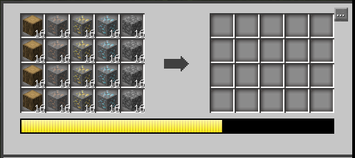

戴黃色讀取條跑完後會出現以下畫面

#### 魔力灌注

魔力灌注是全遊戲中最重要的術式，很多重要裝備的升級跟道具合成都需要藉由魔力灌注來完成的。

8 個魔力石柱，1 個魔力灌注核心，16 個魔導符文，12 個祭壇符文石柱以及四個魔力水晶

詳細的構造要到魔法金屬辭典

\-法術儀式-魔力灌注 查看

合成的方式是手持材料對著魔力石柱右鍵能夠把材料放上去(位置要正確)，9 格放滿之後手持聚魔法杖對著魔力灌注核心右鍵即可開始魔力灌注，魔力灌注速度十分的緩慢，不過有方法能夠使魔力灌注永久加速，手持光之碎片對著魔力灌注核心右鍵能夠消耗光之碎片換取魔力灌注的永久加速

，達到最大速度需要 90 個光之碎片。(光之碎片只能在天界中挖掘的到)

(要注意魔力灌注的過程中千萬不能移動或取出內部物品，否則中央的物品會損毀並且中斷魔力灌注)

(作好法力灌注之後建議先製作法力灌注石，每隔一段時間法力灌注石上方會長出魔力水晶，搭配破壞水晶之後即可自動化產出大量的魔力水晶，是魔力水晶的重要生產來源。)

#### 黑暗鋼錠

製作黑暗鋼錠需要 2 個暗物質、2 個魔法錠、4 個高級金屬能量及 1 個基岩錠。

(不建議用魔力灌注合成，建議造出死亡水晶後召喚死亡收割者，藉由刷 boss 獎勵箱換取黑暗鋼)

#### 人體改造

建造人體改造儀式需要 24 個魔導符文，24 個祭壇符文石柱、 9 個祭壇石
、8 個魔力水晶以及 1 個人體改造儀。

人體改造儀的合成圖如下 

儀式結構請查閱魔法金屬辭典

\-法術儀式-人體改造

打開人體改造儀之後可以看到下面這個 UI 介面

下面十個分別代表了十種人體改造，右方那本書則可將玩家身上的改造清除，每個玩家最多可以選擇三個人體改造，且每次改造皆須花費 30 等角色等級才可進行改造
以下介紹所有人體改造的功能
: 鋒利之爪:增加 12%輸出傷害
堅硬皮膚:防禦力提高 32 點
魚鰓器官:水底游泳不消耗氧氣、最大生命值增加 150 點、最大水量增加 500 點
熔岩皮膚:免疫火焰及岩漿傷害、迴避率提高 7 點
真視之眼:獲得常駐的夜視效果、爆擊率提高 7 點
光合皮毛:提高自然回復量、進入重傷時可以緩慢回復生命
藥物適應:增加 45%治療量、最大生命值增加 100 點、抗藥性時間減半
金剛骨骼:SP 最大值增加 120 點
法力親合:MP 最大值增加 600 點
循環系統:最大水量增加 300 點、最大疲勞值增加 300 點
當選擇了需要的人體改造，確認後靜待一段時間會完成改造，玩家會損失 30 等角色等級(換句話說改造需要至少 30 等角色等級)，獲得短暫的噁心後就取得了改造效果，此時玩家在打開改造介面就可以看到玩家的改造已成功顯示在上方

#### 礦物純化儀

礦物純化儀是碎石機的終極版，相較於碎石機的 2 倍產量，礦物純化儀可以產出 8 倍的產量，對於提高一些特別稀有的礦物的產量時
如彩虹鑽石、光之碎片、飛行石等等，有著極大的作用。(由於礦物純化儀的作用速度極慢，如果魔法能足夠的話，建議在礦物純化儀下方放置能量激發方塊或是時間機器來加速)

合成圖如下所示 

礦物純化儀不需要魔法能也能作用，在上格放入原礦，經過漫長的時間之後，~~會在下格產出純化結晶，將純化結晶放入熔爐燒會產出 8 個產物。~~
礦物純化結晶已於 6.0.0 版本刪除，現在礦物純化儀燒煉完成後會直接產生 8 個成品。

大地礦坑中的深度礦物都無法使用碎石機或礦物純化儀來增大產量。

#### 法杖融合台

法杖融合台是進入黑暗鋼時代之後沒有必要製造但是卻極度推薦的設備，可以製造出 14 把功能不同的法杖，對於發展魔法科技有著很大的助力。

法杖融合台的結構如下圖所示，詳細構造請查閱魔法金屬辭典

 - 法術儀式 - 法杖融合。

放入材料之後手持聚魔法杖對著法杖融合台右鍵即可開始法杖融合，下方讀條完成之後即可完成法杖。

下方是法杖的功能介紹以及合成表(由於合成表 NEI 查不到，而魔法金屬辭典又需要使用知識殘頁才可解鎖講述法杖的功能以及合成表的**魔法道具**頁面 ，才在這作整理)

經驗法杖 : (聚魔法杖左右兩側的材料是神秘寶石)

將重傷的目標生物變成經驗水晶碎塊，補充角色經驗。

法力消耗 : 150

照明法杖 :消耗魔力在目標方塊上方放置魔光火

，魔光火焰除了能夠提供照明之外，還能為建築物增添一點神秘氣氛。

法力消耗 : 50

神盾法杖 :召喚聖光的力量，保護使用者，使其無敵，只需要持續使用神盾法杖，使用者就不會受到任何的傷害，但是它需要非常大量的魔力。

法力消耗 : 500

治癒法杖 :動物們受傷時，除了使用麻煩的治療藥水之外，也能使用治癒法杖來治療動物或其他人，只需要右鍵瞄準目標即可發動。

法力消耗 : 150

空間法杖 : (聚魔法杖左右兩側的材料是金。地獄之星)

空間法杖可以紀錄使用者當下的座標，並且從任何地方順移到儲存的地點，蹲下右鍵即可儲存座標點。

法力消耗 : 900

守護法杖 : (聚魔法杖左右兩側的材料是靈魂精華)

守護法杖能夠保護一個方塊不被破壞，且這種魔法可以辨識主人，只有主人可以解除方塊的保護，右鍵方塊保護方塊，再次右鍵時解除保護。

法力消耗 : 150

方塊法杖 : (聚魔法杖左右兩側的材料是異界寶玉)

搬運箱子是個令人頭痛的問題，但是現在，方塊法杖能夠利用魔法來搬運方塊，只要對著目標方塊右鍵，就能完整無缺的移動方塊，同時保存箱子內的物品或狀態。

法力消耗 : 100
(小技巧 : 將已經儲存目標方塊的方塊法杖放入工作檯能夠合成並未儲存目標方塊的方塊法杖，在處理一整箱的垃圾時非常方便，缺點是箱子拿不回來)

浮空法杖 : (聚魔法杖左右兩側的材料是地獄之星)

飛行魔法在進入拉普達科技後才能實現，在那之前只能用浮空法杖，消耗魔力來達到浮空的效果，只不過要保持在空中的話會需要消耗非常大量的魔力。

法力消耗 : 15

整地法杖 
: 想要一次整平一大塊土地是非常麻煩的事情，即使擁有強大的傳奇工具仍要花上非常久的時間才能達成。如今，使用整地法杖能夠以非常快速的速度整平附近的地形，並且往下填土。(這個法杖只能在 Y 軸高於 60 的地方使用，並且伺服器預設禁止使用。)

法力消耗 : 20

煉金法杖 
: 煉金法杖能夠一點一滴的消磨目標的生命，並且在最終殺死生物，將其生命的力量轉化為滿地的金幣。

法力消耗 : 100

極速法杖 : (聚魔法杖左右兩側的材料是混沌魔晶)

極速法杖能夠利用風的力量，加快目標方塊的運轉速度，只需要持續對著目標方塊使用即可。

法力消耗 : 50

變形法杖 : (聚魔法杖左右兩側的材料是力量水晶)

變形魔法自古一來就被認為是對對手的終極恥辱，它能夠將重傷的目標生物變成呆頭呆腦的豬，從而永遠解除危機，還能增添一點糧食。

法力消耗 : 250

吸血法杖 : (聚魔法杖左右兩側的材料是惡魔之血)

吸血法杖能夠吸取目標生物的生命力並且補充使用者的生命，直至目標死亡為止。

法力消耗 : 100

瞬移法杖 : (聚魔法杖左右兩側的材料是暗物質)

瞬移法杖具有撕裂空間的能力，使用瞬移法杖能夠傳送至目標方向附近，不過只能傳送一定的距離。

法力消耗 : 300

#### 闇血鋼錠

製作闇血鋼錠需要
2 個惡魔之血
2 個魔法錠
1 個黑暗鋼錠及
4 個高級金屬能量
(不建議用魔力灌注合成，建議造出暗影龍晶後召喚影王龍，藉由刷 boss 獎勵箱換取闇血鋼錠)

#### 紅蓮金屬錠

製作紅蓮金屬錠需要 2 個地獄之星、2 個魔法錠、1 個闇血鋼錠及 4 個高級金屬能量。

(不建議用魔力灌注合成，建議造出充滿火焰的結晶體召喚熔岩巨人，藉由刷 boss 獎勵箱換取紅蓮金屬錠。)

#### 引力井

引力井是紅蓮金屬繼續升級所需的設備，是魔法金屬最難建造的設備之一(因為一旦結構不正確就會爆炸)，雖然需要使用的次數很少但是許多強大的飾品跟金屬的合成都需要引力井，論重要程度絕對不比魔力灌注低。

製作引力井儀式需要 44 個魔法強化方塊、4 個魔力水晶、10 個終極稜鏡及 1 個引力井。

引力井的結構請查閱魔法金屬辭典

法術儀式-引力井

(最後放置引力井時可以在下面墊兩個方塊再放引力井，爆炸與否是決定於上圖的這個結構正不正確，看到引力井出現如下圖的紅、藍光柱之後就代表引力井結構穩定)

(引力井會破壞的四個方向紅藍光柱所經過的方塊，這意味著引力井不能夠利用漏斗達到自動化)

#### 無限鋼

製作無限鋼錠需要
2 個遠古銩錠
2 個紅蓮金屬錠
4 個無限之環及
4 個特級金屬能量
(不建議用引力井合成，建議造出墮落枷鎖魔器後召喚死亡天使，藉由刷 boss 獎勵箱換取無限鋼錠)

#### 奧哈立爾鋼錠

製作奧哈立爾鋼錠需要 2 個遠古銩錠、2 個無限鋼錠、4 個大地結晶及 4 個超級金屬能量。

(不建議用引力井合成，建議造出君王的遺物後召喚凋零至尊，藉由刷 boss 獎勵箱換取奧哈立爾鋼錠)

#### 宇宙能量錠

製作宇宙能量錠需要 2 個遠古銩錠、2 個奧哈立爾鋼錠、4 個反物質、4 個超級金屬能量。

(不建議用引力井合成，擊敗凋零至尊並且獲得古老鑰匙後即可前往遠古銩挑戰黑暗騎士，黑暗騎士獎勵箱中開的到宇宙能量錠)

#### 時光熔爐

製作時光熔爐需要 1 個魔法注入器、4 個魔法鋼齒輪、4 個宇宙能量錠。

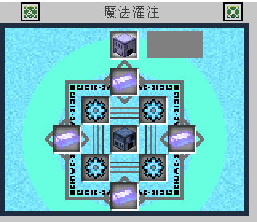

時光熔爐是全遊戲燃燒速度第二快的熔爐，比托米爾的黃金熔爐還快，但比拉普達熔爐慢。

#### 時間機器

製作時間機器需要
2 個彩虹鑽石
2 個時間沙漏
4 個宇宙能量錠
1 個時間核心
(時間核心每個玩家最多只能拿到 1 個，首次開啟凋零至尊獎勵箱時得到)

#### 銀河能量錠

製作銀河能量錠需要
2 個覺醒遠古銩錠
2 個古代鐵錠
4 個賢者之石
4 個超級金屬能量
只能用引力井合成

#### 阿達曼曼錠

製作阿達曼曼錠需要
2 個銀河能量錠
2 個致命晶錠
4 個原初碎片
4 個終極金屬能量

#### 莫那海德錠

製作莫那海德錠需要
2 個阿達曼曼錠
2 個夢幻金錠
4 個幻想寶石
4 個究極金屬能量

#### 黑洞頻率錠

製作黑洞頻率錠需要
2 個莫那海德錠
2 個夢幻金錠
4 個幻想寶石
4 個究極金屬能量

時間機器所需的結構請查閱魔法金屬辭典

法術儀式-時間機器
時間機器的作用是使周遭的 7\*7 祭壇石的上方一格的方塊加速，加速效果在能量激發方塊之上。

(時間機器所耗費的魔法能極為龐大，若缺乏魔法能的情況建議平時把時間機器敲下來，需要使用時再放置)

## 八、黑魔法

當玩家發展到能夠攻略遠古銩遺跡的 BOSS 之後(黑暗騎士、暴風魔蛇會掉落黑暗碎片)，就可以開始製作黑魔法儀式。

首先要在遠古銩遺跡世界中找到損壞的黑暗祭壇。

玩家需要 30 個銩錠、30 個暗物質、1 個黑暗碎片來修復黑暗祭壇。

修復完成後黑暗祭壇會恢復原狀，並且能夠兌換黑魔法相關的物品。

兌換時需要消耗相關材料和玩家等級。

### 升級魔法金屬辭典

玩家可以至黑暗祭壇兌換包含黑魔法知識的魔法金屬辭典。

製作時需要消耗 1 本魔法金屬辭典、1 個暗物質以及 1 個銩錠，且同時消耗玩家的角色等級 1 等。

製作完成之後，玩家的魔法金屬辭典目錄會新增一列**黑魔法**。

### 覺醒遠古銩錠

黑暗祭壇修復完成後，玩家可以開始製作一種全新的金屬-**覺醒遠古銩錠**。

製作覺醒遠古銩錠需要 1 個黑暗碎片、1 個宇宙能量錠以及 1 個超級能量金屬，且同時消耗玩家的角色等級 30 等。(建議擊殺赤瞳惡龍獲得，不要用合成的)

覺醒遠古銩錠可以拿來製作裝備、工具、武器，覺醒遠古銩工具的採收等級是 30。

### 暗能量儀

為了使黑魔法儀式能夠順利運作，需要提供足夠的黑暗能量。

此時需要暗能量儀來傳送黑暗能量給黑魔法儀式。

(充能前) (充能後)

製作暗能量儀需要 30 個暗物質、1 個黑暗碎片、10 個鑽石、1 個地獄之星以及 30 個銩錠，且同時消耗玩家的角色等級 100 等。

玩家將暗物質、黑暗鋼錠、黑暗鋼磚、黑暗碎片放入暗能量儀可以補充黑暗能量。

暗能量儀最多可以暫存 10000 黑暗能量。(即使敲掉重放黑暗能量依舊會保存)

暗能量儀和魔法能分享石碑的運作方式相同，會自動傳輸能量給附近的設備和儀式。

暗物質:25 黑暗能量。

黑暗鋼錠:50 黑暗能量。

黑暗鋼磚:450 黑暗能量。

黑暗碎片:1000 黑暗能量。

### 黑暗附魔

黑暗附魔可以提升道具的附魔等級，每件裝備限定升級一次。

黑暗附魔是屬於多方塊結構的法術儀式，玩家需要從黑暗祭壇兌換黑暗附魔台和相關建材來建造黑暗附魔儀式。

製作黑暗附魔台需要 30 個暗物質、1 個暗能量水晶、1 個黑暗碎片、1 個附魔台、30 個銩錠，且同時消耗玩家的角色等級 100 等。

黑暗附魔的結構如下圖

(材料需求和擺法請參考魔法金屬辭典

)

拿著道具對著黑暗附魔台按右鍵可以將道具放上黑暗附魔台(注意道具必須是已經附魔了的道具，黑暗附魔會將附魔等級提高 4 個等級)，接著手持聚魔法杖對黑暗附魔台按右鍵開始升級。(有時因為伺服器延遲的關係升級特效已經消失並且你對著黑暗附魔台按右鍵會拿不到道具，這時候請再多等一下再按右鍵)

升級期間需要消耗非常多黑暗能量。

完成升級之後，該道具的所有附魔會增加 4 等。

### 黑暗灌注

黑暗灌注能夠強化防具的防禦力和武器的攻擊力。

但這項強化無法永久存在，玩家受傷和使用武器攻擊都會消耗黑暗灌注的能量。

能量消耗殆盡後需要再重新灌注。

黑暗灌注屬於多方塊結構的法術儀式，玩家需要從黑暗祭壇兌換暗能量灌注器和其他相關建材來建造黑暗灌注儀式。

製作暗能量灌注需要消耗 30 個暗物質、1 個黑暗碎片、3 個覺醒遠古銩錠、20 個鑽石以及 30 個銩錠，且同時會消耗玩家的角色等級 100 等。

黑暗灌注的結構如下圖

(材料需求和擺法請參考魔法金屬辭典)

手持防具或武器對著暗能量灌注器按右鍵可以將防具或武器放置在暗能量灌注器上，接著手持聚魔法杖對著暗能量灌注器按右鍵即可開始灌注。

灌注期間需要消耗黑暗能量。

完成灌注之後，道具上會顯示黑暗灌注的剩餘使用次數。

### 圖騰充能

玩家開始使用黑魔法後，可以穿戴一種全新的飾品-圖騰。

為了使圖騰發揮作用，需要使用圖騰充能來為圖騰添加新的能力。

圖騰充能屬於多方塊結構的法術儀式，玩家需要從黑暗祭壇兌換圖騰充能儀和相關建材來建造圖騰充能儀式。

製作圖騰充能儀需要消耗 30 個暗物質、1 個黑暗碎片、40 個暗石、30 個銩錠，且同時消耗玩家的角色等級 200 等。

另外玩家需要製作暗能量圖騰，需要消耗 20 個暗物質、1 個黑暗碎片、1 個地獄之星、1 個覺醒遠古銩錠，且同時消耗玩家的角色等級 100 等。

圖騰充能的結構如下圖

(材料需求和擺法請參照魔法金屬辭典

)

拿著圖騰對著圖騰充能儀點擊右鍵可以將圖騰放上圖騰充能儀，手持聚魔法杖對著圖騰充能儀點擊右鍵開始充能。

充能需要消耗黑暗能量。

充能完成後會隨機給予圖騰 1\~4 條能力。

圖騰各項屬性可能出現的最高數值
: 穿透:+5
物理攻擊力:+15
魔法攻擊力:+15
掉寶:15%
最大魔力:+1000
造成傷害:+17%
受到傷害:-17%

### 黑暗召喚

**黑暗召喚在 6.0.0 版本之後改為召喚各種深淵 BOSS，深淵 BOSS 的血量遠比普通的 BOSS 多非常多，所掉落的特殊材料是深淵裝備強化的必需品。**
黑暗召喚是一種消耗黑暗能量和玩家等級來召喚 BOSS 的儀式。

黑暗召喚屬於多方塊結構的法術儀式，玩家需要從黑暗祭壇兌換黑暗召喚台和相關建材來建造黑暗召喚儀式。

製作黑暗召喚台需要消耗 30 個暗物質、1 個黑暗碎片、1 個地獄之星、3 個覺醒遠古銩錠、30 個銩錠，且同時消耗玩家角色等級 300 等。

黑暗召喚台的結構如下圖

(材料需求和擺法請參照魔法金屬辭典)

先將黑暗召喚台補充黑暗能量後，選擇欲召喚的 BOSS，點擊開始召喚即可。

每次召喚 BOSS 都會消耗黑暗能量和玩家等級。

(終界龍只能在終界召喚，請在終界設置黑暗召喚台的多方塊結構後再召喚終界龍)

(黑暗召喚台只能召喚原版 minecraft、法力金屬以及遠古銩世界的 BOSS)

### 黑暗轉換

黑暗轉換是透過消耗黑暗能量來複製物品的儀式。

黑暗轉換屬於多方塊結構的法術儀式，玩家需要從黑暗祭壇兌換黑暗轉換器和相關建材來建造黑暗轉換儀式。

製作黑暗轉換器需要 30 個暗物質、1 個黑暗碎片以及 30 個銩錠，且會消耗玩家的角色等級 300 等。

黑暗轉換的結構如下。

(材料需求和擺法請參照魔法金屬辭典

)

黑暗轉換可以消耗黑暗能量複製法力合金(基岩錠\~宇宙能量錠)、金屬能量以及各種基礎物資(包括寶石)，越高階的法力合金所需要的黑暗能量以及時間會越多。

下圖是可以被黑暗轉換複製出來的物品。

(基礎物資、金屬能量、魔力金屬、基礎金屬、寶石、染料)

詳細能像消耗可參考[百科](https://www.mcmod.cn/item/407741.html)

### 暗能量熔爐

暗能量熔爐是消耗黑暗能量來燒煉物品的設備。

製作暗能量熔爐需要 10 個暗物質、1 個黑暗碎片以及 10 個銩錠，且會消耗玩家的角色等級 100 等。

原礦放左邊，補充黑暗能量之後即可開始燒煉。

暗能量熔爐燒煉物品時有機率獲得兩倍產量，可搭配粉碎機複製金屬。

### 暗能量高爐

暗能量高爐是消耗黑暗能量來將鐵錠轉換成黑暗鋼錠的設備。

暗能量高爐屬於多方塊結構的法術儀式，玩家需要從黑暗祭壇兌換暗能量高爐和相關建材來建造暗能量高爐。

製作暗能量高爐需要 30 個暗物質、10 個黑暗鋼錠、1 個地獄之星、1 個黑暗碎片以及 30 個銩錠，且會消耗 200 玩家的角色等級。

暗能量高爐結構如下圖

鐵錠放左邊，補充黑暗能量之後即可開始製造黑暗鋼錠。

不知道為什麼空一頁

## 九、拉普達

### 升級魔法金屬辭典

需要使用藍天石碑，消耗一顆拉普達碇以及 100 角色等級，升級之後即可在魔法金屬辭典上看到拉普達頁面，所有跟拉普達有關的多方塊結構都請去觀看魔法金屬辭典

乙太能量：運轉拉普達科技所用能量
乙太能量轉換率
: 賢者之石、拉普達錠-10 能量
乙太粉末-30 能量
乙太結晶-120 能量
安普洛斯天空力量錠-150 能量

### 占星者

使用星捲賦予武器星數，需要將 4 張星等卷軸放置在祭壇的 4 個魔力石柱上，成功的機率則為四張卷軸的成功率總和除以 4，當星數到達三、五、十星時將有特別效果(從 3 種效果中隨機一種)。

當星等強化成功時，星數上升。武器星等每上升 1 星，造成的傷害提高 10%。

三星效果 : 暴擊率增加 5 點、基本攻擊力增加 8 點、穿透值增加 1 點
五星效果 : 暴擊率增加 12 點、 基本攻擊力增加 16 點 、穿透值增加 3 點
滿星效果 : 攻擊時恢復 10%生命值、 對魔王生物造成額外 30%傷害、
穿透值增加 8 點、 最終傷害提高 7%、 基本攻擊力增加 64 點

### 乙界位移

消耗一個超級終界珍珠以及乙太能量即可製作出一個拉普達傳送珍珠，拉普達傳送珍珠可以記錄多個座標的用於直接傳送的超級珍珠。

使用界面如下

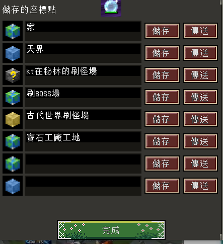

### 黃金屋

防具、工具、武器或任意附魔過的物品都能夠進行鍍金並獲得更強大的能力。

參照辭典搭建多方塊結構來使用。

可轉化為黃金值的物品：金粒=1、金錠/終結金錠/金粉=9、金磚=81、碎金=3、金蛋=6、碎金=8、玫瑰金錠/琥珀金錠=10、金礦/遠古金礦=18、神廟金錠=20、玫瑰/琥珀金磚=90。

(建議統一用金磚來轉化，可以省乙太能量)

每轉化 1 個物品消耗 1 點乙太能量，每次鍍金消耗 100 點乙太能量。

鍍金階段與黃金值消耗如下
: 鍍金-10000 黃金值。

純金-20000 黃金值。

真金-30000 黃金值。

鍍金效果如下(造成的傷害存在小數點，可能有浮動)
: 防具：每級造成傷害+3%，暴擊率+1，穿透值+1。

武器及其他物品：每級造成傷害+10%、無視怪物 33%鍍金法力護盾。

額外效果：穿戴滿 4 件防具時，所有防具的鍍金效果翻倍。

除此之外，每級鍍金效果可以提高工具的採收效率 2 點，受全局採收效率影響。

### 風行者

可以消耗一個飛行石來為飾品注入飛行力量，飾品只限戒指、項鍊、腰帶、斗篷、護腕，且不能是可升級飾品。

每一種飾品的可獲得飛行力量以及乙太能量的消耗如下
: 戒指：消耗 65 點乙太能量，飛行力量+200。

腰帶：消耗 100 點乙太能量，飛行力量+500。

斗篷：消耗 100 點乙太能量，飛行力量+500。

護腕：消耗 100 點乙太能量，飛行力量+300。

項鏈：消耗 100 點乙太能量，飛行力量+600。

雙擊空格即可飛行，玩家浮空時，每 5 秒消耗 1 點飛行力量。

玩家飛行能量不為 0 時，雙擊取消飛行掉落時不會受到傷害。

靠近風行者核心時，可消耗乙太能量來補充飛行力量，每 3 點乙太能量補充 1 次飛行力量，每次最多 30 點。(如果將充滿飛行能量的飾品剝離並且重新穿戴，該飾品會失去所有的飛行能量，需要重新補充)

副本中無法飛行。

### 銀色波江

將材料放入設備中，就能激發聖泉的力量，泡進泉中，可以獲得對應的效果。泉水材料可以是賢者之石、黃金地獄之星、混沌魔晶、靈魂精華或時間沙漏，每個材料都會造成不同的效果。

每次放入材料後，都會持續 30 分鐘有效，只需要泡進泉水，就可以獲得對應的效果，長達 4 個小時，同時身上其它的狀態效果也將全部解除。

賢者之石: 天空聖泉 (全能力小幅度提升)

金-地獄之星: 財寶魔法 (掉寶率提升)

混沌魔晶: 勇氣祝福 (攻擊力提升)

靈魂精華: 專注魔法 (獲得的職業經驗值提升)

時間沙漏: 博學祝福 (獲得的生產經驗值提升)

### 天空冒險

天空冒險是一個卡牌類小遊戲，支持最多 4 名玩家合作，結算時可獲得大量金錢、職業經驗值獎勵。

開啟鑽石、翡翠等級的天空冒險獎勵箱時必定獲得世紀之果，這也是遊戲中獲得世紀之果的唯一途徑。

當玩家等級到達 50 等時即可購買戰艦進行天空冒險。

天空冒險領取各級別獎勵箱子為 5.10.15.20.25.30 關，只要到該關卡即可領取，不需破關、
初始之島、睡蓮群島、空想之島、火山之島、海洋之島、風中之島、天空秘境、樂土群島、天堂群島、遠古遺跡、天空之核、星空神域、彩虹之島、探求之路、未知星雲、上層空域、星光之河、邊境之島、星界之門、星空之島、金光之路、祝福沼澤、應許聖堂、未知領域、勇者之路、末日聖地、英雄神殿、黃金聖所、英雄之墓、永恆深空、無垠星海總共 30 個島嶼。

由於百科內容超多，於是我在這直接召喚[百科的連結](https://www.mcmod.cn/item/438396.html)(絕對不是懶得搬過來)

## 十、狀態效果(更新版本:5.5.5)

全能力微幅提升
: 造成傷害+10%，爆擊機率+4，迴避機率+4，防禦力+2，穿透值+1。

全能力微量提升
: 造成傷害+10%，爆擊機率+4，迴避機率+4，防禦力+8，穿透值+1。

全能力小幅提升
: 造成傷害+15%，爆擊機率+6，迴避機率+6，防禦力+12，穿透值+2。

全能力中幅提升
: 造成傷害+15%，爆擊機率+6，迴避機率+6，穿透值+2。

全能力大幅提升
: 造成傷害+20%，爆擊機率+8，迴避機率+8，防禦力+16，穿透值+3。

全能力巨幅提升
: 造成傷害+25%，爆擊機率+10，迴避機率+10，防禦力+20，穿透值+4。

全能力巨量提升
: 造成傷害+30%，爆擊機率+12，迴避機率+12，防禦力+24，穿透值+5。

全能力極大幅提升
: 造成傷害+35%，爆擊機率+14，迴避機率+14，防禦力+28，穿透值+6。

冰緩 : 這個狀態會導致移動速度減緩。

麻痺 : 這個狀態會導致無法移動、跳躍、攻擊，通常不會持續太久。

破甲 : 這個狀態會導致受到的傷害大幅增加。

眩暈 : 這個狀態會導致無法移動、跳躍、攻擊，通常不會持續太久。

破綻 : 這個狀態會因為來源不同而有不同的效果，通常是作為技能的 CD 使用。

出血 : 這個狀態會導致任何治療行為失效。

連環斬 : 這個狀態會提高物理近戰攻擊力。(劍鬥士一轉技能)

草之祝福 :這個狀態會提高全部能力(傷害+15%爆擊+4 迴避+4 防禦力+8 穿透值+3)(蠱毒師一轉技能:霧療)

聖光祝福 : 這個狀態會增加執業經驗值獲取量，並且全能力大幅提高。(使用傳說武器魔導書時獲得)

貪婪 : 這個狀態會導致擊殺敵人時，增加掉落的錢幣數量，並且增加掉寶率。

魔力盾 : 這個狀態會增加防禦力 100 點。(大法師一轉技能 : 魔力盾)

經驗加倍 : 這個狀態會提高擊殺怪物時獲得的經驗量。

迅捷 : 大幅提高迴避率。(喝魔藥獲得)

精確 : 大幅提高爆擊率。(喝魔藥獲得)

抗藥性 : 這個狀態會導致無法使用生命或魔力藥水。(喝完生命或魔力藥水後會短暫獲得此狀態)

啞刺 : 這個狀態會使蠱毒師增加 40%傷害。(蠱毒師一轉技能 : 啞刺)

魔法無效 : 這個狀態會導致魔法恢復無效。

破壞抵抗 : 這個狀態會導致無法破壞任何方塊，以及無法放置任何方塊。

箭術 : 這個狀態會大幅提高物理遠程傷害。(喝魔藥或是使用傳說武器獲得)

魔導 : 這個狀態會大幅提高魔法攻擊。(喝魔藥獲得)

魔藥 : 這個狀態會大幅提高造成的傷害。(喝魔藥或是使用傳說武器獲得)

強擊 : 這個狀態會提高造成的傷害以及爆擊機率。

力量 : 這個狀態會提高造成的傷害，並且小幅提高全部能力。(喝魔藥獲得)

元素強化 : 這個狀態會使得元素攻擊在克制敵人的屬性時，大幅提高造成的傷害。

詛咒 
: 這個狀態會使造成的傷害減少，並且增加受到的傷害。

失手 
: 這個狀態會導致攻擊時有一定機率無效化。

溫暖 
: 這個狀態會減少體溫的流失，並且緩慢提升體溫。

寒冷 
: 這個狀態會減少體溫的增加，並且緩慢的降低體溫。

甜點 
: 這個狀態會小幅提高爆擊機率與迴避率。

料理 
: 這個狀態會大幅提高全能力。(食用料理時獲得)

蠱毒 
: 這個狀態會導致來自蠱毒師的傷害增加。

無敵 
: 持有這個狀態時將不會受到任何的傷害。

壓力 
: 這個狀態會導致造成的傷害減少，並且受到的傷害提高。(大部分 BOSS 都會對玩家施加這個狀態)

飛行無效 
: 持有這個狀態時，將會導致任何飛行方法失效。(部分 BOSS 會對玩家施加這個狀態)

摔傷無效 
: 持有這個狀態時，不會受到掉落傷害。(使用全職業共通技能 : 順身術 時獲得)

治癒能量 
: 職業是白魔導並且使用魔導書時獲得此狀態，可以提高治癒法術的治療量。

黑暗祈禱 
: 持有這個狀態的話，狀態即將結束時，會受到巨大的傷害。

致命熔岩 
: 持有這個狀態時，受到的傷害會極大幅提升。(BOSS 炙焰鳳凰會施加此狀態)

突刺 
: 職業為夜行者並且使用一轉技能 : 突刺術 時獲得此狀態，提高 30%造成傷害。

同命 
: 持有此狀態時，若擊殺同樣持有此狀態的目標時，自己會連帶死亡。

魔力吸收 
: 持有此狀態時，每次攻擊並且命中時能夠回復 50 魔力，(使用大法師一轉技能 : 魔力吸收 獲得)

死亡印記 
: 持有此狀態時，受到的傷害會增加。(使用夜行者一轉技能 : 死亡印記 獲得)

遠古咒法 
: 持有此狀態時，武器將會只能造成原始傷害，任何增傷效果都將會失效。

魔力恢復 
: 持有此狀態時，提高魔力的恢復速度。(浸泡魔法泉時獲得此狀態)

魔力無效 
: 持有此狀態時，無法恢復魔力。

魔力增幅 
: 持有此狀態時，進行消耗魔力的動作時，會消耗更多的魔力。

脫水 
: 持有此狀態時，將會增加水份的流失速度。(飲用鹹水獲得此狀態)(鹹水用水壺在生態域 : 海洋 裝水時獲得)

破滅祈禱 
: 持有此狀態時，弱狀態持續時間低於 10 秒時，持有狀態者會死亡。(暴風魔蛇會施加此狀態)

戰吼 
: 持有此狀態時，攻擊力會提高，受到的傷害減少。(使用暗騎士一轉技能 : 戰吼 獲得)

影子護盾 
: 持有此狀態時，受到的傷害減少。

戰鬥咆嘯 
: 持有此狀態時，攻擊力會提高。

法力激發 
: 持有此狀態時，爆擊機率跟迴避率提高。

噬血 
: 持有此狀態時，攻擊造成的傷害的一部分會吸收為生命值。(使用夜行者一轉技能 : 噬血術 獲得)

戰意 
: 持有此狀態時，造成的傷害增加。(使用白魔導一轉技能 : 戰意 獲得)

酒精 
: 持有此狀態時，攻擊力提高，受到的傷害提高。(喝酒獲得)(連續喝六瓶會死亡)

腐敗 
: 持有此狀態時，受到的傷害會大幅增加。(蠱毒師一轉技能 : 酸性毒 施加)

著魔 
: 持有此狀態時，魔法攻擊力增加。(召喚師一轉技能 : 著魔 施加)

活動 
: 持有此狀態時，會無法顯示 UI 介面，特殊地圖專用。

甜蜜 
: 持有此狀態時，提高生命恢復的效果。

劇毒 
: 持有此狀態時，將會隨時間受到巨量的傷害。

石化 
: 持有此狀態時，無法移動或攻擊。

凍結 
: 持有此狀態時，無法移動或攻擊。

沉默 
: 持有此狀態時，無法使用任何技能。

美味
: 使玩家造成的傷害+30%，暴擊率+4，迴避率+4，防禦力+8，穿透值+3。

減少受到創傷的機率
(食用傳奇或聖品等級的料理時獲得)

秘藥 
: 持有此狀態時，全能力大幅提高。(喝秘藥獲得)

感性 
: 持有此狀態時，獲得的職業經驗量會增加。(喝魔藥獲得)

毅力 
: 持有此狀態時，死亡後不會損失經驗值與金幣。

鐵皮 
: 持有此狀態時，防禦力提高。(喝魔藥獲得)

幸運 
: 持有此狀態時，能夠獲得更多的生產經驗值。(喝魔藥獲得)

看穿 
: 持有此狀態時，穿透值提高。(喝魔藥獲得)

抗性 
: 持有此狀態時，受到的傷害減少。(喝魔藥獲得)

晨光 
: 持有此狀態時，全能力大幅提升。(使用咒術師一轉技能 : 自然晨光 獲得)

戰術指揮 
: 持有此狀態時，全能力大幅提升。(使用暗騎士一轉技能 : 旋風斧 獲得)

羽蛇守護 
: 持有此狀態時，攻擊力、防禦力大幅提升。(守護羽蛇或白羽套裝提供)

管理員祝福 
: 持有此狀態時，全能力大幅提升。(管理員給予)

祝福琴聲 
: 持有此狀態時，全能力小幅提升。(演奏豎琴獲得)

戰鬥號角 
: 持有此狀態時，攻擊力提升。(號角演奏獲得)

天空聖泉 
: 持有此狀態時，全能力提升。(祝福之泉提供)

財寶魔法 
: 持有此狀態時，掉寶率提升。(祝福之泉提供)

勇氣祝福 
: 持有此狀態時，攻擊力提升。(祝福之泉提供)

專注魔法 
: 持有此狀態時，獲得經驗量提升。(祝福之泉提供)

博學祝福 
: 持有此狀態時，獲得生產經驗值提升。(祝福之泉提供)

痛苦之劍 
: 持有此狀態時，攻擊力大幅提高。(使用拉普達神器 : 暗法之銘 獲得)

火之剋星 
: 持有此狀態時，才可以有效的對抗炙焰鳳凰，由滅焰神泉提供。

抽搐 
: 持有此狀態時，迴避率大幅降低。

至殘 
: 持有此狀態時，重傷時即使回滿血也無法救活，免死金牌也無法使用。

泰坦守護 
: 持有此狀態時，無法破壞或放置方塊、使用物品，攻擊也會失效。

黑暗力量 
: 持有此狀態時，全能力大幅提高。(全職業二轉共通技能)

怒氣爆發 
: 持有此狀態時，攻擊力與穿透值會提高。(劍鬥士二轉技能)

血戰誓約 
: 持有此狀態時，攻擊力會提高並且能夠吸血。(劍鬥士二轉技能)

刺穿 
: 持有此狀態時，受到的傷害會增加。(神射手二轉技能:破甲強襲、夜行者二轉技能:比首劍舞、暗騎士二轉技能:煉獄之炎、咒術師二轉技能:星辰重擊、圖騰師二轉技能:千針萬確)

風神祝福 
: 持有此狀態時，迴避率、穿透值與攻擊力會提高。(神射手二轉技能 )

冰柱連擊 
: 持有此狀態時，使用法杖將會施展練續冰柱攻擊。(大法師二轉技能)

神聖領域 
: 持有此狀態時，攻擊力會提高並且能夠吸血。(白魔導二轉技能)

大地力量 
: 持有此狀態時，能夠抵抗死亡一次。(暗騎士二轉技能)

十字連斬 
: 持有此狀態時，攻擊力會提高，並且可以吸血。(夜行者二轉技能)

孤注一擲 
: 持有此狀態時，攻擊力與穿透值會提高，但是會受到更多的傷害。(夜行者二轉技能)

真理之門 
: 持有此狀態時，攻擊力會提高，並且能夠吸血。(白魔導二轉技能)

星蝕 
: 持有此狀態時，能夠吸血。(咒術師二轉技能)

日蝕 
: 持有此狀態時，攻擊力與穿透值提高。(咒術師二轉技能)

先祖吶喊 
: 持有此狀態時，全能力大幅提高，圖騰運作速度增加。(蠱毒師二轉技能)

無限魔力 
: 持有此狀態時，施展技能時不會扣損魔力。(大法師二轉技能)

天罡神盾 
: 持有此狀態時，攻擊力與穿透值大幅提高，且不受任何傷害。(暗騎士二轉技能)

天空護佑 
: 持有此狀態時，全能力大幅提高。(咒術師二轉技能)

由於百科內容超多，所以直接召喚[百科的連結](https://www.mcmod.cn/item/list/1111-6.html)(絕對不是懶得搬過來)

## 十一、常見問題

(目前方向: 先把 DC 上的常見問題搬到魔法金屬大全裡面並且做照片更新與修改)

Q1:升級版本之後無法進入遊戲?
A1:將舊版檔案刪除即可。

Q2:出現 Mod rejections 沒辦法進入官方伺服器?
A2:請至巴哈姆特貼文上下載模組包，<https://forum.gamer.com.tw/C.php?bsn=18673&snA=147405&tnum=234&subbsn=12>

Q3:魔法合成台、金屬融合台無法運作?
A3:在底下放魔法粉充能，金屬融合台放金屬能量充能

Q4:我找不到某種礦物怎麼辦?
A4:礦物屬於區域性生成，若在某個地點找不到某種礦物，跑到遠一點的地方尋找即可。

Q5:要如何設置領地?
A5:打開背包選認領區塊，左鍵新增區塊、右鍵消除區塊。

Q6:要在哪裡查物品的合成表?
A6:用 NEI，對著物品按 R 查詢合成表，按 U 查詢物品用途，或者查看魔法金屬辭典。(這裡說的按鍵是預設情況)

Q7:為什麼我的 NEI 沒有出現?
A7:打開背包後按 O (英文字母) 就會出現 NEI 介面。(這裡說的按鍵是預設情況)

Q8:如果魔法粉袋子跟礦物背包遺失了該怎麼辦?
A8:魔法粉袋子可以用皮革和魔法粉製作，礦物背包可以在採礦商店用 2500 採礦硬幣購買。

Q9:有東西不會做或是不知道用途?
A9:翻看這本魔法金屬大全、找 NEI 合成表或查閱魔法金屬辭典

，上述三種方法都沒有用的話再到官方 DC 群詢問管理員。

Q10:為什麼我沒辦法破壞或放置任何東西?
A10:請注意自己是否位於重生點保護區或是他人的領地，若離開上述的區域後仍無法正常使用，請重新登入。

Q11:如何修復裝備?
A11

1.  找 npc 修理。

2.  製作裝備工作檯。

3.  製作法力修復台。

4.  使用原版的鐵砧修復，但是傳奇武器無法使用此項。

    Q12:如何治療別人?
    A12

5.  牧師技能。

6.  治療法杖。

7.  瘋狂對著對方丟飛濺治療藥水。

8.  在他旁邊放置治療水晶/火坑等物品。

9.  召喚師的風蛇召喚物可以治療他人。

    Q13:為什麼我下載了模組包還是無法進入遊戲?
    A13:請記得解壓縮模組包，並將檔案放置在正確的路徑，或著下載魔法金屬自動安裝軟體，載點在巴哈主串中**https://forum.gamer.com.tw/C.php?bsn=18673&snA=147405&tnum=234&subbsn=12**
    Q14:我想跟朋友一起玩，但我們沒辦法使用對方的領地。

    A14:左方點選 FriendsGUI 可將指定玩家設置為好友，設置成功之後對方即可使用你的領地。

    

    Q15:高爐結構如何擺放?
    A15:請參考一下圖。

    

    Q16:進官服的時候出現以下訊息該怎麼解決?
    A16:通常是因為模組沒有在 mods 路徑下導致，請將所有必要模組放在 mods 路徑下，不要放在其他資料夾中。

    

    Q17:如果出現 fatally missing blocks and items 該如何解決?
    A17:到 config 資料夾打開 Muya 資料夾內的 core.cfg，將**僅啟用核心庫**改成 true，其他全部改成 false。

    

    Q18:物品資料夾破圖該如何解決?
    A18:把資源包打開，把 assets/minecraft/textures 裡面的 font 資料夾刪除。

    

    Q19:我現在有了一個裝了 Forge 的 minecraft，請問我應該如何使用用戶端?
    A19

10. 解壓縮你的用戶端，請只壓縮一次，請不要把**任何**.jar 檔案解壓縮。\\

11. 打開你的用戶端，你會看到 mods 以及 config 這兩個資料夾。

12. 打開你的 minecraft 資料夾。

    (或其他指定的資料夾，不過我想你都來問這個問題了，應該也不會自己設定遊戲資料夾)

13. 把 mods 跟 config 都丟進 minecraft 裡面，請全部取代。

14. 確認你的魔法金屬是現在伺服器爭在使用的版本，並且確認你的魔法金屬沒有出現重複的檔案。

15. 打開你的 minecraft。

    Q20:裝了 NEI 遊戲卻開不起來怎麼辦?
    A20:請確認有下載 CodeChickenLib 以及 CodeChickenCore，此為 NEI 前置模組，請確認這兩個都有安裝正確。

    Q21:召喚師要如何設定召喚獸?
    A21:手持鐮刀 Shift+右鍵即可開啟設定召喚獸介面。

    Q22:為什麼我不能使用星等強化卷軸?
    A22:禁入拉普達科技之後，建造占星者結構才可以使用，用指令方塊無法製作。

    Q23:打完副本拿到獎勵箱，打開後卻沒辦法解任務怎麼辦?
    A23:請去打簡單難度(金錠)，打開簡單難度的獎勵箱即可完成任務。

    Q24:蜜蜂/女王蜂合成不出來?
    A24:用 F3+H 可以看到物品編號，在(#5595/編號)的地方，編號必須要是 0，才可以合成出蜜蜂或是女王蜂。現在養蜂系統還在維護中，很多合成不出來是正常現象。

    

    Q25:葡萄怎麼種?哪裡買?
    A25:葡萄種子可以在農耕商店購買，要種葡萄要先做出葡萄架，並且距離地面至少 1 格高，不然葡萄沒有位置生長，葡萄會自己蔓延到旁邊的架子上。

    

    Q26:我要怎麼完天空冒險?
    A26:請參考目錄:拉普達科技:天空冒險方塊。

    Q27:寶藏積分?寶藏可以做什麼用?
    A27:目前寶藏積分沒有用途，全部寶藏都可以販售給 npc 賺取金錢。

    

    Q28:皮革要怎麼製作?現在生物為什麼都掉生皮?
    A28: 5.4.0 新增曬皮架。

    系統簡述
:     生物現在不掉落皮革，而掉落生皮，所有需要皮革的配方先在需要完成的皮革。蹲下右鍵將生皮放在地上，使用任意匕首右鍵可以刮除皮毛，獲得**刮過得生皮**。將刮過的生皮蹲下+右鍵裝水的鍋釜來浸泡，獲得**浸泡的生皮**，最後將浸泡的生皮右鍵放上曬皮架來製造皮革，皮革完成曬制後可以一次收穫多個完成的皮革。

    Q29:天空力量石碑可以在哪裡找到?
    A29:亡靈古墓。

    Q30:為什麼我自己的魔法保險櫃不能拆?
    A30:請蹲下並打掉他。

    Q31:我裝了 NEI 和前置卻進不了遊戲，出現崩潰?
    A31:2021/04/30
    CodeChickenCore 的作者有發布更新，請自行前往 CurseForge 下載最新版本並將舊版替換掉，即可順利進入遊戲。

    Q32:我第一次進終界怎麼沒看到終界龍?
    A32:正常，請把科技推到黑魔法之後用黑暗召喚台召喚終界龍
    Q33:我想設定移動水晶!但是他都不動 OR 傳送到他下面的方塊?
    A33:如果直接法杖右鍵點擊，會點擊到該方塊的**下面或隔壁**一個方塊的座標，要設定到正確的位置，請先如圖在該位置隨意放置一個方塊後，用法杖儲存位置後再敲除，如傳送的 B 座標有方塊，移動水晶不會有動作。

    

## 十二、職業

玩家在剛開始遊玩也就是 1 等的時候就可以選擇，選擇完職業後會獲得初心者武器箱，開啟之後會獲得相對應的初始武器

初始武器具有最低的傷害加成以及無限的耐久值，做為過渡的武器擁有非常優秀的性能，建議在擁有穩定修復裝備的來源之前都使用初始武器。

(法術職業 如:大法師、白魔導、咒術師除外)

角色等級上限是 30 等，如果要提升上限到 60 等需要吃覺醒密典

，覺醒密典可以在水、火、冰、木以及骷髏副本獎勵箱中開到，吃一本可以提升 5 等等級上限，最多可以吃 6 本。

60 等之後要提升等級上限到 70 等需要吃永恆聖杯，吃一個永恆聖杯即可以提升等級上限至 70，擊倒炙焰鳳凰後獲得不死鳥羽毛以及安普洛斯天空力量錠才能合成，合成表如下圖，

70 等之後要提升等級上限需要使用轉生之鑰，可以使用職業的二轉技能並且提升等級上限到 100 等，轉生之鑰合成表如下圖。

100 等以後提升等級上限需要使用傳奇英雄傳，一個傳奇英雄傳可以提升最大等級一級，最高提升至 120 級，傳奇英雄傳有機率在英雄聖殿獎勵箱獲得。

全職業共通技能

一轉
順身術 : 消耗 50 SP
，前進時按技能鍵能向前方衝刺，或者按上+技能鍵可以向上方跳躍，同時 4 秒內免疫摔落傷害，(預設按 C 發動)

技能升級效果 : 無(最高技能等級 : 1 級)

二轉 -黑暗力量 
: 消耗 1000 魔力以及 1 顆黑魔法水晶，凝聚全身力量呼喚黑暗力量，以瑪夏達巴之名，召喚黑暗能源來強化自己持續時間內，攻擊力、穿透值大幅提高，持續時間 60 秒，冷卻時間 2400 秒。

技能升級效果 : 減少冷卻時間 60 秒。

二轉 - 戰鬥思想 
: 沉澱自己，透過冥想來增加自身的能力，提高物理攻擊力與魔法攻擊力。

技能升級效果 : 增加提高的物理攻擊/魔法攻擊。

(一)劍鬥士
劍鬥士是近距離輸出職業，持有重型闊劍的劍士是團隊中不可或缺的重要力量，在最前線給予敵人沉重的打擊。(使用武器
: 劍)

一轉 - 劍鬥士之路

劍氣波 
: 消耗 200 魔力，發射劍氣波攻擊前方目標，造成 150%物理近戰暴風屬性劈砍傷害
持劍時按下武器功能(預設 v)發動，冷卻時間 2 秒。

技能升級效果 : 增加 10%劍氣波傷害。

戰鬥防守 
: 消耗 200 魔力，持劍防禦時，可以吸收傷害，並且將傷害的 60%吸收為自己的生命力(持劍時右鍵防禦發動)

技能升級效果 : 增加 2%吸收傷害生命力 。

連環斬 : (最低學習等級 : 5 等)

，消耗 300 魔力，給予自身連環斬效果，提高 25%傷害，普通攻擊時可以砍出劍氣波，最多同時傷害 4 個目標，持續時間 20 秒，冷卻時間 60 秒。

技能升級效果 : 增加 5 秒連環斬效果持續時間。

玄月斬 : (最低學習等級 : 5 等)

，消耗 250 魔力，向前方發動玄月斬攻擊，快速對前方目標揮出 10 下斬擊，每次造成 150%物理近戰暴風屬性傷害，冷卻時間 8 秒。

技能升級效果 : 增加玄月斬 10%傷害。

幻影劍 : (最低學習等級
: 5 等)，消耗 400 魔力，連續召喚 15 個幻影劍向前射出攻擊遠方的敵人，每個幻影劍造成 200%物理近戰大地屬性劈砍傷害，冷卻時間 16 秒。

技能升級效果 : 增加幻影劍 10%傷害。

劍術精通
: (最低學習等級 : 5 等)

，藉由鍛鍊身體來增加自身的體力以及攻擊力，增加 10 點物理近戰攻擊力、生命值提高 100 點、減少重力攻擊造成的傷害、獲得抵抗擊退的效果。

技能升級效果 : 無(最高技能等級 : 1 級)

二轉 - 狂戰士之路

劍術大師 
: 持續不斷的練習劍術，每次攻擊時，有機率造成目標出血效果，攻擊帶有出血效果的目標時，可以提高 40%傷害。

技能升級效果 : 無(最高技能等級 : 1 級)

怒氣爆發 
: 消耗 400 魔力，將凝聚的力量全部施放，獲得怒氣爆發效果，對附近所有目標造成 900%物理近戰大地屬性能量傷害，並且立刻重製所有一轉主動技能的 CD，同時在持續時間內大幅提高玩家的穿透值以及攻擊力，持續時間 10 秒，CD100 秒
技能升級效果 : 暫無

狂暴劍斬 
: 消耗 400 魔力，猛力揮劍，向前方發出 5 道猛烈斬擊攻擊遠方的目標，每個斬擊造成 650%物理近戰大地屬性劈砍傷害，並且可以穿透目標，造成直線傷害，冷卻時間 12 秒。

技能升級效果 : 暫無

血戰誓約 
: 消耗 400 魔力，獲得血戰誓約效果，期間內每次普功都會提高血戰誓約的等級，效果期間將提高攻擊力，並且將傷害的一部分轉化為生命力，持續時間 90 秒，冷卻時間 120 秒。

技能升級效果 : 暫無

龍卷劍斬 
: (超級技能)，消耗 800 魔力，向前方發出奮力一擊，颳起颶風，颶風將會持續吸引周遭的目標，每秒造成 450%物理近戰暴風屬性劈砍傷害，持續時間 40 秒，冷卻時間 600 秒。

技能升級效果 : 減少冷卻時間 20 秒。

(二)神射手
神射手是遠距離輸出職業，具有移動速度以及迴避的強化，在遠距離游擊敵人，絕不放過任何一個目標。(使用武器
: 弓)

一轉 - 神射手之路

麻痺陷阱 
: 消耗 200 魔力，在腳下放置麻痺陷阱，當目標踩中陷阱或者在附近時，麻痺陷阱會造成 250%物理遠程雷電屬性穿刺傷害，並且給予目標麻痺效果，持續 9 秒，冷卻時間 5 秒。(持弓時按技能鍵發動，預設 V)

技能升級效果 : 增加 10%麻痺陷阱傷害。

穿空箭 
: 消耗 200 魔力，發射直線飛行的穿空箭矢，穿透目標並且造成連環傷害，每發造成 400%物理遠程聖光屬性穿刺傷害，並且給予目標穿甲效果，蹲下時射箭發動。

技能升級效果 : 增加 10%穿空箭傷害。

五重矢 : (最低學習等級 
: 5 等)，消耗 200 魔力，連續發射 5 發箭矢，每發造成 200%物理遠程暴風屬性穿刺傷害，射箭前按下技能鍵，射箭後發動，冷卻時間 6 秒。

技能升級效果 : 增加 10%五重矢傷害。

爆裂箭 : (最低學習等擊 
: 5 等)，消耗 300 魔力，發射三發爆裂箭矢，造成範圍 200%物理遠程火焰屬性穿刺傷害，射箭前按下技能鍵，射箭後發動，冷卻時間 14 秒。

技能升級效果 : 增加 20%爆裂箭傷害。

閃電矢 : (最低學習等級 
: 5 等)，消耗 500 魔力，發射直線飛行的閃電箭矢，命中之後造成 250%物理遠程暴風屬性穿刺傷害，並且召喚落雷陣，持續召喚落雷範圍攻擊，持續時間內共造成 30 次 100%魔法攻擊雷電屬性能量傷害，持續 10 秒，射箭前按下技能鍵，射箭後發動，冷卻時間 20 秒。

技能升級效果 : 增加 20%閃電矢傷害。

弓術精通 : (最低學習等級 
: 5 等)，持續不斷的練習箭術，提高物理遠程攻擊力 12 點，提高暴擊率 5 點，暴擊傷害 100%提升。

技能升級效果 : 無(最高技能等級 : 1 級)

二轉 - 風行者之路

蓄力射擊 
: 持續拉著弓時，可以蓄力，最多蓄力 3 次，發射箭矢時，依照蓄力的次數大幅增加傷害。

技能升級效果 : 無(最高技能等級 : 1 級)

連成一氣 
: 消耗 400 魔力，連續發射 9 發箭矢，每發造成 350%物理遠程暴風屬性穿刺傷害，並且在最後發射爆炸箭矢，造成 800%物理遠程大地屬性爆破傷害，冷卻時間 16 秒。

技能升級效果 : 暫無

破甲強襲 
: 消耗 500 魔力，蓄力發出一箭，對目標造成 3200%物理遠程暴風屬性穿刺傷害，並且給予目標刺穿效果，使目標受到傷害提高 30%，持續時間 16 秒，冷卻時間 30 秒。

技能升級效果 : 暫無

風神祝福 
: 消耗 600 魔力，發動風神祝福，期間內移動速度、迴避率與攻擊力大幅提高，持續時間 20 秒，冷卻時間 100 秒。

技能升級效果 : 暫無

暴風箭雨 
: (超級技能)，消耗 800 魔力，呼喚魔法暴風，在一定時間內以極快的速度降下箭雨，每波造成 1300%物理遠程暴風屬性穿刺傷害，冷卻時間 600 秒。

技能升級效果 : 減少冷卻時間 20 秒。

(三)大法師
大法師是遠距離輸出職業，使用數種不同的元素魔法打出瘋狂的高段數 AOE 傷害，依戰況不同使用不同的魔法，是怪物最為懼怕的存在。(使用武器
: 法杖)

一轉 - 大法師之路

衝擊波 
: 消耗 300 魔力，在腳下施放一圈的衝擊波，擊退周遭的敵人並且造成多次 50%魔法攻擊火焰屬性能量傷害，持法杖時按下武器功能發動(預設 V)，冷卻時間 5 秒。

技能升級效果 : 增加 10%衝擊波傷害。

魔力吸收 
: 消耗 100 魔力，持續時間內攻擊敵人並且造成傷害時可以補充 50 魔力，持法杖時蹲下按武器功能發動(預設 V)

技能升級效果 : 增加 4 秒魔力吸收持續時間。

爆裂彈 : (最低學習等級 
: 5 等)，消耗 300 魔力，發射三波散狀爆裂魔法球，造成範圍 250%魔法攻擊火焰屬性能量傷害，冷卻時間 10 秒。

技能升級效果 : 增加 20%爆裂彈傷害。

魔法箭 : (最低學習等級 
: 5 等)，消耗 400 魔力，連續發射 16 發魔法箭矢，追蹤並且攻擊目標，每發造成 150%魔法攻擊暴風屬性穿刺傷害，冷卻時間 16 秒。

技能升級效果 : 增加 10%魔法箭傷害。

魔力盾 : (最低學習等級 
: 5 等)，消耗 500 魔力，召喚魔力護盾保護自己，增加 100 點防禦力，持續 30 秒，冷卻時間 60 秒。

技能升級效果 : 增加 4 秒魔力盾持續時間。

法力精通 : (最低學習等級 
: 5 等)，鑽研魔法，並且學習法杖的操縱技巧，提高魔法攻擊力 12 點，暴級率提高 5 點。

技能提升效果 : 無(最高技能等級 : 1 級)

二轉 - 元素魔導之路

消滅魔法 
: 鑽研元素魔法，啟動元素相剋系統，法師施展的攻擊元素若是克制目標的元素，將可以增加 120%傷害。

技能提升效果 : 無(最高技能等級 : 1 級)

冰柱連擊 
: 消耗 800 魔力，召喚寒冰風暴，在目標頭上降下無數冰錐，持續時間內使用法杖來連續施展，每個冰錐可以造成 350%魔法攻擊寒冰屬性能量傷害，持續 20 秒，冷卻時間 80 秒。

技能升級效果 : 暫無。

元素爆裂 
: 消耗 900 魔力，向前方扇狀範圍依序發射火焰、雷電、寒冰與黑暗元素球，每一擊造成 800%魔法攻擊能量傷害，冷卻時間 10 秒。

技能升級效果 : 暫無。

無盡魔力 
: 消耗 100 魔力，發動無盡魔力效果，持續時間內使用任何魔法可以不消耗魔力，但是會受到額外的傷害，持續 20 秒，冷卻時間 100 秒。

技能升級效果 : 暫無。

萬雷殞落 : (超級技能)，消耗 3000 魔力
:詠唱萬雷之力，當咒語結束時，天打雷劈、萬雷殞落，對指定範圍內的敵人施以無數雷霆攻擊，每波造成 2000%魔法攻擊雷電屬性能量傷害，冷卻時間 600 秒。

技能升級效果 : 減少 20 技能冷卻時間。

(四)夜行者
夜行者是近距離輸出職業，使用短匕進行偷襲，對於迴避性有巨大的強化，能夠給予敵人致命的一擊。(使用武器
:匕首)

一轉－夜行者之路

突刺術 
: 消耗 100 魔力，向前方突刺，給予自己突刺的效果，提高 30%傷害。(持匕首時右鍵發動)

技能提升效果 : 增加 2% 突刺術效果增加傷害量。

死亡印記 
: 消耗 600 魔力以及 1 個魔法石，給予攻擊目標死亡印記的效果，使攻擊目標增加 40%受到的傷害，持續 8 秒，冷卻時間 30 秒。

技能提升效果 : 增加 1 秒死亡印記的持續時間。

連環鏢 : (最低學習等級 
: 5 等)，消耗 200 魔力，向前方投擲散狀飛鏢，每個飛鏢造成 250%物理近戰源水屬性穿刺傷害，冷卻時間 8 秒。

技能提升效果 :增加 10％連環鏢傷害。

強雷襲 : (最低學習等級 
: 5 等)，消耗 350 魔力，向前方連續發射三發雷電飛鏢，每個飛鏢造成 500%物理近戰雷電屬性穿刺傷害，擊中目標之後，召喚落雷，造成 200%物理近戰雷電屬性能量傷害，冷卻時間 15 秒。

技能提升效果 : 增加 20%強雷襲傷害。

噬血術 : (最低學習等級 
: 5 等)，消耗 500%魔力，給予自己噬血效果，提高 40%傷害，並且每次攻擊可以補充傷害值 5%的生命力，持續時間 30 秒，冷卻時間 50 秒。

技能提升效果 : 增加 4 秒噬血術持續時間。

變身迴避 
: 被動技能，領悟暗殺術的至高精華，提升自身能力、物理攻擊力 12 點、迴避率 5 點、獲得抵抗擊退的效果，爆擊傷害提升 50%。

技能提升效果 : 無(最高技能等級 : 1 級)

二轉 - 暗殺者之路

暗殺領悟 
: 領悟暗殺者的真諦，每次攻擊時，都有機率造成致命一擊，爆擊傷害大幅增加。

技能提升效果 : 無(最高技能等級 : 1 級)

匕首劍舞 
: 向前方發射扇形匕首，命中目標後每一枚匕首造成 900%物理近戰大地屬性劈砍傷害，並且給予攻擊目標刺穿的效果，使目標在持續時間內承受的傷害增加，持續 16 秒，冷卻時間 24 秒。

技能提升效果 : 暫無。

十字連斬 
: 向前方斬擊，造成 1200%物理近戰源水屬性劈砍傷害，並發動十字連斬效果，持續時間內提高物理攻擊力，並且攻擊命中之後會回復生命值，持續 30 秒，冷卻時間 8 秒。

技能提升效果 : 暫無。

孤注一擲 
: 獲得孤注一擲效果，持續時間內自身攻擊力與穿透值大幅提升，並且重設所有一轉技能冷卻時間，但是持續時間內會使玩家受到額外 300%傷害，持續 20 秒，冷卻時間 100 秒。

技能提升效果 : 暫無。

刀刃迷宮 
: 超級技能，召喚無數刀刃，攻擊範圍內所有目標，每次造成 1000%物理近戰源水屬性劈砍傷害，持續時間 30 秒，冷卻時間 600 秒。

技能提升效果 : 減少技能冷卻時間 20 秒。

(五)暗騎士
暗騎士是近距離坦克職業，使用戰鎚進行戰鬥，在戰鬥的第一線承受傷害並且保護其他隊友，具有生命力的強化。(使用武器
: 戰鎚)

一轉 - 暗騎士之路

戰吼 
: 消耗 200 魔力，發動戰吼，提高自身以及周遭隊友 20%攻擊力，持續 30 秒，並且將周圍的怪物的攻擊目標設定為自身，持續 5 秒，持戰鎚時按下武器功能發動(預設 V)

技能提升效果 : 增加 4 秒戰吼持續時間，增加 1 秒吸引怪物仇恨的時間。

血魔轉換 
: 消耗 150 魔力，恢復自身 5%生命值，持戰鎚時右鍵連續發動，發動時無法進行攻擊，且移動速度減緩，但防禦力提升。

技能提升效果 :增加 1%血魔轉換的恢復生命值

犧牲術 : (最低學習等級 : 5)，消耗 300 魔力，消耗自身現有一半 HP，並且恢復周遭隊友等同於減少的生命值，同時移除隊友的負面狀態，對周遭的怪物造成對大生命值 x2 的物理近戰大地元素抵銷傷害，冷卻時間 25 秒。

技能提升效果 : 減少 1 秒犧牲術冷卻時間。

旋風斧 : (最低學習等級 : 5)，消耗 500 魔力，投擲旋風斧攻擊敵人，造成 350%物理近戰大地屬性劈砍傷害，同時斧頭會在敵方目標之間彈跳，最多彈跳 7 次，並且給予自己與周遭的隊友**戰術指揮**效果，提升全部能力，冷卻時間 5 秒。

技能提升效果 : 增加 10%旋風斧傷害。

動地鎚 : (最低學習等級 : 5)，消耗 500 魔力，猛擊地面並隆起巨石，對前方一直線目標連續造成 150%物理近戰大地屬性重擊傷害，持續 5 秒，冷卻時間 30 秒。

技能提升效果 : 增加 10%動地鎚傷害。

防禦體系 : (最低學習等級 : 5)，鍛鍊自身，練就一身銅牆鐵壁般的堅實身體，提高物理攻擊力 5 點，生命值提高 200 點，減少重力傷害，獲得抵抗擊退效果。

技能提升效果 : 無(最高技能等級 : 1 級)

二轉 - 死亡騎士之路

驚奇骨骼 
: 天身具有橫練的筋骨，簡直是百年難得一件的練武奇才，打通任督二脈之後，可以使自身在受到致死傷害時，至少殘留 1 點生命值，此效果每 50 秒可以發動一次。

技能提升效果 : 無(最高技能等級 : 1 級)

暗影巨鎚 
: 消耗 500 魔力，發射黑暗魔球，擊中之後，召喚巨鎚落下，造成範圍內所有目標 800%物理近戰黑暗屬性重擊傷害，冷卻時間 15 秒。

技能提升效果 : 暫無。

煉獄之炎 
: 消耗 500 魔力，召喚紅炎毒刺，攻擊範圍內所有目標，造成 900%物理近戰黑暗屬性穿刺傷害，受到傷害的目標將會獲得**刺穿**效果，目標受到的傷害會提升，持續時間 16 秒，冷卻時間 24 秒。

技能提升效果 : 暫無。

大地力量 
: 消耗 500 魔力，召喚大地力量來保護自己與周遭的友軍，持續時間內受到的傷害大幅減少，當受到足以致死的傷害時，效果會消失，並且阻擋該次傷害，持續時間 60 秒，冷卻時間 120 秒。

技能提升效果 : 暫無。

天罡(ㄍㄤ)神盾 
: 消耗 800 魔力，超級技能，向天空祈禱，利用神聖力量守護自己與隊友，30 秒內，自己與隊友獲得**神盾**效果，傷害與穿透值大幅提升，冷卻時間 600 秒。

技能提升效果 : 天罡神盾冷卻時間減少 20 秒。

(六)召喚師
召喚師是遠距離輸出職業，使用鐮刀進行戰鬥，召喚各種魔物上場助陣，在戰場上有著十分強大的輔助能力。(使用武器
: 鐮刀)

一轉 - 召喚師之路

魔界召喚

: 消耗 500 魔力與 1 個召喚石，打開魔界傳送門召喚設定好的魔物到身邊，召喚物擁有玩家屬性的一定比率，持續 10 分鐘。若在召喚物尚未消失時召喚新的召喚物，舊的召喚物會消失，持鐮刀時按下武器功能發動(預設 V)。(持有鐮刀時蹲下+右鍵設定召喚物)

技能提升效果 : 增加 20%召喚物的攻擊力與生命值。

召回 
: 消耗 100 魔力，傳送附近所有屬於自己的召喚物到自己身邊，並且重設他們的攻擊目標，持鐮刀時蹲下時按下武器功能發動(預設 V)

技能提升效果 : 減少 5 點召回消耗的魔力。

著魔 : (最低學習等級 : 5)，消耗 100 魔力，立刻補充自己所有魔力，並且給予附近所有召喚物**著魔**效果，提高 200%傷害，持續 30 秒，冷卻時間 90 秒。

技能提升效果 : 減少 2 秒著魔冷卻時間。

還魂術 : (最低學習等級 : 5)，消耗 300 魔力，殺死自己所有的召喚物，每一隻補充自身 20%生命與魔力值，若召喚物擁有**著魔**效果，額外補充 20%生命力與魔力，冷卻時間 12 秒。

技能提升效果 : 增加 2%補充的生命力與魔力。

魔連彈 : (最低學習等級 : 5)，消耗 300 魔力，召喚魔連彈，連續發射扇狀魔法球攻擊前方目標，每一發造成 120%魔法攻擊魔法屬性能量傷害，冷卻時間 12 秒。

技能提升效果 : 增加 10%魔連彈傷害。

生命聖火 : (最低學習等級 : 5)

，燃燒自身生命獲得的生命聖火使得召喚師能夠與召喚物相互溝通，大幅提升召喚物的能力，提高 30%召喚物傷害，提高魔法攻擊力 8 點。

技能提升效果 : 無(最高技能等級 : 1 級)

二轉 - 馴獸師之路

心靈水滴 
: 當受到致死傷害時，將由附近的召喚物頂替該次傷害，發動後需要 60 秒之後才能再次發動，另外，攻擊時，身邊 8 格內每個召喚獸都會提高自身的傷害，每個召喚獸提高 100%。(ㄟ不是召喚物除了被犧牲補充生命值跟魔力還要被拿來檔死喔(((ﾟ д ﾟ)))也太可憐了八
.by ocean)

技能提升效果 : 無(最高技能等級 : 1 級)

共鳴召喚 
: 消耗 600 魔力，殺死附近所有基本召喚物，並一次將所有召喚物召喚出來，然後補充召喚師的所有生命值與魔力，持續時間結束之後，召喚物會消失，持續時間 90 秒，冷卻時間 150 秒。

技能提升效果 : 暫無。

聖獸守護 : 消耗 600 魔力，召喚聖獸 : 火鳳凰
，火鳳凰以召喚師 800%的攻擊力連續發射火球攻擊目標，鳳凰同時降下治療光環，每秒補充附近隊友的生命值，持續時間 90 秒，同時獲得**火之祈禱**效果，冷卻時間 150 秒。

技能提升效果 : 暫無。

魔法飛彈 
: 消耗 600 魔力，連續發射扇狀魔法球，每發造成 800%魔法攻擊黑暗元素能量傷害，冷卻時間 12 秒。

技能提升效果 : 暫無。

誓約之龍 
: 消耗 1000 魔力，超級技能，打開通往冥府的大門，召喚誓約之龍前來助陣，誓約之龍具有免疫一切傷害的能力，並且以召喚師的 3200%攻擊力持續攻擊目標，持續時間 120 秒，同時獲得**龍之祈禱**效果，冷卻時間 600 秒。(從冥府召喚出來的難道不該是屍骸龍或是骨龍嗎?(\*´･д･)?
.by ocean)

技能提升效果 : 減少誓約之龍冷卻時間 20 秒
(七)咒術師
咒術師是遠距離輔助職業，透過不同的符咒施展出不同的範圍效果，使用得當的話能夠扭轉戰局。(使用武器
: 扇子)

一轉 - 咒術師之路

符咒充能 
: 消耗 100 魔力，充能附近的所有魔力殘骸，每一種魔力殘骸充能效果都不同，手持扇子時按下武器功能發動(預設 V)

技能提升效果 : 無(最高技能等級 : 1 級)

符咒解放 
: 立刻補充自己所有魔力，並且獲得魔導效果，持續 10 秒，增加魔力傷害，冷卻時間 30 秒，手持扇子時蹲下按下武器功能(預設 V)發動
技能提升效果 : 增加 4 秒魔導效果持續時間。

閃電符 : (最低學習等級 : 5)，消耗 300 魔力，向前方發設閃電符，每一發造成 250%魔法攻擊雷電屬性詛咒傷害，並且在命中敵人之後召喚落雷攻擊，造成連環 150%魔法攻擊雷電屬性能量傷害，冷卻時間 4 秒。

技能提升效果 : 增加閃電符 10%傷害。

自然晨光 : (最低學習等級 : 5)

，消耗 300 魔力與 1 個治療粉，召喚自然晨光在自己身邊，每秒持續恢復生命值與魔力值，並且給予**晨光**效果，增加全能力，持續 50 秒，冷卻時間 60 秒。

技能提升效果 : 增加 5 秒自然晨光的持續時間。

風速符
: (最低學習等級 : 5)，消耗 300 魔力，向前方連續發射多發風速符，每發造成 150%魔法攻擊暴風屬性詛咒傷害，冷卻時間 20 秒。

技能提升效果 : 增加 10%風速符傷害。

心靈之火 : (最低學習等級 : 5)，學習咒法並且領悟靈魂的力量，提高魔法攻擊力 12 點，提高魔法恢復速度。

技能提升效果 : 無(最高技能等級 : 1 級)

二轉 - 占星師之路

月之神力 
: 向月亮獻上祝福，每次攻擊都將降下落星，造成額外的攻擊，每顆造成 100%魔法攻擊聖光屬性能量傷害。

技能提升效果 : 無(最高技能等級 : 1 級)

連環星降 
: 消耗 600 魔力，召喚數波流星來攻擊範圍內所有目標，每個流星造成 500%魔法攻擊聖光屬性能量傷害，另外，當持有**日蝕**效果時，流星會產生爆破傷害，當持有**星蝕**效果時，流星波數會增加，冷卻時間 16 秒。

技能提升效果 : 暫無。

天空護佑 
: 消耗 600 魔力，發動天空護佑效果，持續時間內，自身全能力大幅增加，持續時間 60 秒，另外發動時，當持有**日蝕**效果時，重設所有一轉技能冷卻時間，當持有**星蝕**效果時，恢復自身與附近隊友的 60%生命值與魔力值，冷卻時間 100 秒。

技能提升效果 : 暫無。

日夜輪迴 
: 消耗 600 魔力，施放時，若自身尚未持有效果或持有**星蝕**效果時，將會獲得**星蝕**效果，持續 120 秒，**日蝕**效果將提高攻擊力與穿透值，**星蝕**效果將使玩家在攻擊目標時，恢復自己的生命值與魔力值，冷卻時間 60 秒。

技能提升效果 : 暫無。

星辰重擊 
: 消耗 900 魔力，超級技能，呼喚晨星力量，眼前大範圍內降下星辰重擊所有目標，每波造成 3500%魔法攻擊魔法屬性重擊傷害，並且給予目標**刺穿**效果，使目標受到傷害提升，持續時間 16 秒，冷卻時間 600 秒。

技能提升效果 : 減少星塵重擊冷卻時間 20 秒。

(八)白魔導
白魔導是遠距離輔助職業，主要專精於保護與治療魔法，擅長在後方輔助隊友，使用光屬性魔法也能有可觀的輸出。(使用武器
: 法書)

一轉 - 白魔導之路

治療術 
: 消耗 200 魔力，召喚治療光芒，治療自己與周遭隊友，根據魔法攻擊與治療能量的層數，增加治療量，手持法書時蹲下右鍵發動。(現今版本機制是以玩家半徑 8 格範圍內補血，一次最多奶 5 個實體，可回血目標包刮玩家、召喚物、圖騰、白蛇等等)

技能提升效果 : 無(最高技能等級 : 1 級)

戰意 
: 消耗 250 魔力，給予自己與周遭隊友**戰意**效果，提高 45%攻擊力與獲得的經驗量，持續 20 秒，手持法書時按下武器功能鍵(預設 V)發動。

技能提升效果 : 增加 4 秒戰意持續時間。

聖光矢 : (最低學習等級 : 5)，消耗 200 魔力，向前方連續發射光之箭矢，每一發造成 250%魔法攻擊聖光屬性穿刺傷害，命中目標之後，每一箭都能補充 250 魔力，冷卻時間 10 秒。

技能提升效果 : 提升聖光矢 10%傷害。

淨化術 : (最低學習等級 : 5)，消耗 300 魔力，召喚神聖光環，消除自身以及周遭隊友的負面效果，並且給予**聖光守護**效果，減少 10%受到的傷害，並且全能力小幅增加，持續 20 秒，冷卻時間 20 秒。

技能提升效果 : 提升 4 秒聖光守護效果的持續時間。

癒療之泉 : (最低學習等級 : 5)，消耗 500 魔力以及 1 個治療粉，召喚癒療之泉在身邊，癒療之泉每秒治療周遭隊友生命值，持續 60 秒，冷卻時間 90 秒。

技能提升效果 : 減少 5 秒癒療之泉的冷卻時間。

聖療經 : (最低學習等級 : 5)，奶媽中的聖經，祖傳按摩法能讓胸圍提高 2cup
(x，提高治療量 10%，生命值提高 100 點。

技能提升效果 : 無(最高技能等級 : 1 級)

二轉 - 主教之路

光能爆破 
: 引用聖光之力，普通攻擊時每一發都會造成爆破傷害，給予範圍攻擊效果並且增強 30%普通攻擊傷害。

技能提升效果 : 無(最高技能等級 : 1 級)

光耀直擊 
: 消耗 500 魔力，召喚連環光柱，對正前方所有目標造成持續傷害，每次造成 700%魔法攻擊聖光屬性神聖傷害，冷卻時間 8 秒。

技能提升效果 : 暫無。

神聖領域 
: 消耗 500 魔力，降下神聖之光，持續時間內範圍裡所有友方目標都將持續恢復生命值，並且獲得**神聖領域**效果，提高穿透值，並且傷害值得一定量可以恢復為生命值，持續時間 30 秒，冷卻時間 80 秒。

技能提升效果 : 暫無。

神聖之箭 
: 消耗 500 魔力，發射神聖之箭，每一發造成 850%魔法攻擊聖光屬性穿刺傷害，並且連續召喚聖光球攻擊目標，造成 500%魔法攻擊聖光屬性能量傷害，冷卻時間 24 秒。

技能提升效果 : 暫無。

真理之門 
: 消耗 800 魔力，超級技能，打開通往真理(天堂?)的大門，以聖光的力量來保護自己以及隊友，恢復自己與附近隊友的生命值，並且清除負面效果，給予**真理之門**的效果，增加攻擊力與穿透值，並且連續對附近敵人造成 2400%魔法攻擊聖光屬性神聖傷害，持續 5 秒，冷卻時間 600 秒。

技能提升效果 : 減少 20 秒冷卻時間。

(九)蠱(ㄍㄨ ˇ)毒師
蠱毒師是遠距離輔助職業，使用吹箭來戰鬥，吹箭攻擊不高，但是使用各種毒藥可以造成強大的持續傷害效果。(使用武器
: 吹箭)

一轉 - 蠱毒師之路

蠱毒爆 
: 消耗 200 魔力，召喚蠱毒的力量，激發潛藏在敵人體內的毒性，讓附近所有擁有蠱毒效果的目標受到 200%物理遠程自然屬性毒藥傷害，蠱毒效果層數越高，傷害會成倍增加，手持吹箭時按下武器功能(預設 V)時發動。

技能提升效果 :增加 5%蠱毒爆傷害。

啞刺 
: 消耗 300 魔力，給予自己**啞刺**效果，增加 40%傷害，持續時間 20 秒，手持吹箭時蹲下+按下武器功能鍵(預設 V)發動。

技能提升效果 : 增加 4 秒啞刺效果的持續時間。

飛散箭 : (最低學習等級 : 5)，消耗 300 魔力，向前方發射散狀飛箭，每一發造成 200%物理遠程自然屬性穿刺傷害，冷卻時間 10 秒。

技能提升效果 : 增加 10%飛散箭傷害。

補充
: 實際上造成的是物理遠程無屬性穿刺傷害，而不是物理遠程自然屬性穿刺傷害。

霧療 : (最低學習等級 : 5)，消耗 300 魔力與 1 個治療粉，在自身周圍製造煙霧，每秒持續恢復生命值，並且會持續獲得**草之祝福**效果，提高全部能力，持續 40 秒，冷卻時間 80 秒。

技能提升效果 : 增加 5 秒霧療持續時間。

酸性毒 : (最低學習等級 : 5)，消耗 500 魔力，持續向前方噴射劇毒，連續造成 80%物理遠程自然屬性毒藥傷害，持續 5 秒，並且給予目標**腐敗**效果，提高目標 30%受到的傷害，持續 10 秒，冷卻時間 30 秒。

技能提升效果 : 增加 5%酸性毒傷害。

致命劇毒 : (最低學習等級 : 5)，精通蠱毒，將來自叢林的 7749 種劇毒怪物關在一個壺內，所煉出的最強蠱毒，提高物理遠程傷害 10 點，魔力最大值提高 300 點。

技能提升效果 : 無(最高技能等級 : 1 級)

二轉 - 圖騰師之路

上古碑文 
: 透過研讀遠古的碑文來增強自己的能力，每次攻擊時，有一定的機率重設飛散箭與酸性毒的冷卻時間，此效果每 20 秒最多觸發一次，攻擊時，目標持有的狀態越多，造成越大的傷害，每個狀態提高 16%傷害。

技能提升效果 : 無(最高技能等級 : 1 級)

月亮圖騰 
: 消耗 200 魔力，呼喚月亮圖騰降下流星攻擊隨機一個目標，每一發造成 1000%魔法攻擊黑暗屬性能量傷害，並且造成**月光侵蝕**效果，最多一次召喚 5 個圖騰，持續時間 60 秒，冷卻時間 5 秒。

技能提升效果 : 暫無。

補充
: 實際上造成的是物理遠程光明屬性燃燒傷害，而不是魔法攻擊黑暗屬性能量。

五個圖騰是所有插下的圖騰加起來，不是單種。

太陽圖騰 
: 消耗 200 魔力，呼喚太陽圖騰每秒造成附近所有目標 500%魔法攻擊火焰屬性燃燒傷害，並且造成**陽光烈炎**效果，最多一次召喚 5 個圖騰，持續時間 60 秒，冷卻時間 5 秒。

補充
: 實際上造成的是物理遠程火焰屬性燃燒傷害，而不是魔法攻擊火焰屬性燃燒傷害。

五個圖騰是所有插下的圖騰加起來，不是單種。

技能提升效果 : 暫無。

先祖吶喊 
: 消耗 400 魔力，發動**先祖吶喊**效果，發動後附近所有圖騰的運作時間大幅提高，並且時間內自身全能力提升。持續時間 30 秒，冷卻時間 100 秒。

技能提升效果 : 暫無。

千針萬確 
: 消耗 800 魔力，超級技能，召喚巨大的圖騰，以極快的速度對範圍內所有目標降下無數飛針，每波造成 1400%物理遠程暴風屬性穿刺傷害，並且給予目標**毒殺**效果，增加目標受到的傷害，持續時間 60 秒，冷卻時間 600 秒。

技能提升效果 : 減少千針萬確的冷卻時間 20 秒。

補充
: 實際上造成的是物理遠程暴風屬性穿刺傷害與魔法攻擊暴風屬性能量傷害。

可以在插滿五個圖騰時

## 十三、結語

只是無聊提出的想法，竟然就這樣開始了 2021/3/1
大全竟然活了快一年了! 2021/12/2
不過我倒是覺得中間沒更新的半年跟死了沒兩樣拉

 by ocean 2021/12/3

